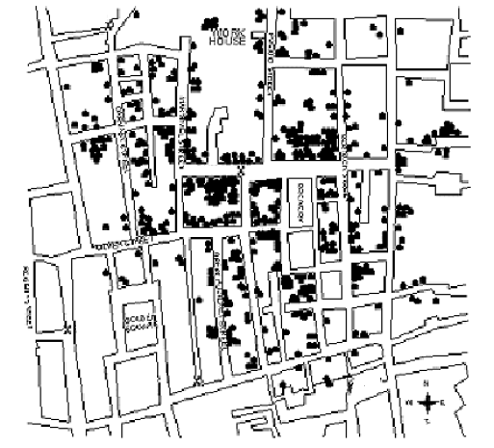
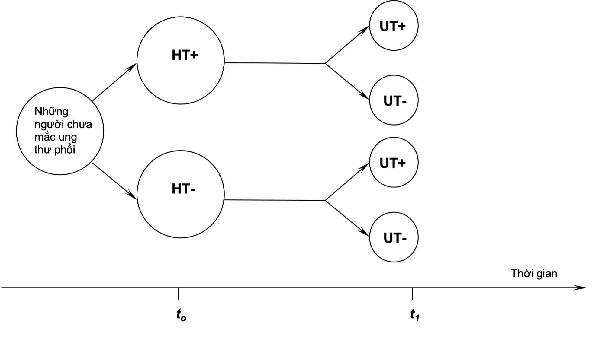
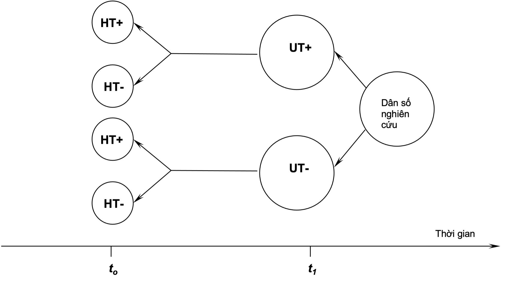
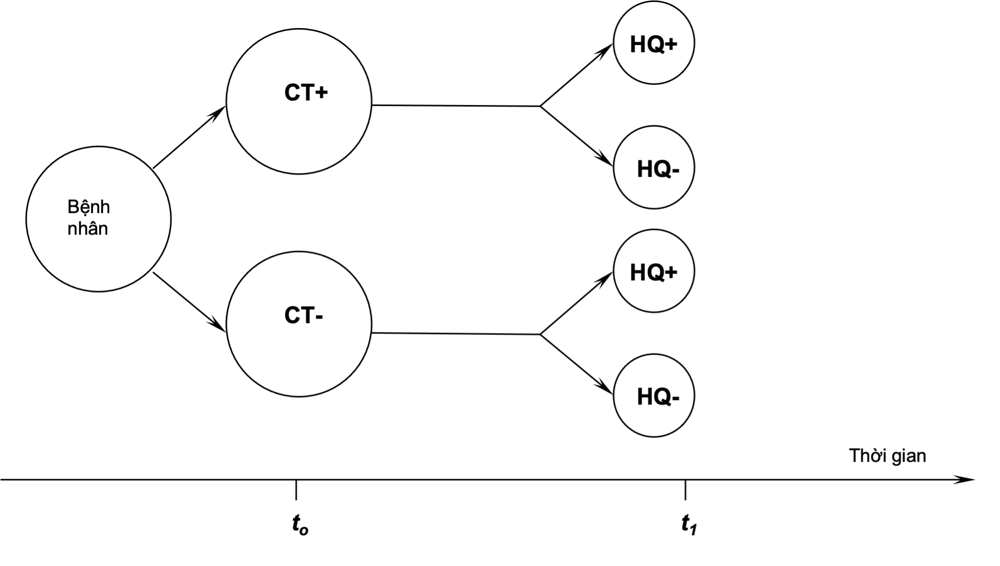

# Giới thiệu về Dịch tễ học {#dthcb_gioithieu}

## Mục tiêu bài giảng {-}

Sau khi học xong bài này, học viên có thể

* Hiểu được định nghĩa của dịch tễ học.
* Liệt kê được ba mục đích chính, ba chiến lược nghiên cứu, và ba nội dung hoạt động của dịch tễ học.

## Giới thiệu {-}

Dịch tễ học, được dịch từ một từ tiếng Anh là *epidemiology*. Theo từ nguyên, *epidemiology* bắt nguồn từ 3 từ La tinh, *epi* có nghĩa là về, *demos* có nghĩa là dân, và *logos* là môn học. Như vậy, dịch tễ học là một môn học khảo sát về những hiện tượng xảy ra ở người dân. Vào lúc khởi thủy trong lịch sử phát triển của dịch tễ học, những hiện tượng đó là những hiện tượng xảy ra hàng loạt, và lây lan từ người này sang người khác trong một tập thể vào một thời điểm nào đó, thí dụ như một trận dịch hạch, dịch tả, v.v. Nói một cách khác, lúc ban đầu, dịch tễ học chỉ nghiên cứu những bệnh lây thành dịch. Chính vì thế, cho đến nay, còn không ít người vẫn hiểu lầm rằng dịch tễ học chỉ quan tâm đến những bệnh truyền nhiễm. Từ đó, họ đã đánh giá thấp vai trò của dịch tễ học, và xem nó như là một môn phụ của bệnh học truyền nhiễm, với lập luận rằng bệnh lý học và phác đồ điều trị những bệnh nhiễm thuộc về chuyên ngành truyền nhiễm, trong khi đó, những điều mà dịch tễ học quan tâm chỉ có tính cách bổ sung cho bức tranh lâm sàng của bệnh nhiễm, thí dụ, những đối tượng nào dễ mắc bệnh, cách thức nào mà bệnh có thể lây từ người này sang người khác, và làm cách nào để không nhiễm mầm bệnh, v.v. 

Tuy nhiên, trong quá trình phát triển của y khoa, những nhà khoa học đã nhận ra rằng có những bệnh vẫn xảy ra hàng loạt ở con người, nhưng không lây từ người này sang người khác, thí dụ, ung thư phổi, xơ vữa động mạch, tai nạn giao thông, bướu cổ, v.v. Bằng cách áp dụng những phương pháp nghiên cứu của dịch tễ học, các chuyên gia trong ngành y đã xác định được những nguyên nhân, hay những yếu tố đã tạo điều kiện khiến cho con người mắc những bệnh không lây nói trên, và từ đó, đề ra những biện pháp phòng chống rất hiệu quả. 

## Lịch sử diễn tiến của Dịch tễ học {-}

Y học lâm sàng và dịch tễ học bắt đầu cùng lúc, và những khái niệm và nguyên lý dịch tễ học đã được xây dựng phần lớn bởi những bác sĩ lâm sàng. Nhưng rồi sau đó, hai ngành học bắt đầu tách rời với những đối tượng nghiên cứu, phương pháp nghiên cứu, trường phái, cách dạy, v.v., khác nhau. Trong những thập niên gần đây, bác sĩ lâm sàng và nhà dịch tễ học mới thấy những lĩnh vực hoạt động của họ có tương quan, và bổ sung cho nhau rất nhiều trong việc tìm ra những nguyên nhân của bệnh tật, và đánh giá được tác dụng của những biện pháp điều trị và dự phòng cho những bệnh lây cũng như không lây.

Dù rằng những ý tưởng về dịch tễ học đã được ghi dấu từ thời Hippocrates (khoảng 400 năm trước công nguyên), đến Graunt (1662), Farr, Snow (cả hai vào khoảng giữa thập niên 1800), và những người khác, nhưng môn học này vẫn không thật sự phát triển cho đến cuối Thế Chiến thứ hai. Hippocrates đã cố gắng cắt nghĩa sự xuất hiện của bệnh với một cơ sở lý luận khoa học chứ không bằng quan điểm siêu nhiên. Trong bài viết của ông với nhan đề ‘Về không khí, nước, và nơi chốn’ Hippocrates đã đề nghị rằng những yếu tố thuộc về túc chủ và môi trường, thí dụ một loại hành vi nào đó có thể ảnh hưởng đến sự phát triển của bệnh. 

Một tác giả khác đã đóng góp rất sớm cho dịch tễ học là John Graunt, một nhà bán y phục người Anh, đã xuất bản một bài phân tích quan trọng về những dữ kiện chết trong năm 1662. Ông là người đầu tiên định lượng những mô hình về sinh, chết, và sự xuất hiện bệnh, ghi nhận những sự phân bố nam, nữ, tỉ lệ chết cao ở trẻ em, những khác biệt giữa thành thị, nông thôn, và những biến thiên theo mùa. Đến giữa thập niên 1880, William Farr bắt đầu thu thập một cách có hệ thống, và phân tích những số thống kê về tỉ lệ chết của Anh quốc. Farr, người được xem là cha đẻ của giám sát và sinh thống kê hiện đại, đã phát triển nhiều thực hành cơ bản mà ngày nay được sử dụng trong sinh thống kê và xếp loại bệnh. Ông đã mở rộng phân tích dịch tễ học của những dữ kiện về tình hình mắc bệnh và tình hình chết, xem xét những ảnh hưởng của tình trạng hôn nhân, nghề nghiệp, và cao độ. Nhiều khái niệm và kỹ thuật về dịch tễ học do ông phát triển vẫn còn được sử dụng đến ngày nay. Trong khi đó, một nhà gây mê tên là John Snow đã thực hiện một loạt những giám sát tại Luân đôn mà sau đó đã mang đến cho ông danh hiệu ‘cha đẻ của dịch tễ học thực địa’. Hai mươi năm trước sự phát triển của kính hiển vi, Snow đã tiến hành những nghiên cứu về những trận dịch tả bùng phát, vừa để tìm nguyên nhân của bệnh vừa để ngăn ngừa tái phát. Công trình của ông minh họa một cách kinh điển trình tự của dịch tễ học, từ dịch tễ học mô tả, đến phát sinh giả thuyết, đến kiểm định giả thuyết (dịch tễ học phân tích), và ứng dụng.

Nghiên cứu của Snow được tiến hành trong năm 1854 khi một trận dịch tả xuất hiện ở Quảng Trường Vàng tại Luân đôn. Ông bắt đầu cuộc giám sát bằng cách xác định xem những người bị dịch tả đã sống và làm việc ở đâu trong khu vực này. Rồi ông dùng những thông tin này để vẽ một bản đồ phân bố những ca bệnh, mà những nhà dịch tễ học gọi đó là một bản đồ điểm (Hình \@ref(fig:hinh0101)). Vì cho rằng nước có thể là nguồn lây của dịch tả, Snow cũng đánh dấu vị trí của những bơm nước trên bản đồ điểm, và rồi tìm mối liên hệ giữa sự phân bố những hộ có người bệnh tả với vị trí của những bơm nước. Ông thấy rằng những hộ có bệnh tập trung nhiều xung quanh bơm A, bơm của Phố Lớn, hơn là quanh bơm B hoặc C, và ông nghi rằng nguồn lây có khả năng nhiều nhất chính là bơm Phố Lớn. Hỏi những người dân sống gần các bơm khác, ông biết rằng họ tránh bơm B vì nó đang bị nhiễm bẩn nặng, còn bơm C thì lại được đặt ở một nơi rất bất tiện cho hầu hết những cư dân trong vùng Quảng Trường Vàng. Tuy nhiên, Snow cho rằng còn quá sớm để kết luận bơm Phố Lớn là nguồn lây, vì bản đồ điểm cho thấy trong một khu vực gồm có hai khu phố về phiá đông của bơm Phố Lớn vẫn không có một trường hợp dịch tả nào. Có thể không có ai sống trong khu vực đó, hoặc vẫn có người sinh sống nhưng họ đã được bảo vệ bằng một cách nào đó. Tiếp tục giám sát, Snow khám phá ra rằng tại đó có một xưởng bia, và trong khuôn viên của nó có một giếng sâu là nơi mà những công nhân xưởng bia, đồng thời cũng là những người sống trong vùng, lấy nước. Thêm vào đó, xưởng bia còn phát cho những công nhân phần rượu luá mạch hàng ngày. Vì có được những thực phẩm phân phối không bị ô nhiễm này nên có thể giải thích tại sao không có nhân viên nào của xưởng bia bị dịch tả. Như vậy, để khẳng định rằng bơm Phố Lớn là nguồn gốc của trận dịch, Snow đã thu thập thông tin về nơi mà những người bệnh dịch tả đã lấy nước. Sử dụng nước từ bơm Phố Lớn là một yếu tố phổ biến ở những bệnh nhân tả. Snow đã quyết định ngăn việc sử dụng bơm nước đó và dập tắt được dịch.

```{r hinh0101, fig.cap="Bản đồ điểm do Snow thực hiện để theo dõi những trường hợp mắc và chết vì dịch tả trong trận dịch 1854 tại thành phố Luân đôn.", echo=FALSE}

```

Đóng góp lớn thứ hai của Snow liên quan đến một giám sát khác cũng về trận dịch tả bùng phát ở Luân đôn năm 1854. Trong một trận dịch ở Luân đôn đã xảy ra trước đó vào năm 1849, Snow ghi nhận rằng những quận có tỉ lệ chết cao nhất được cấp nước bởi hai công ty: công ty Lambeth, và công ty Southwark & Vauxhall. Vào lúc đó, cả hai công ty này đều lấy nước từ sông Thames, đoạn phiá dưới Luân đôn. Đến năm 1852, công ty Lambeth di chuyển về phiá trên Luân đôn, do đó, nguồn nước mà công ty này lấy không có nước cống của Luân đôn. Khi dịch tả xuất hiện trở lại ở Luân đôn vào năm 1853, Snow đã so sánh những quận được cung cấp với nước ở trên Luân đôn với những quận nhận nước từ dưới Luân đôn. Bảng \@ref(tab:bang0101) cho thấy những gì mà Snow khám phá khi ông so sánh tình hình chết vì dịch tả suốt một khoảng thời gian 7 tuần vào muà hè năm 1854.

Những dữ kiện trong bảng \@ref(tab:bang0101) cho thấy rằng nguy cơ chết vì dịch tả của những quận được cấp nước chỉ bởi công ty Southwark & Vauxhall là 5 lần lớn hơn so với nguy cơ tương ứng của những quận chỉ được phục vụ bởi công ty Lambeth. Tỉ suất chết chung ở những quận được cấp nước bởi cả hai công ty là ở vào khoảng giữa những tỉ suất chết của những quận chỉ được cung cấp bởi một công ty (tỷ suất chết chuyên biệt theo công ty). Những dữ kiện này cho thấy hai khu vực với hai nguồn cấp nước khác nhau có tỉ suất chết khác nhau. Nhưng liệu sự khác nhau giữa hai tỉ suất này là chỉ do sự khác biệt của nguồn cấp nước hay còn do những yếu tố nào khác. Để kiểm định giả thuyết của mình, Snow tập trung vào riêng những quận được phục vụ bởi cả hai công ty, vì những hộ trong cùng một quận là có thể tương đồng về nhiều đặc tính, trừ một đặc tính khác nhau là nhận nước từ hai công ty cấp nước khác nhau. Trong những quận này, Snow xác định công ty cấp nước của từng gia đình có người tử vong vì dịch tả trong khoảng thời gian 7 tuần. Bảng \@ref(tab:bang0102) trình bày những kết quả của khảo sát này.

```{r bang0101, echo = FALSE}
data.frame(
  quan = c("Southwark & Vauxhall", "Lambeth", "Cả hai"),
  danso = c(167654, 19133, 300149),
  tuvong = c(844, 18, 652),
  tisuat = c(5.0, 0.9, 2.2)
) %>%
  gt(caption = "Tỉ lệ chết vì dịch tả tại những quận ở Luân đôn, phân bố theo khu vực cấp nước của hai công ty Lambeth, và Southwark & Vauxhall, 9 tháng Bảy-26 tháng Tám, 1854.") %>%
  cols_label(quan = "Quận được cung cấp nước do công ty",
             danso = "Dân số (năm 1851)",
             tuvong = "Số chết vì tả",
             tisuat = "Tỉ suất chết/1.000 dân") %>%
  fmt_number(
    columns = 2:3,
    decimals = 0,
    suffixing = FALSE,
    sep_mark = ",",
    dec_mark = "."
  ) %>%
  tab_source_note(source_note = "Nguồn: Snow J. Snow on cholera. London. Humphrey Milford: Oxford U. Press. 1936.")
```

```{r bang0102, echo = FALSE}
data.frame(
  quan = c("Southwark & Vauxhall", "Lambeth"),
  danso = c(98862, 154615),
  tuvong = c(419, 80),
  tisuat = c(4.2, 0.5)
) %>%
  gt(caption = "Tỉ lệ chết vì dịch tả ở Luân đôn, phân bố theo hộ gia đình được cấp nước bởi 2 công ty Lambeth, và Southwark & Vauxhall, 9 tháng Bảy-26 tháng Tám, 1854.") %>%
  cols_label(quan = "Nhà được cấp nước bởi công ty",
             danso = "Dân số (năm 1851)",
             tuvong = "Số chết vì tả",
             tisuat = "Tỉ suất chết/1.000 dân") %>%
  fmt_number(
    columns = 2:3,
    decimals = 0,
    suffixing = FALSE,
    sep_mark = ",",
    dec_mark = "."
  ) %>%
  tab_source_note(source_note = "Nguồn: Snow J. Snow on cholera. London. Humphrey Milford: Oxford U. Press. 1936.")
```

Những dữ kiện này ủng hộ thêm cho giả thuyết của Snow, và minh họa trình tự của những bước mà ngày nay được dùng để điều tra những trận dịch bùng phát. Snow đã mô tả sự phân bố những trường hợp bệnh theo những nhóm dân số cụ thể khác nhau, theo thời gian, địa điểm, để từ đó hình thành một giả thuyết về đường lây. Rồi ông kiểm định giả thuyết này với một nghiên cứu được thiết kế chặt chẽ hơn, bảo đảm rằng những nhóm nghiên cứu là có thể so sánh được với nhau. Kết quả của nghiên cứu này đưa ra khuyến cáo công ty Southwark & Vauxhall phải đổi nơi lấy nước nhằm tránh những nguồn ô nhiễm. Dù không có kiến thức về vi trùng, nhưng với những phương pháp nghiên cứu dịch tễ học, Snow đã chứng minh được rằng nước là một yếu tố chuyên chở trong việc lây lan dịch tả, và rằng những thông tin dịch tễ học có thể được sử dụng để chỉ đạo cho những hành động y tế công cộng kịp thời và đúng đắn.

Vào khoảng giữa và cuối thập niên 1800, nhiều tác giả khác ở Châu Âu và Hoa kỳ bắt đầu ứng dụng những phương pháp dịch tễ học để điều tra sự xuất hiện của bệnh, và hầu hết tập trung vào những bệnh nhiễm cấp tính. Trong thập niên 1900, các nhà dịch tễ học đã mở rộng ứng dụng những phương pháp của họ vào những bệnh không lây. Từ Thế Chiến thứ hai, người ta đã chứng kiến một hiện tượng bùng nổ trong sự phát triển những phương pháp nghiên cứu và những cơ sở lý thuyết vững chắc của dịch tễ học, và trong việc ứng dụng dịch tễ học vào toàn bộ những vấn đề liên quan đến sức khoẻ, hành vi, và ngay cả kiến thức, và thái độ. Những nghiên cứu của Doll và Hill về hút thuốc và ung thư phổi, và nghiên cứu về bệnh tim mạch ở những cư dân tại Framingham, Massachusetts, là hai thí dụ cho thấy những nhà nghiên cứu tiền phong đã ứng dụng phương pháp dịch tễ học vào bệnh mạn tính từ Thế Chiến thứ hai. Đây là một thành quả to lớn chưa từng có của dịch tễ học ứng dụng. Sau cùng, trong khoảng thập niên 1960 và đầu thập niên 1970, những người làm công tác sức khoẻ đã ứng dụng phương pháp dịch tễ học để thanh toán bệnh đậu mùa trên toàn thế giới. Ngày nay, dịch tễ học được sử dụng một cách thường xuyên bởi những người làm công tác y tế công cộng trên khắp thế giới và nó cũng đã được chấp nhận và sử dụng bởi những người không chuyên về dịch tễ học trong nghiên cứu và giải quyết những vấn đề sức khoẻ cũng như rất nhiều những vấn đề khác.

## Định nghĩa của Dịch tễ học {-}

Dịch tễ học được định nghĩa như sau *"Dịch tễ học là một môn học về sự phân bố, và những yếu tố quyết định của những biến cố và tình trạng liên quan đến sức khoẻ trong những dân số cụ thể, và sự ứng dụng môn học này trong việc kiểm soát những vấn đề sức khoẻ."*

Bệnh là một quá trình biến đổi từ trạng thái sinh lý bình thường đến một mức độ làm thay đổi chức năng của một bộ phận hoặc một cơ quan trong cơ thể con người. Tuy nhiên, y khoa không chỉ nghiên cứu bệnh tật mà còn quan tâm đến những hiện tượng liên quan đến bệnh tật. Ung thư phổi là một bệnh có tử vong rất cao, thường xảy ra ở những người hút thuốc lá. HIV/AIDS thường gặp ở gái mại dâm, những người mua dâm, những người nghiện ma túy sử dụng chung bơm kim tiêm. Tiêu chảy thường gặp ở những trẻ em không có thói quen rửa tay trước khi ăn, và sau khi đi cầu. Hút thuốc lá không phải là bệnh tật mà là một hiện tượng có liên quan đến bệnh ung thư phổi, cũng như mại dâm, ma túy đối với HIV/AIDS, và hành vi không rửa tay đối với bệnh tiêu chảy. Hút thuốc lá, mại dâm, ma túy, và giữ vệ sinh kém là những hành vi liên quan đến sức khỏe. Cũng có những nguyên nhân để những hiện tượng này xảy ra hàng loạt ở một tập thể người vào một thời điểm nào đó, và dịch tễ học cũng nghiên cứu những nguyên nhân gây những ra hiện tượng này. 

Khi mô tả về bệnh, hoặc nói chung là những hiện tượng sức khỏe, nhà dịch tễ học không chỉ diển tả một cách chung chung rằng bệnh đã xảy ra nhiều hay ít trong một tập thể người, mà cụ thể hơn, họ sẽ cho thấy những tần số và tỉ lệ bệnh ở những nhóm người có những thuộc tính đặc biệt, cư ngụ tại một khu vực riêng biệt, và vào một thời điểm nào đó trong năm. Thí dụ sau đây là một mô tả về sự phân bố của bệnh sốt xuất huyết dengue tại thành phố Hồ chí Minh.

*Sốt xuất huyết dengue là một bệnh lưu hành tại TP. Hồ Chí Minh (TP. HCM). Tỉ suất bệnh trong hai trận dịch 1983 và 1987 là 799,9/100.000 dân và 721,4/100.000 dân, tương ứng. Tỉ suất chết vì bệnh trung bình là 0,55%. Dịch xảy ra ở những quận nội thành rồi lan ra những quận ngoại thành. Trong những quận nội thành, dịch xảy ra ở những nơi đông dân cư. Nghiên cứu trong vòng 10 năm (1981-1990) cho thấy lứa tuổi mắc bệnh nhiều nhất là 5-9 tuổi (39,5%), và 10-15 tuổi (29,6%); những thể bệnh nặng (độ 3, 4) đa số xảy ra ở nhóm tuổi 5-9. Theo những dữ kiện được báo cáo bởi Trung tâm Y tế dự phòng TP. HCM, số mắc sốt xuất huyết dengue có giảm trong những năm 1992, 1993, và 1994. Trong khoảng thời gian 1989-1994, tại miền nam Việt Nam, không có dịch lớn so với năm 1987. Tỉ suất nhiễm giảm thấp nhất vào năm 1994. Những hình ảnh tương tự được ghi nhận tại TP. HCM. Týp vi-rút DEN-3 xuất hiện vào năm 1994 gây nên những trận dịch lớn vào những năm tiếp theo. Trong trận dịch năm 1995, tỉ suất mắc/100.000 dân cao hơn gấp 2,5 lần so với năm trước, và tỉ suất của năm 1996 là gấp 3 lần so với năm 1994. Huyện Nhà bè có tỉ suất mắc cao nhất (448,19 ca/100.000 dân), tiếp theo là quận 8 (401,71 ca/100.000 dân). Huyện có tỉ suất mắc thấp nhất là Củ chi (9,93 ca/100.000 dân). Riêng tại những quận nội thành, quận 8 có tỉ suất mắc cao nhất rồi đến quận 6, và thấp nhất là ở quận Phú nhuận (77,71 ca/100.000 dân). Trong năm 1997, số mắc giảm nhưng vẫn còn cao hơn nhiều so với những năm 1992, 1993 và 1994.*

*Trong năm 1992, bệnh tập trung nhiều ở những quận nội thành như quận 10, Gò vấp, Tân bình, Bình thạnh. Bệnh và dịch sốt xuất huyết dengue có khuynh hướng xảy ra nhiều ở những quận giáp ranh ngoại thành, có mật độ dân cư thấp như Tân bình, Gò vấp, Bình thạnh, quận 8, và quận 6. Đây là những thay đổi so với thời kỳ 1983-87, là khoảng thời gian mà dịch xảy ra chủ yếu ở những quận nội thành, đông dân cư rồi lan dần ra những huyện ngoại thành. Khuynh hướng của sự thay đổi này càng rõ nét trong những năm tiếp theo. Trong năm 1993, Thủ đức và Nhà bè có tỉ suất mắc/100.000 dân cao hơn so với tất cả những quận nội thành, trừ Tân bình. Trong trận dịch 1995, tỉ suất mắc cao được ghi nhận ở ba huyện ngoại thành, Cần giờ, Thủ đức, Nhà bè, và một quận nội thành là Gò vấp; trong số đó, Cần giờ có tỉ suất mắc cao nhất. Hình ảnh tương tự cũng đã xảy ra trong năm 1996, với tỉ suất cao nhất của huyện Nhà bè. Trong năm 1997, tỉ suất mắc cao trên 200/100.000 dân được ghi nhận ở ba huyện ngoại thành, Cần giờ, Nhà bè, Thủ đức, và hai quận nội thành, quận 5 và 8; trong đó Cần giờ có tỉ suất 522,97/100.000 dân, một tỉ suất cao nhất trong toàn thành được ghi nhận từ trước đến nay.*

Cách mô tả bệnh sốt xuất huyết dengue trong thí dụ trên cho thấy sự xuất hiện của bệnh ở những lứa tuổi khác nhau, cư ngụ ở những khu vực khác nhau, và diễn tiến của bệnh đã thay đổi như thế nào trong nhiều năm khác nhau. Nói một cách khác, dịch tễ học đã cho chúng ta thấy được sự phân bố của bệnh theo từng con người (ai mắc bệnh), không gian (bệnh xảy ra ở đâu), và thời gian (bệnh xảy ra khi nào) cụ thể. 

Như đã nói trên, mỗi một bệnh hoặc một hiện tượng sức khỏe đều được gây ra do một, hoặc nhiều nguyên nhân. Nguyên nhân gây bệnh là một yếu tố, thông qua một quá trình với những cơ chế cụ thể gây ra một bệnh lý đặc thù ở một người. Mycobacterium tuberculosis là nguyên nhân gây ra bệnh lao ở người, và bệnh bắt đầu bằng sự xâm nhập của vi khuẩn vào cơ thể người qua một ngõ vào cụ thể, thí dụ đường hô hấp, và thông qua một cơ chế với nhiều bước khác nhau, xâm nhập vào mô, từ đó gây ra những biến đổi trong tế bào để tạo ra những sang thương lao. Tuy nhiên, nhiều bằng chứng cho thấy rằng không phải ai nhiễm M. tuberculosis cũng sẽ bị lao. Những yếu tố khác giúp cho M. tuberculosis có thể gây ra bệnh lao ở một cá nhân là người đó có thể sống trong một môi trường ô nhiễm, hoặc bị suy dinh dưỡng, hoặc không chủng ngừa, hoặc rất nhiều những yếu tố khác chỉ có ở cá nhân đó mà không có ở những người khác. Những yếu tố này có thể được gọi là những yếu tố nguy cơ của bệnh, tức là những yếu tố khi hiện diện trong ta sẽ tăng khả năng mắc bệnh cho ta. Nguyên nhân, hoặc yếu tố nguy cơ có thể được gọi là những yếu tố xác định của bệnh.

## Đối tượng nghiên cứu của Dịch tễ học {-}

Trong thực hành, bác sĩ lâm sàng quan tâm đến từng cá nhân người bệnh, không quan tâm đến những người-bệnh-không-tìm-đến-bác-sĩ. Họ chỉ để ý đến những điều đặc biệt trên từng bệnh nhân mà đôi khi không xếp bệnh nhân của mình vào những nhóm theo một vài thuộc tính đặc biệt nào đó. Thí dụ, khi khám và điều trị những bệnh nhân suyển, bác sĩ lâm sàng chỉ chú trọng tìm những dấu hiệu bệnh lý ở phổi để chẩn đoán, thí dụ âm rít ở phổi, hoặc một dấu hiệu co kéo lồng ngực; sau đó, cho bệnh nhân một phác đồ điều trị, và chỉ quan tâm xem bệnh nhân có đáp ứng với phác đồ đó hay không. Chúng ta biết rằng suyển mới mắc thường xảy ra ở lứa tuổi nhỏ (từ 5 tuổi trở lại). Thời gian trung bình của bệnh suyển là 10 năm, nhưng suyển mắc khi còn nhỏ tuổi sẽ khỏi dần theo thời gian (trung bình là 5 năm), trong khi suyển mắc ở tuổi lớn thường có khuynh hướng thành mạn tính. Những ghi nhận này chỉ có được nhờ sự phân tích tỉ suất bệnh và thời gian mắc bệnh theo từng nhóm tuổi, từ đó giúp chúng ta tiên lượng bệnh (Bảng \@ref(tab:bang0103)).

```{r bang0103, echo = FALSE}
data.frame(
  tuoi = c("0-5", "6-16", "17-44", "45-64", "65+", ""),
  tisuat = c("6/1,000", "3/1,000", "2/1,000", "1/1,000", "", "3/1,000"),
  hienmac = c("29/1,000", "32/1,000", "26/1,000", "33/1,000", "36/1,000", "30/1,000"),
  thoigian = c(4.8, 10.7, 13.0, 33.0, 33.0, 10.0)
) %>%
  gt(caption = "Bệnh suyễn ở Mỹ, mối liên quan giữa tỉ suất mới mắc, số hiện mắc, và thời gian bệnh") %>%
  cols_label(tuoi = "Tuổi (năm)",
             tisuat = "Tỉ suất mới mắc (Hàng năm)",
             hienmac = "Số hiện mắc",
             thoigian = "Thời gian trung bình của bệnh (năm) = Số hiện mắc : Tỉ suất mới mắc") %>%
  tab_source_note(source_note = "Nguồn: [2]")
```

Đào tạo lâm sàng được định hướng theo cơ chế sinh bệnh được xây dựng trên nền tảng của những khoa học cơ sở như sinh hóa, giải phẩu, sinh lý, v.v; từ đó, bác sĩ lâm sàng tin rằng hiểu cặn kẽ quá trình sinh bệnh trên mỗi cá nhân người bệnh có nghĩa là hiểu y khoa. Khác với những bác sĩ lâm sàng, đối tượng nghiên cứu của nhà dịch tễ học là những nhóm người, cả người bệnh lẩn người khỏe, dù họ có tìm đến bác sĩ hay không. Khi nghiên cứu về bệnh, họ xếp nhóm những đối tượng quan sát dựa theo những tiêu chí lâm sàng thô, thí dụ, người hút thuốc/không hút thuốc, người có bệnh/không bệnh, người khỏi bệnh/chết, v.v.; tuy nhiên, bên trong những lớp đó chứa vô số những tình huống đặc biệt. Hút thuốc lá là nguyên nhân của ung thư phổi, nhưng không phải người nào hút thuốc lá cũng sẽ mắc bệnh. Chính nhờ sự phân chia những người hút thuốc lá thành những nhóm nhỏ khác nhau (thí dụ, không hút, hút dưới 1 gói/ngày, hút đến 2 gói/ngày, hoặc hút cùng một liều lượng nhưng trong những khoảng thời gian khác nhau, 1 năm, 2 năm, v.v.) mà các nhà dịch tễ học đã xác định được hút thuốc lá là yếu tố nguy cơ của ung thư phổi cũng như nhiều bệnh ung thư khác, và các bệnh tim mạch. Nhà dịch tễ học quan tâm xem một điều gì đó có thể xảy ra hay không hơn là xảy ra như thế nào. Họ dựa một phần vào sự hiểu biết cơ chế bệnh để hình thành giả thuyết, và kiểm định những giả thuyết đó trên những quần thể người. Dù khi cơ chế sinh bệnh là không rõ, họ vẫn giữ giả thuyết một khi nó đã được kiểm chứng là đúng. Thí dụ, những người hút thuốc lá thường mắc những bệnh tim mạch, và bệnh tim mạch sẽ bớt xảy ra nếu những người hút thuốc lá giảm hút hoặc bỏ hút. Khi quan sát thấy hiện tượng này, những nhà dịch tễ học có thể kết luận rằng có sự liên quan giữa hút thuốc lá và bệnh tim mạch. Trong khi đó, một bác sĩ lâm sàng thiên về cơ chế sinh bệnh sẽ không thỏa mãn nếu không xác định được chất gì trong khói thuốc, và con đường mà chất đó gây ra bệnh tim mạch.

Nói chung, bác sĩ lâm sàng quan tâm đến sức khoẻ của một cá nhân, nhà dịch tễ học quan tâm đến sức khoẻ chung của những người dân trong một cộng đồng. Khi đối diện với một bệnh nhân tiêu chảy, bác sĩ lâm sàng và nhà dịch tễ học có những nhiệm vụ khác nhau, dù rằng cả hai đều quan tâm đến việc hình thành chẩn đoán xác định. Bác sĩ lâm sàng thường tập trung vào việc điều trị và săn sóc cho cá nhân người bệnh; trong khi đó, nhà dịch tễ học quan tâm đến sự tiếp xúc với nguồn bệnh, thí dụ, có còn ai tiếp xúc ngoài những người đã mắc bệnh, khả năng để bệnh lan rộng ra trong cộng đồng là bao nhiêu lớn, và những sự can thiệp để phòng ngừa các trường hợp bệnh mới, hoặc tái phát.

## Những nội dung cơ bản của Dịch tễ học {-}

### Mục Đích Của Dịch Tễ Học {-}

Bảng \@ref(tab:bang0104) tóm tắt những mục đích, chiến liược nghiên cứu, và những nội dung hoạt động của dịch tễ học. Theo định nghĩa trên đây của dịch tễ học thì những nghiên cứu dịch tễ nhắm vào ba mục đích chính: 1). Mô tả trạng thái của bệnh trong dân số, xem bệnh xảy ra nhiều bao nhiêu, xảy ra đối với ai, ở đâu, và khi nào; 2). Từ những mô tả đó, dịch tễ học so sánh những điểm khác biệt của sự phân bố bệnh trong những dân số mang những thuộc tính khác nhau. Sự so sánh này sẽ giúp nhà dịch tễ học xác định những yếu tố có liên quan đến bệnh, có nghĩa là những yếu tố quyết định cho việc mắc bệnh của một người này chứ không phải là người khác, của một dân số này chứ không phải một dân số khác. Những yếu tố đó có thể là yếu tố nguy cơ, hoặc là nguyên nhân của bệnh. 3). Những kết luận rút ra được từ những sự mô tả hoặc so sánh nói trên sẽ giúp cho những nhà dịch tễ học, hoặc những nhân viên y tế nói chung đề ra được những hành động cụ thể nhằm cải thiện sức khoẻ của người dân và cộng đồng. Những chương trình hành động này bao gồm những biện pháp can thiệp sức khỏe (thí dụ như phòng ngừa, điều trị, giáo dục sức khoẻ, v.v.), và những nhà dịch tễ học sẽ lượng giá hiệu lực và tác động của những chương trình can thiệp đó bằng cách so sánh hiệu lực xảy ra trên những nhóm dân số khác nhau, nhóm được can thiệp và nhóm không được can thiệp. 

```{r bang0104, echo = FALSE}
data.frame(
  mucdich = c("Mô tả bệnh trạng", "Xác định nguyên nhân của bệnh", "Lượng giá hiệu lực của biện pháp cải thiện sức khỏe"),
  chienluoc = c("Mô tả", "So sánh", "So sánh"),
  noidung = c("Dịch tễ học mô tả", "Dịch tễ học phân tích", "Dịch tễ học can thiệp")
) %>%
  gt(caption = "Mục đích, chiến lược nghiên cứu, và những nội dung hoạt động của dịch tễ học") %>%
  cols_label(mucdich = "Mục đích",
             chienluoc = "Chiến lược",
             noidung = "Nội dung") 
```

### Những Chiến Lược Nghiên Cứu Của Dịch Tễ Học {-}

Để đạt được ba mục đích trên, dịch tễ học sử dụng những chiến lược nghiên cứu mà trong mỗi chiến lược khác nhau, sẽ có những thiết kế khác nhau. Bảng 4 trình bày những mục đích của dịch tễ học cùng với những chiến lược tương ứng. Để mô tả được bệnh trạng của một dân số, nhà dịch tễ học sử dụng chiến lược mô tả trên từng nhóm dân số, và kết quả của nó là tần số, tỉ lệ, hoặc tỉ suất bệnh của mỗi một dân số cụ thể. Để xác định được nguyên nhân gây bệnh, hay nói chung là những yếu tố xác định của một hiện tượng sức khỏe, nhà dịch tễ học sử dụng chiến lược so sánh bệnh trạng ở hai hoặc nhiều dân số khác nhau. Qua sự so sánh này, nhà dịch tễ học sẽ xác định được những yếu tố (có ở một dân số này mà không có ở một dân số khác) khiến cho một hiện tượng sức khỏe xảy ra nhiều hơn ở một dân số này thay vì ở một dân số khác. Có hai cách tiếp cận chính để đi tìm nguyên nhân trong dịch tễ học, đó là cách tiếp cận đoàn hệ, và cách tiếp cận bệnh-chứng.

#### Cách tiếp cận đoàn hệ {-}

Cách tiếp cận đoàn hệ xuất phát từ nguyên nhân để đi tìm hậu quả. Để chứng minh rằng hút thuốc lá là nguyên nhân của ung thư phổi, người nghiên cứu sẽ khảo sát hai nhóm người, có và không có hút thuốc lá, và ngay từ thời điểm khảo sát (to), chưa một người nào trong hai nhóm đó có ung thư phổi (Hình \@ref(fig:hinh0102)). Người nghiên cứu sẽ theo dõi cả hai nhóm trong một khoảng thời gian, từ to đến t1, để phát hiện và so sánh tỉ suất ung thư phổi trong hai nhóm. Nếu tỉ suất ung thư phổi trong nhóm có hút thuốc là cao hơn tỉ suất tương ứng trong nhóm không hút thuốc lá, người nghiên cứu có thể kết luận rằng hút thuốc lá là nguyên nhân của ung thư phổi. 

```{r hinh0102, fig.cap="Cách tiếp cận đoàn hệ để tìm nguyên nhân (HT+ có hút thuốc, HT- không hút thuốc, UT+ có ung thư, UT- không ung thư).", echo=FALSE}

```

#### Cách tiếp cận bệnh-chứng {-}

Trong cách tiếp cận bệnh-chứng, vào thời điểm t1 bắt đầu nghiên cứu, người nghiên cứu sẽ chọn hai nhóm có, thí dụ ung thư phổi, và không có bệnh. Nhóm không có ung thư phổi được gọi là nhóm chứng. Người nghiên cứu sẽ truy ngược trong quá khứ để xác định và so sánh tỉ lệ hút thuốc lá trong hai nhóm. Nếu tỉ lệ hút thuốc lá trong nhóm ung thư là cao hơn tỉ lệ tương ứng trong nhóm không ung thư, người nghiên cứu có thể kết luận rằng hút thuốc lá là nguyên nhân của ung thư phổi. Cách tiếp cận bệnh-chứng đi từ hậu quả tìm ngược lại nguyên nhân (Hình \@ref(fig:hinh0103)).

```{r hinh0103, fig.cap="Cách tiếp cận bệnh-chứng để tìm nguyên nhân (HT+ có hút thuốc, HT- không hút thuốc, UT+ có ung thư, UT- không ung thư).", echo=FALSE}

```

Nghiên cứu can thiệp có bản chất của tiếp cận đoàn hệ (Hình \@ref(fig:hinh0104)). Để xác định hiệu lực của một phác đồ điều trị mới, người nghiên cứu bắt đầu bằng hai nhóm bệnh nhân, được và không được can thiệp, có nghĩa là được sử dụng phác đồ điều trị mới hoặc không. Sau một thời gian theo dõi từ to đến t1, người nghiên cứu sẽ đo lường và so sánh tỉ lệ những bệnh nhân có tình trạng sức khoẻ được cải thiện ở hai nhóm. Nếu tỉ lệ cải thiện ở nhóm được sử dụng phác đồ điều trị mới (được can thiệp) là cao hơn tỉ lệ tương ứng ở nhóm sử dụng phác đồ điều trị củ (không được can thiệp), người nghiên cứu có thể kết luận rằng phác đồ điều trị mới là hiệu lực hơn phác đồ củ.

```{r hinh0104, fig.cap="Một nghiên cứu can thiệp đánh giá hiệu lực của một phác đồ điều trị mới so với phác đồ điều trị cũ (CT+ có can thiệp, CT- không can thiệp, HQ+ có hiệu quả, HQ- không hiệu quả).", echo=FALSE}

```

### Những Nội Dung Hoạt Động Của Dịch Tễ Học {-}

Ba nội dung chính của dịch tễ học là dịch tễ học mô tả, dịch tễ học phân tích, và dịch tễ học can thiệp. Như đã trình bày ở những phần trên, dịch tễ học mô tả cho chúng ta thấy được sự phân bố của bệnh hoặc của những hiện tượng sưc khỏe trong từng dân số, theo những đặc tính về người (Ai), nơi chốn (Ở đâu), và thời gian (Khi nào). Kết quả của dịch tễ học mô tả được sử dụng để hình thành những giả thuyết về nguyên nhân. Thí dụ, khi mô tả về bệnh sốt xuất huyết dengue trong một dân số, nhận thấy rằng hầu hết bệnh nhân là trẻ em trên 5 tuổi, cư ngụ tại thành thị, trong những gia đình có trữ nước sinh hoạt, nhà dịch tễ học có thể hình thành một giả thuyết về những yếu tố xác định một trẻ sẽ có khả năng mắc bệnh sốt xuất huyết deunge nhiều hơn những trẻ khác. Những yếu tố đó có thể là tuổi trên 5, sống tại thành thị, và trong những gia đình có thói quen trữ nước sinh hoạt. Giả thuyết này sẽ được kiểm định bằng dịch tễ học phân tích.

Dịch tễ học phân tích sử dụng hai hoặc nhiều dân số mang những thuộc tính khác nhau để so sánh sự xuất hiện của một hiện tượng sức khỏe. Một nhóm sẽ có những thuộc tính được nghi ngờ là nguyên nhân gây bệnh, thí dụ trẻ trên 5 tuổi, sống tại thành thị, và trong những gia đình có thói quen trữ nước sinh hoạt. Dựa vào sự so sánh tỉ suất sốt xuất huyết dengue ở nhóm này với những nhóm khác không mang những thuộc tính vừa kể, nhà dịch tễ học có thể xác định những yếu tố vừa nêu là những yếu tố xác định khả năng mắc bệnh của một trẻ, nếu tỉ suất bệnh trong nhóm này là cao hơn tỉ suất tương ứng của những nhóm khác.

Sau khi đã xác định được những nguyên nhân gây bệnh bằng dịch tễ học phân tích, những chuyên gia về sức khỏe sẽ đề xuất những biện pháp can thiệp tác động vào những nguyên nhân đó nhằm cải thiện sức khỏe của người dân và cộng đồng. Khi đó, họ sẽ sử dụng dịch tễ học can thiệp để xác định hiệu quả của những biện pháp can thiệp. Những biện pháp can thiệp đó có thể là một biện pháp dự phòng cho những người chưa mắc bệnh, thí dụ vắc-xin ngừa bệnh nhiễm trùng; một biện pháp điều trị cho những người đã mắc bệnh, thí dụ một loại thuốc điều trị tăng huyết áp.

## Những ứng dụng của Dịch tễ học {-}

### Đánh Giá Sức Khoẻ Của Cộng Đồng Hoặc Của Dân Số {-}

Để hình thành chính sách và lập kế hoạch chương trình, những viên chức y tế công cộng lượng giá sức khoẻ của cộng đồng hoặc của dân số mà họ phục vụ, và phải xác định xem những dịch vụ y tế là sẳn có, tiếp cận được, có hiệu quả, và có hiệu năng hay không. Để làm điều này, họ phải trả lời những câu hỏi: Những vấn đề sức khoẻ của cộng đồng là gì? Xảy ở đâu? Ai là người có nguy cơ? Những vấn đề nào đang giảm theo thời gian? Những vấn đề nào đang tăng hoặc có khả năng tăng? Những mô hình này có liên quan thế nào đến mức độ và sự phân phối của những dịch vụ sẵn có? Những phương pháp dịch tễ học mô tả và phân tích tạo điều kiện để trả lời cho những câu hỏi như thế, và các câu trả lời này sẽ giúp những người hữu trách tạo ra những quyết định hành động để đem lại sức khoẻ tốt hơn cho người dân.

### Những Quyết Định Cá Nhân {-}

Trong sinh hoạt hàng ngày đôi khi chúng ta có những quyết định về lối sống, dựa vào những thông tin dịch tễ học, nhưng có thể chúng ta không nhận ra điều đó. Khi quyết định ngưng hút thuốc, leo thang thay vì đi thang máy, kêu món rau cải trộn thay vì cơm chiên nhiều dầu mỡ, hoặc chọn một biện pháp tránh thai này thay vì một biện pháp khác, chúng ta có thể đã bị ảnh hưởng, vô tình hoặc hữu ý, bởi sự đánh giá về những yếu tố nguy cơ của các nhà dịch tễ học. Từ Thế Chiến thứ hai, những nhà dịch tễ học đã cung cấp những thông tin liên quan đến tất cả những quyết định đó. Sự tăng nguy cơ ung thư phổi ở những người hút thuốc lá đã được công bố trong thập niên 1950; trong thập niên 1960 và 1970 là những ghi nhận về nhiều điều lợi và hại liên quan đến các biện pháp kiểm soát sinh đẻ. Khoảng giữa thập niên 1980, những nhà dịch tễ học đã xác định rằng nguy cơ nhiễm HIV có liên quan đến một số những hành vi tình dục và ma túy; và, tích cực hơn nữa, những nhà dịch tễ học tiếp tục khẳng định được vai trò của luyện tập và ăn kiêng đúng cách trong việc giảm nguy cơ các bệnh tim mạch. Những điều này và hàng trăm những khám phá khác của dịch tễ học là trực tiếp sát hợp với những sự lựa chọn hàng ngày của người dân, mà những lựa chọn đó có ảnh hưởng đến sức khoẻ cả cuộc đời của họ.

### Bổ Sung Cho Y Học Lâm Sàng {-}

Khi nghiên cứu một sự bùng phát bệnh, những nhà dịch tễ học dựa vào các bác sĩ lâm sàng và các chuyên viên phòng thí nghiệm để xác định chẩn đoán cho những cá nhân người bệnh. Nhưng những nhà dịch tễ học cũng đóng góp vào sự hiểu biết của các bác sĩ về bức tranh lâm sàng và lịch sử tự nhiên của bệnh. Thí dụ, chính những nhà dịch tễ học là những người đã viết thành văn bản diển tiến của nhiễm HIV, từ sự tiếp xúc ban đầu đến sự phát triển một loạt những hội chứng lâm sàng bao gồm hội chứng suy giảm miễn dịch mắc phải (AIDS). Họ cũng đã viết thành văn bản vô số những tình trạng liên quan đến hút thuốc, từ bệnh phổi và bệnh tim đến ung thư phổi và ung thư cổ tử cung.

Hầu hết những nghiên cứu dịch tễ học hướng đến việc tìm những nguyên nhân, những yếu tố ảnh hưởng đến nguy cơ mắc bệnh của một cá nhân. Việc làm này đôi khi có tính hàn lâm, nhưng thường thì mục đích của nó là xác định một nguyên nhân để từ đó có được một hành động y tế công cộng đúng đắn và kịp thời. Người ta đã từng nói rằng dịch tễ học không bao giờ có thể chứng minh được một mối quan hệ nhân quả giữa yếu tố phơi nhiễm và bệnh. Tuy nhiên, dịch tễ học thường cung cấp đầy đủ thông tin để ủng hộ cho một hành động hiệu quả. Những thí dụ là rất nhiều, trong đó có câu chuyện của John Snow cấm sử dụng một bơm nước và dập tắt được trận dịch tả ở Luân đôn.

Người ta cũng đã từng nói rằng những nhà nghiên cứu lâm sàng, hoặc trong phòng thí nghiệm cứ mãi nhìn bệnh tật theo những cơ chế sinh bệnh xảy ra bên trong tế bào, do đó, đã hạn chế rất nhiều khả năng can thiệp cho người bệnh. Tuy nhiên, dịch tễ học và khoa học phòng thí nghiệm cũng thường cùng nhau cung cấp bằng chứng cần thiết cho việc xác định nguyên nhân. Thí dụ, một nhóm những nhà dịch tễ học đã xác định được nhiều yếu tố nguy cơ khác nhau trong một trận viêm phổi bùng phát ở những người tham dự Đại hội Quân nhân Hoa kỳ ở Philadelphia trong năm 1976. Tuy nhiên, trận bùng phát đã không được “giải quyết” mãi đến khi trực khuẩn Legionnaire được xác định trong phòng thí nghiệm gần 6 tháng sau.

## Kết luận {-} 

Khi bàn về bất kỳ một hiện tượng sức khỏe nào ở con người, chúng ta cần phải trả lời, theo thứ tự, ba câu hỏi : 1) Hiện tượng sức khỏe đó xảy ra phổ biến như thế nào, và xảy ra cụ thể đối với ai, ở đâu, và khi nào; 2) Nguyên nhân nào gây ra hiện tượng sức khỏe đó; 3) Nếu can thiệp vào nguyên nhân, mức độ mà tình trạng sức khỏe sẽ được cải thiện là bao nhiêu. 
Ba nội dung hoạt động của dịch tễ học sẽ giúp nhân viên y tế trả lời lần lượt ba câu hỏi trên. Từng nội dung hoạt động sẽ có một chiến lược cụ thể để đạt được mục đích nghiên cứu. Với những thành quả đạt được, cho đến nay, dịch tễ học đã khẳng định được vị trí quan trọng của nó, cùng với những chuyên ngành khác trong y khoa, đóng góp rất nhiều cho những tiến bộ của y học cải thiện sức khỏe của người dân và cộng đồng.

## Tài liệu tham khảo đề nghị đọc thêm {-}

1. U.S. Department of Health and Human Services. Public Health Services. Centers for Diseases Control and Prevention. Principles of Epidemiology. An Introduction to Applied Epidemiology and Biostatistics. Atlanta 12-1992. Lesson 1: Introduction to epidemiology. 1-71.

2. Mausner SJ, Bahn KA. Epidemiology: An introductory text. USA. WB Saunders Company. 1974: 6, 237-261.

3. Nguyễn Đỗ Nguyên. Dịch tễ học sốt xuất huyết dengue. Báo cáo chuyên đề bổ sung chương trình đào tạo nghiên cứu sinh tiến sĩ. TP. HCM, 1999: 12

## Bài tập {-}

1. Phân tích trình tự những bước hoạt động trong hai nghiên cứu của Snow về dịch tả ở Luân đôn, theo những thông tin được trình bày trong tài liệu này, để xác định rằng Snow đã sử dụng đúng ba nội dung hoạt động của dịch tễ học, đó là mô tả, phân tích, và can thiệp.

2. Cho biết những vấn đề sau đây thuộc nội dung nào của dịch tễ học, mô tả, phân tích, hoặc can thiệp. Nếu là phân tích, cho biết cách tiếp cận là đoàn hệ, hoặc bệnh-chứng

    2.1. Những đặc tính dân số học của các bệnh nhân lao bỏ trị tại TP. Hồ chí Minh trong năm 1995.

    2.2. Một nghiên cứu được thiết kế để xác định xem vận động thể lực có liên quan đến béo phì hay không. Đối tượng được chia làm hai nhóm, có và không có vận động thể lực. Tình trạng béo phì được đánh giá bằng chỉ số khối cơ thể của đối tượng nghiên cứu trong nhiều năm tiếp theo sau.

    2.3. Đế đánh giá hiệu lực của một loại kẹo ngậm cai thuốc lá, một nhóm người có hút 1 gói thuốc lá mỗi ngày liên tục trong vòng 5 năm được chia làm hai nhóm, một nhóm sử dụng kẹo ngậm có thuốc và một nhóm ngậm một loại kẹo không thuốc có hình dạng y như kẹo thuốc. Tỉ lệ bỏ thuốc lá được xác định trong hai nhóm sau 1 tháng, 3 tháng, 6 tháng, và một năm.

    2.4. Trong một nghiên cứu ảnh hưởng gây ung thư da của thuốc nhuộm tóc, đối tượng nghiên cứu được chia thành hai nhóm, có và không có ung thư da. Tiền sử sử dụng thuốc nhuộm tóc được xác định bằng cách phỏng vấn.

    2.5. Ba loại truyện mà học sinh cấp một thích đọc nhất là truyện tranh (45%), truyện phiêu lưu mạo hiểm (20%), và truyện cổ tích (10%).

