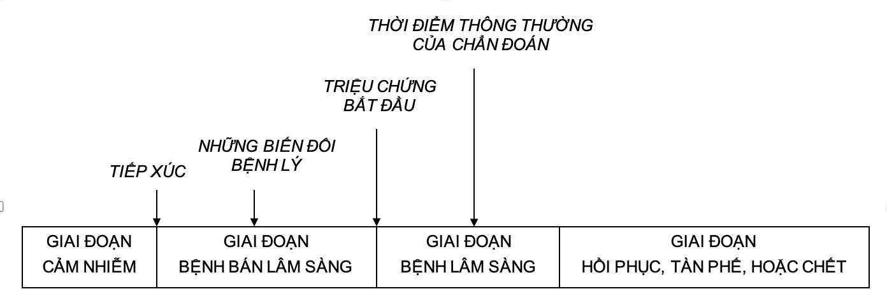
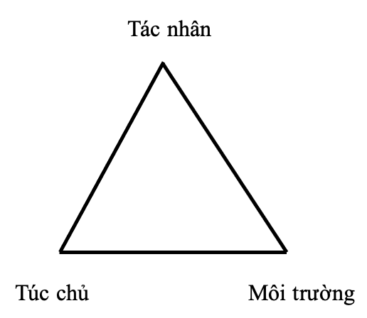
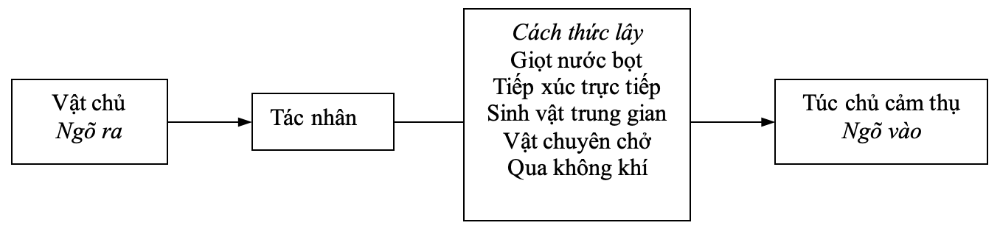
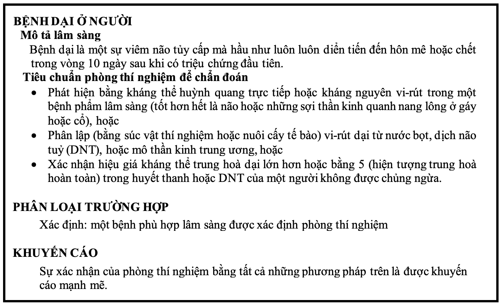

# Bệnh và sự xuất hiện dịch {#dthcb_dich2}

## Mục tiêu bài giảng {-}

Sau khi học xong bài này, học viên có thể:

* Liệt kê được bốn giai đoạn trong quá trình phát triển của một bệnh.
* Liệt kê được ba thành phần của dây chuyền lây.
* Mô tả được những ứng dụng của lịch sử tự nhiên và dây chuyền lây trong lĩnh vực phòng ngừa.
* Liệt kê được các hình thức của một vụ dịch, và cách xác định một trường hợp bệnh.

## Giới Thiệu {-}

Những nghiên cứu y khoa không chỉ tập trung vào bệnh (thí dụ, HIV/AIDS, tăng huyết áp, chấn thương, v.v.), mà còn quan tâm đến những hiện tượng có liên quan đến sự xuất hiện của bệnh (thí dụ, hút thuốc lá, mại dâm, ma túy, v.v.). Bệnh và những hiện tượng liên quan đến bệnh có thể được gọi chung là những hiện tượng sức khỏe, mà trong số đó, những bệnh lây vẫn còn chiếm một phần đáng kể trong mô hình bệnh của nhiều quốc gia trên thế giới. Ngay cả ở những nước đã phát triển, các bệnh lây, do tính chất nghiêm trọng của chúng, vẫn còn là một trọng tâm hoạt động của các cơ quan y tế, do đó, đã được nghiên cứu cặn kẽ và hiểu thấu đáo hơn so với những bệnh không lây. Những nội dung trình bày dưới đây chủ yếu tập trung vào dịch tễ học của những bệnh lây, nhưng cũng sát hợp với những bệnh không lây. 

## LỊCH SỬ TỰ NHIÊN CỦA BỆNH {-}

Lịch sử tự nhiên của bệnh là quá trình diển tiến của một bệnh trên một cá nhân theo thời gian mà không có bất kỳ một sự can thiệp nào của y khoa. Quá trình này bắt đầu với sự tiếp xúc, hoặc tích tụ những yếu tố có khả năng gây bệnh, và nếu không có can thiệp y khoa, quá trình này sẽ kết thúc bằng sự bình phục, tàn phế, hoặc chết của người bệnh. Những giai đoạn trong lịch sử tự nhiên của bệnh được trình bày trong Hình \@ref(fig:hinh0201). Hầu hết các bệnh đều có một lịch sử tự nhiên đặc trưng, nhưng vẫn còn những bệnh mà quá trình diển tiến của chúng chưa được hiểu rõ. Trên một cá nhân, diển tiến thông thường của bệnh có thể bị tạm ngưng ở bất cứ thời điểm nào do những can thiệp của một biện pháp điều trị, hoặc phòng ngừa, hoặc những thay đổi của túc chủ, và rất nhiều những ảnh hưởng khác.

```{r hinh0201, fig.cap="Những giai đoạn trong lịch sử tự nhiên của một bệnh .", echo=FALSE}

```

Lịch sử tự nhiên bắt đầu với một sự tiếp xúc hoặc sự tích tụ của những tác nhân gây bệnh trong một túc chủ cảm thụ, đến một mức đủ để bắt đầu quá trình bệnh. Thời kỳ này là giai đoạn cảm nhiễm. Thí dụ, trong bệnh mạch vành, giai đoạn cảm nhiễm tương ứng với thời kỳ nồng độ cholesterol tăng cao dần trong huyết thanh. Đối với bệnh lây, tác nhân gây bệnh thường là một vi sinh vật. Đối với những bệnh ung thư, đó là những yếu tố sinh ung như những sợi abestos hoặc những thành phần trong khói thuốc lá (đối với ung thư phổi), và những yếu tố kích ung, như estrogen (đối với ung thư nội mạc tử cung). Những tác nhân gây bệnh hoặc những yếu tố tạo sự thuận lợi cho sự xuất hiện của bệnh được gọi chung là những yếu tố nguy cơ. Một số yếu tố nguy cơ có thể thay đổi được, thí dụ, hút thuốc lá là một hành vi nguy cơ có thể bỏ được. Tuy nhiên, một số yếu tố nguy cơ khác là không thể thay đổi, thí dụ, tuổi và giới tính được xác định là những yếu tố có thể tăng nguy cơ mắc một số bệnh, nhưng đây là những yếu tố không thể thay đổi được. 

Thời kỳ của những biến đổi bán lâm sàng, hoặc bệnh lý tiềm ẩn thường theo sau sự tiếp xúc, và kết thúc khi những triệu chứng bệnh bắt đầu. Trong giai đoạn này bệnh chưa có những triệu chứng lâm sàng, nhưng tác nhân gây bệnh đã tạo ra những biến đổi bệnh lý trong cơ thể túc chủ, thí dụ, hiện tượng xơ vữa ở động mạch vành xảy ra trước khi có những triệu chứng hoặc dấu hiệu lâm sàng của bệnh mạch vành tim; hoặc những biến đổi tiền ác tính (đôi khi có thể đã là ác tính) ở mô trong các bệnh ung thư.  Đối với những bệnh lây, thời kỳ này được gọi là thời kỳ ủ bệnh; đối với những bệnh mạn tính, thời kỳ này được gọi là thời kỳ tiềm ẩn. Thời kỳ này có thể ngắn khoảng vài giây trong những hiện tượng mẫn cảm, hoặc phản ứng với độc tố; cho tới khoảng nhiều thập niên đối với một vài bệnh mạn tính. Thời kỳ ủ bệnh là một thời khoảng cụ thể cho từng bệnh, thí dụ, đối với viêm gan A, thời gian này là từ 2 đến 6 tuần. Đối với bệnh bạch cầu liên quan đến tiếp xúc với nổ bom nguyên tử ở Hiroshima, đa số các trường hợp đã có thời kỳ tiềm ẩn là 6-7 năm, và biến thiên trong khoảng từ 2 đến 12 năm. Dù rằng bệnh là tiềm ẩn trong thời kỳ ủ bệnh, nhưng vẫn có thể có một vài biến đổi bệnh lý có thể phát hiện được bằng những phương pháp xét nghiệm. Hầu hết những chương trình sàng lọc cố gắng phát hiện bệnh trong giai đoạn này của lịch sử tự nhiên, vì nếu chẩn đoán được bệnh thì can thiệp sớm có thể hiệu quả hơn là điều trị vào một giai đoạn trễ.

Sự khởi phát của những triệu chứng đánh dấu sự chuyển tiếp từ bệnh bán lâm sàng sang lâm sàng, và hầu hết bệnh thường được chẩn đoán trong giai đoạn bệnh lâm sàng. Ở giai đoạn này, những biến đổi về giải phẩu và chức năng đã đủ để tạo ra những triệu chứng hoặc dấu hiệu thấy được. Diển tiến của giai đoạn bệnh lâm sàng rất thay đổi, ở một số người, quá trình bệnh có thể không bao giờ diển tiến đến bệnh có biểu hiện lâm sàng, tuy nhiên, ở một số người khác, nó có thể kết thúc bằng một phổ rộng của bệnh lâm sàng, từ nhẹ đến nặng, hoặc chết. 

Sau khi qua hết giai đoạn lâm sàng, bệnh sẽ bước sang giai đoạn hồi phục, tàn phế, hoặc chết. Sự tàn phế được hiểu như là sự hạn chế hoạt động của một cá nhân, và khái niệm này chú trọng vào sự mất chức năng hơn là những khiếm khuyết thể chất. Cùng một mức độ tàn phế về thể chất như nhau nhưng mỗi cá nhân có phản ứng khác nhau, do đó, chức năng của cơ quan hay bộ phận đã bị tàn phế sẽ biểu hiện khác nhau. 

### Những Ứng Dụng Của Lịch Sử Tự Nhiên Của Bệnh {-}

#### Phòng ngừa {-}

Những sự hiểu biết về lịch sử tự nhiên của một bệnh cho thấy rằng bệnh có một quá trình diển tiến theo thời gian, và một khi bệnh đã xuất hiện thì thường những thay đổi bệnh lý do nó tạo ra là không thể thay đổi được. Do đó, mục đích của y khoa là, nếu có thể được, luôn luôn phát hiện và can thiệp vào những giai đoạn sớm của lịch sử tự nhiên. Những hoạt động phòng ngừa được xây dựng căn cứ trên khái niệm này. Hiểu một cách đơn giản, phòng ngừa có nghĩa là ngăn chận sự phát triển của bệnh trước khi nó xuất hiện. Tuy nhiên, tùy theo cơ chế tác dụng của biện pháp được áp dụng, phòng ngừa có thể chia làm bốn mức độ khác nhau.

Phòng ngừa bậc 0 ngăn không cho yếu tố nguy cơ xuất hiện, thí dụ, cấm sản xuất thuốc lá trong phòng ngừa ung thư phổi và các bệnh tim mạch. Phòng ngừa bậc 1 giữ cho bệnh hoàn toàn không thể xảy ra, thí dụ, chủng ngừa đối với những bệnh truyền nhiễm. Phòng ngừa bậc 2 nhằm phát hiện bệnh sớm khi chưa có triệu chứng, và khi điều trị sớm có thể ngăn bệnh không khởi phát, thí dụ làm thử nghiệm phết mỏng PAP trong sàng lọc ung thư cổ tử cung. Phòng ngừa bậc 3 gồm những hoạt động ngăn ngừa những hậu quả xấu hơn, hoặc những biến chứng sau khi bệnh đã khởi phát, thí dụ sử dụng thuốc ức chế $\beta$ để giảm nguy cơ tử vong đối với những bệnh nhân đã hồi phục sau nhồi máu cơ tim. Như vậy, theo cơ chế tác dụng, những mức độ phòng ngừa bậc 0, 1, 2, và 3 đã tấn công vào các giai đoạn tương ứng sau đây của lịch sử tự nhiên: trước giai đoạn cảm nhiễm, trong giai đoạn cảm nhiễm, trong giai đoạn bán lâm sàng; và trong 2 giai đoạn lâm sàng, và hồi phục, tàn phế, hoặc chết.

#### Hiện tượng tảng băng trong chẩn đoán lâm sàng {-}

Do phổ lâm sàng thay đổi rộng, những trường hợp được chẩn đoán bởi bác sĩ lâm sàng trong cộng đồng thường chỉ đại diện cho “chóp của tảng băng”. Có nhiều trường hợp còn quá sớm để chẩn đoán hoặc có thể vẫn không có triệu chứng. Thí dụ, theo Tổ Chức Y Tế Thế Giới, đối với sốt xuất huyết dengue, khi có một trường hợp sốc được chẩn đoán trong bệnh viện thì tại khu vực sinh sống của trường hợp đó có khoảng 150 đến 200 người đang mắc bệnh lặng lẽ chưa được phát hiện. Một trường hợp chẩn đoán được tại bệnh viện chính là phần nổi của tảng băng thấy được, nhưng phần chìm rất lớn lại không thể thấy được. Điều thách thức đối với người làm công tác sức khoẻ công cộng là những người nhiễm trùng tiềm tàng hoặc không chẩn đoán được vẫn có thể lây cho những người khác. Những người bị nhiễm nhưng có bệnh bán lâm sàng như vậy được gọi là những người mang trùng. Người mang trùng thường là những người ở trong thời kỳ ủ bệnh hoặc nhiễm trùng tiềm ẩn. Những người bệnh sởi, viêm gan A, và một vài bệnh khác có khả năng lây vào một vài ngày trước khi khởi phát những triệu chứng. Mặt khác, những người mang trùng cũng có thể là những người đã phục hồi từ bệnh lâm sàng của họ, như những người mang vi-rút viêm gan B mạn tính.
 
## DÂY CHUYỀN LÂY {-}

### Tam Giác Dịch Tễ Học {-}

Bệnh thường được mô tả là kết quả của một sự tương tác giữa ba yếu tố túc chủ, tác nhân gây bệnh, và môi trường tạo thuận lợi cho sự phơi nhiễm. Ba yếu tố này được trình bày ở ba đỉnh của một tam giác, được gọi là tam giác hay bộ ba dịch tễ học (Hình \@ref(fig:hinh0202)). Khi sự tương tác xảy ra, túc chủ sẽ trở nên cảm nhiễm với bệnh. 

```{r hinh0202, fig.cap="Sơ đồ của bộ ba, hay tam giác, dịch tễ học.", echo=FALSE}

```

#### Yếu tố tác nhân {-}
Trước đây, từ ‘tác nhân’ ám chỉ một vi sinh vật truyền nhiễm như vi-rút, vi trùng, ký sinh trùng, hoặc các vi sinh vật khác. Khi dịch tễ học được áp dụng cho những bệnh không lây, khái niệm về tác nhân được mở rộng ra để bao gồm những nguyên nhân vật lý và hoá học có thể gây ra bệnh.

#### Yếu tố túc chủ {-}
Những yếu tố túc chủ là những yếu tố nội tại ảnh hưởng đến sự tiếp xúc, tính cảm nhiễm, hoặc đáp ứng của một cá nhân đối với tác nhân gây bệnh. Những yếu tố túc chủ có ảnh hưởng đến khả năng tiếp xúc của một người gồm có tuổi, chủng tộc, giới, tình trạng kinh tế xã hội, và những hành vi (thí dụ, hút thuốc lá, lạm dụng thuốc, kiểu sống, những thực hành tính dục và ngừa thai, tập quán ăn). Những yếu tố túc chủ ảnh hưởng đến tính cảm nhiễm và đáp ứng của một người đối với một tác nhân gồm có tuổi, thành phần di truyền, tình trạng dinh dưỡng và miễn dịch, cấu trúc cơ thể học, sự hiện diện của bệnh hoặc dược phẩm, và bản chất tâm lý.

#### Yếu tố môi trường {-}
Những yếu tố môi trường là những yếu tố bên ngoài ảnh hưởng đến tác nhân và cơ hội tiếp xúc. Chúng bao gồm những yếu tố vật lý (địa dư, thời tiết), môi trường vật lý (một nhà điều dưỡng, bệnh viện); những yếu tố sinh học (côn trùng lan truyền tác nhân); và những yếu tố kinh tế xã hội (sự đông đúc, vệ sinh, và sự sẵn có của những dịch vụ sức khoẻ).

### Dây Chuyền Lây {-}
Cơ chế tạo ra một bệnh trên một túc chủ diễn tiến qua một quá trình được gọi là dây chuyền lây. Sự lây truyền bắt đầu khi tác nhân rời bỏ vật chủ, hoặc túc chủ của nó, qua một ngõ ra, rồi được chuyển tải bằng một cách thức lây nào đó, và xâm nhập qua một ngõ vào thích hợp để gây nhiễm một túc chủ cảm thụ (Hình \@ref(fig:hinh0203)).

```{r hinh0203, fig.cap="Dây chuyền lây.", echo=FALSE}

```

#### Vật chủ {-}
Vật chủ của một tác nhân gây bệnh là nơi cư trú mà trong đó tác nhân sống và phát triển. Một vật chủ có thể là con người, súc vật, hoặc môi trường. Vật chủ không nhất thiết là nguồn mà từ đó tác nhân được chuyển qua túc chủ. Thí dụ, vật chủ của Clostridium botulinum là đất, nhưng nguồn của hầu hết những trường hợp nhiễm botulinum là thực phẩm đóng hộp không kỹ có chứa bào tử C. botulinum.

**Vật chủ người** Có hai loại vật chủ người, đó là những người bệnh có triệu chứng, và những người mang trùng. Một người mang trùng là một người bệnh không có biểu hiện lâm sàng nhưng có khả năng truyền tác nhân sang người khác. Có nhiều loại người mang trùng khác nhau:
- Người mang trùng không triệu chứng, không bao giờ có triệu chứng trong suốt thời gian bị nhiễm.
- Người mang trùng ẩn là những người có khả năng lây truyền trước khi bệnh lâm sàng.
- Người hồi phục mang trùng là những người có khả năng lây truyền sau khi bệnh lâm sàng. 
- Người mang trùng mạn tính là người tiếp tục mang một tác nhân (như vi-rút viêm gan B, hoặc Salmonella typhi) trong một thời gian kéo dài (hàng tháng hoặc hàng năm) theo sau lần nhiễm trùng ban đầu. 
Khả năng truyền bệnh của những người mang trùng là đáng kể vì họ không nhận thức được rằng họ bị nhiễm cho nên không có biện pháp phòng ngừa đặc biệt để ngăn lây lan. Ngược lại, những người có triệu chứng thường ít có khả năng lây rộng rãi vì khi có triệu chứng, họ sẽ có nhiều khả năng được chẩn đoán và điều trị, do đó giảm thiểu cơ hội tiếp xúc với những người khác.

**Vật chủ súc vật** Những bệnh của động vật (thí dụ, bệnh lở mồm long móng ở bò, heo; bệnh than ở cừu; dịch hạch ở động vật gặm nhấm; giun lươn ở lợn; bệnh dại ở chó, mèo, v.v.) có thể lây từ súc vật sang người trong một số điều kiện. Trong những bệnh này, súc vật là vật chủ, và người là vật chủ tình cờ. Một nhóm khác của những bệnh với vật chủ súc vật là những bệnh gây ra do vi-rút được truyền do côn trùng (thí dụ, viêm não St. Louis lây truyền do muỗi), hoặc gây ra do ký sinh trùng (thí dụ, sốt rét lây truyền do muỗi, và bệnh sán máng lây truyền do ốc nước ngọt).

**Vật chủ môi trường** Thực vật, đất, và nước trong môi trường cũng là những vật chủ đối với một số tác nhân lây, thí dụ, vi nấm (sống và nhân lên trong đất), trực khuẩn Legionnaire (trong những hồ chứa nước từ những tháp làm lạnh, hoặc những máy cô đặc sinh hơi tạo ra).

#### Ngõ ra {-}
Ngõ ra là con đường mà qua đó một tác nhân rời túc chủ nguồn. Ngõ ra thường tương ứng với điểm mà tác nhân khu trú, thí dụ, trực khuẩn lao và vi-rút cúm rời đường hô hấp; sán máng qua nước tiểu; vi khuẩn tả trong phân, những con cái ghẻ Sarcoptes scabiei trong vết thương ở da; và vi-rút đường ruột 70, một tác nhân của viêm kết mạc xuất huyết, trong những chất tiết của kết mạc. Một vài những tác nhân qua đường máu có thể đi ra bằng cách xuyên qua nhau (bệnh ban Đức, giang mai, bệnh nhiễm toxoplasma), trong khi những loại khác đi ra bằng đường da, cụ thể là qua vết cắt hoặc kim (viêm gan B), hoặc qua những động vật tiết túc hút máu (sốt rét).

#### Những cách thức lây {-}
Sau khi một tác nhân rời khỏi vật chủ tự nhiên của nó, nó có thể được truyền qua một túc chủ cảm thụ bằng nhiều cách. Những cách thức lây có thể được xếp loại là trực tiếp hoặc gián tiếp; hoặc ngang hoặc thẳng (Bảng \@ref(tab:bang0201)). 

```{r bang0201, echo = FALSE}
data.frame(
  method = c("Trực tiếp", "", "Gián tiếp", rep("", 4), "Ngang", rep("", 2), "Thẳng"),
  example = c("Tiếp xúc trực tiếp", "Sự lan ra của giọt nước bọt",
              "Qua không khí", "Qua vật chuyên chở", "Qua sinh vật trung gian",
              "  Cơ học", "  Sinh học",
              "Qua vật chuyên chở", "Tiếp xúc trực tiếp người-người", "Qua sinh vật trung gian",
              "Mẹ truyền sang con qua nhau")
) %>%
  gt(caption = "Những cách thức lây") %>%
  cols_label(method = "Cách thức lây",
             example = "")
```

Trong sự lây truyền trực tiếp, tác nhân được chuyển giao tức khắc từ một vật chủ sang một túc chủ cảm thụ do tiếp xúc trực tiếp (qua hôn, tiếp xúc da-da, giao hợp, tiếp xúc với đất hoặc thực vật có chứa những sinh vật lây), hoặc qua trung gian của giọt nước bọt (trong một khoảng cách ngắn trước khi giọt nước bọt rơi xuống đất).

Trong sự lây truyền gián tiếp, một tác nhân được chuyên chở từ một vật chủ tới một túc chủ cảm thụ bởi:

- Những hạt treo trong không khí.

- Những sinh vật trung gian, là những trung gian có sự sống, thí dụ, những động vật tiết túc, như ruồi chuyên chở Shigella trên những phần phụ của nó. Trong sự chuyên chở cơ học, tác nhân không nhân lên, hoặc không trải qua những biến đổi sinh lý bên trong sinh vật trung gian. Khi tác nhân trải qua những biến đổi bên trong sinh vật trung gian, thì sinh vật trung gian sẽ là một vật chuyên chở sinh học, và được xem là một túc chủ trung gian.

- Những vật chuyên chở, là những trung gian không có sự sống, thí dụ như thức ăn, nước, những sản phẩm sinh học (máu), những đồ dùng (khăn tay, chăn màn, dao phẩu thuật, v.v.). 

#### Ngõ vào {-}
Tác nhân gây bệnh xâm nhập vào túc chủ cảm thụ qua một ngõ vào, và ngõ vào để xâm nhập một túc chủ mới thường giống với ngõ ra để rời bỏ túc chủ nguồn. Thí dụ, vi-rút cúm phải rời đường hô hấp của túc chủ nguồn và xâm nhập đường hô hấp của túc chủ mới. Đường lây truyền phổ biến của nhiều tác nhân gây bệnh đường ruột là đường “phân-miệng”, vì những sinh vật được thải ra trong phân, được chuyên chở bởi những bàn tay bẩn, và rồi chuyển sang một vật chuyên chở (như thức ăn, nước, hoặc dụng cụ nấu nướng) để vào miệng của một túc chủ mới. Những ngõ vào khác gồm có da (bệnh giun móc), màng nhày (giang mai, mắt hột), và máu (viêm gan B).

#### Túc chủ {-}
Mắc xích cuối cùng trong dây chuyền lây là một túc chủ cảm thụ. Tính cảm thụ của một túc chủ tùy thuộc vào những yếu tố di truyền, tính miễn dịch thụ đắc đặc hiệu, và những yếu tố chung khác. Các yếu tố chung chống lại sự nhiễm bệnh gồm da, màng nhày, tính axít của bao tử, tiêm mao trong đường hô hấp, phản xạ ho, những đáp ứng miễn dịch không đặc hiệu có thể thay đổi khả năng của một cá nhân để kháng lại sự nhiễm hoặc hạn chế tính sinh bệnh. Những yếu tố chung có thể tăng tính cảm thụ là suy dinh dưỡng, nghiện rượu, và bệnh hoặc điều trị làm hỏng đáp ứng miễn dich không đặc hiệu.

Tính miễn dịch thụ đắc đặc hiệu có liên quan đến những kháng thể bảo vệ trực tiếp chống lại một tác nhân cụ thể. Một cá nhân có được kháng thể bảo vệ bằng hai cách: 

- Miễn dịch chủ động: tự phát triển kháng thể qua đáp ứng với nhiễm trùng, vắc-xin, hoặc giả độc tố. 

- Miễn dịch thụ động: thụ đắc những kháng thể từ mẹ trước khi sanh, qua nhau, hoặc do được tiêm kháng độc tố hoặc gờ-lô-bu-lin miễn dịch.

Dây chuyền lây có thể bị gián đoạn khi một tác nhân không tìm được một túc chủ cảm thụ. Điều này có thể xảy ra khi trong quần thể có một tỉ lệ cao những cá thể đề kháng lại với tác nhân. Khả năng lan truyền của mầm bệnh ở nhóm người này là không cao mà tập trung vào một số ít người cảm nhiễm. Khái niệm này được gọi là tính miễn dịch quần thể.

Mức độ cần có của tính miễn dịch quần thể để ngăn chận, hoặc triệt tiêu một trận bùng phát dịch là thay đổi tùy theo bệnh. Theo lý thuyết, tính miễn dịch quần thể có nghiã là không phải người nào ở trong cộng đồng cũng phải đề kháng (miễn dịch) để ngừa sự lan truyền bệnh và sự xảy ra dịch. Thực tế đã cho thấy, tính miễn dịch quần thể đã không ngăn được những trận bùng phát bệnh sởi và ban Đức trong những dân số có mức miễn dịch cao khoảng 85 đến 90%. Một vấn đề là, trong những dân số miễn dịch cao, con số tương đối ít của những người cảm nhiễm thường quần tụ thành những nhóm nhỏ, do có những đặc tính riêng về văn hoá và kinh tế xã hội. Nếu tác nhân được đưa vào một trong những nhóm nhỏ này, một trận bùng phát dịch có thể xảy ra.

### Những Ứng Dụng Của Dây Chuyền Lây {-}

Nếu biết được một tác nhân đi ra và xâm nhập một túc chủ như thế nào, và những cách lây truyền của nó là gì, chúng ta có thể xác định được những biện pháp kiểm soát thích hợp. Nói chung, những biện pháp kiểm soát nên nhắm vào mắc xích nào trong dây chuyền lây là nhạy cảm nhất với sự can thiệp. Đối với một số bệnh, sự can thiệp thích hợp nhất có thể hướng vào việc kiểm soát hoặc loại bỏ tác nhân ngay từ nguồn. Trong bệnh viện, những bệnh nhân có thể được điều trị hoặc/và cách ly, với những cảnh giác “cẩn thận lây đường ruột”, “cẩn thận lây hô hấp” “cẩn thận chung”, và những thứ tương tự cho những lối ra khác nhau. Trong cộng đồng, đất có thể được giải nhiễm hoặc phủ lại để ngăn sự thoát ra của tác nhân.

Đôi khi chúng ta hướng những can thiệp vào cách thức lây. Đối với sự lây truyền trực tiếp, chúng ta có thể cho điều trị những túc chủ nguồn, hoặc giáo dục túc chủ nguồn tránh loại tiếp xúc đặc thù có liên quan đến sự lây truyền. Trong bệnh viện, vì hầu hết những sự nhiễm trùng được truyền đi qua tiếp xúc trực tiếp, rửa tay là cách quan trọng nhất để ngăn bệnh lan tràn. Đối với kiểu lây truyền qua vật chuyên chở, có thể giải nhiễm hoặc loại bỏ vật chuyên chở. Đối với kiểu lây phân-miệng, có thể giảm nguy cơ nhiễm trong tương lai bằng cách thanh khiết lại môi trường, và giáo dục người dân làm tốt vệ sinh cá nhân. Đối với kiểu lây qua không khí, có thể thay đổi sự thông khí hoặc áp suất không khí, và lọc hoặc xử lý không khí. Đối với kiểu lây qua sinh vật trung gian, chúng ta thường kiểm soát bằng cách giảm thiểu hoặc thanh toán quần thể côn trùng trung gian.

Cuối cùng, chúng ta có thể áp dụng những biện pháp bảo vệ ngõ vào của một túc chủ có khả năng cảm thụ, hoặc giảm tính cảm thụ của một túc chủ có khả năng. Thí dụ, bao tay và khẩu trang của một nha sĩ là nhằm bảo vệ nha sĩ đối với nước bọt, những chất tiết, và máu của bệnh nhân, cũng như bảo vệ bệnh nhân đối với nha sĩ. Kháng sinh phòng ngừa và tiêm chủng là những chiến lược để cải thiện sự bảo vệ của một túc chủ cảm thụ.

## SỰ XUẤT HIỆN BỆNH THÀNH DỊCH {-}

### Mức Độ Bệnh {-}

Con số những trường hợp bệnh hiện diện thường xuyên trong cộng đồng là mức nền của một bệnh. Mức này không nhất thiết phải là mức mong đợi, mà trong thực tế phải bằng không. Đúng ra nó là mức quan sát được. Về mặt lý thuyết, nếu không có sự can thiệp nào xảy ra, và nếu mức độ là đủ thấp để không làm giảm tổng số người cảm thụ, bệnh sẽ tiếp tục xuất hiện mãi mãi ở mức nền. Do đó, mức nền thường được coi là mức mong đợi của bệnh. Thí dụ, trong 4 năm qua, con số những trường hợp bại liệt báo cáo là từ 5 đến 9. Do đó, giả sử rằng không có thay đổi trong dân số, chúng ta sẽ hy vọng thấy vào khoảng 7 trường hợp được báo cáo trong năm tới.

Những bệnh khác nhau, trong những cộng đồng khác nhau, sẽ có những mô hình khác nhau của sự xuất hiện mong đợi: 1) một sự xuất hiện có mô hình bất thường, với những trường hợp lẻ tẻ xảy ra vào những khoảng thời gian bất thường được gọi là ca lẻ tẻ; 2) một mức độ xuất hiện duy trì ở một mức bệnh thấp cho tới trung bình được xem là mức lưu hành; 3) một sự xuất hiện duy trì ở mức độ cao được gọi là mức lưu hành cao; 4) thỉnh thoảng, mức bệnh vượt hơn mức mong đợi, trong một vùng vào một thời điểm cụ thể, nó được gọi là một vụ dịch. Những nhân viên sức khoẻ cộng đồng thường dùng từ bùng phát, cùng một nghiã với dịch, nhưng từ bùng phát ít làm kinh động công chúng; 5) khi một trận dịch lan ra một vài quốc gia hoặc đại lục, ảnh hưởng một số lớn người, nó được gọi là đại dịch.

Một trận dịch có thể xảy ra khi tác nhân và túc chủ cảm thụ hiện diện đủ số, và tác nhân có thể được chuyển tải một cách có hiệu quả từ nguồn đến những túc chủ cảm thụ. Cụ thể hơn, một trận dịch có thể sinh ra trong những điều kiện sau đây:

* một sự gia tăng tức thời về số lượng hoặc độc lực của tác nhân
* tác nhân vừa được đưa vào một vùng mà từ trước giờ nó không có
* cách thức lây mạnh hơn, do đó, nhiều túc chủ cảm thụ bị tiếp xúc hơn
* một vài thay đổi về tính cảm thụ trong đáp ứng của túc chủ với tác nhân
* những yếu tố làm tăng sự tiếp xúc của túc chủ, hoặc gây sự xâm nhập qua những ngõ vào mới

### Các Mô Hình Dịch {-}

Đôi khi chúng ta xếp loại những vụ dịch tuỳ theo chúng lan tràn như thế nào trong dân số. Một trận dịch nguồn chung là một trận dịch mà trong đó tất cả các trường hợp bệnh đều tiếp xúc với một tác nhân chung. Nếu tiếp xúc trong một khoảng thời gian tương đối ngắn, mỗi trường hợp đều phát bệnh vào cuối một thời kỳ ủ bệnh, thì trận dịch nguồn chung lại được xếp loại là một trận dịch nguồn điểm. Trận dịch của những trường hợp bệnh bạch cầu sau vụ nổ bom nguyên tử ở Hiroshima có một nguồn điểm tiếp xúc. Trong một vài trận dịch nguồn chung, những trường hợp có thể được tiếp xúc trong một khoảng thời gian nhiều ngày, nhiều tuần, hoặc lâu hơn, với sự tiếp xúc liên tục hoặc không liên tục.
Một trận dịch không có một nguồn chung, nhưng lan dần từ người này qua người khác, được gọi là một trận dịch nhân rộng (dịch tản phát). Thường thì sự lây truyền là do tiếp xúc trực tiếp người-người, như với bệnh giang mai. Sự lây truyền có thể sinh ra do vật chuyên chở, như sự lây truyền viêm gan B hoặc HIV do dùng chung kim chích, hoặc sinh ra do sinh vật trung gian, như sự lây truyền của sốt vàng do muỗi.

Một số trận dịch có thể có những đặc tính của cả dịch nguồn chung và dịch nhân rộng. Mô hình của một trận dịch nguồn chung theo sau bởi một sự lan truyền thứ phát người-người không phải là hiếm. Những kiểu này được gọi là dịch hỗn hợp. Thí dụ, trong một trận dịch nguồn chung của lỵ trực trùng xảy ra ở một nhóm 3.000 phụ nữ tham gia một nhạc hội, nhiều người phát sinh triệu chứng sau khi trở về nhà. Trong một vài tuần sau, người ta phát hiện những trường hợp lỵ lan tràn theo kiểu lây người-người từ những người tham dự nhạc hội.

Cuối cùng, một số trận dịch không là nguồn chung theo nghiã thông thường, cũng không là nhân rộng kiểu người-người. Những trận dịch bệnh truyền từ động vật và bệnh truyền do sinh vật trung gian xuất hiện có thể là do tỉ suất nhiễm toàn bộ đầy đủ của những loài túc chủ, sự hiện diện đủ của những sinh vật trung gian, và có đủ tương tác người-sinh vật trung gian. Những thí dụ gồm có bệnh Lyme ảnh hưởng một vài tiểu bang đông bắc Hoa kỳ vào cuối những năm 1980, và trận dịch lớn bệnh viêm não St. Louis ở Florida năm 1990.

### Định Nghĩa Trường Hợp {-}

Một định nghiã trường hợp là một bộ những tiêu chí để xác định rằng một người là có một bệnh nào đó, hoặc một tình trạng có liên quan đến sức khoẻ. Với một định nghiã trường hợp chuẩn chúng ta bảo đảm rằng các trường hợp đều được chẩn đoán theo một cách giống nhau, bất kể nó xảy ra ở đâu, khi nào, hoặc được ai xác định. Từ đó, chúng ta có thể so sánh số những trường hợp bệnh xảy ra vào một thời gian hoặc nơi chốn này với số xảy ra vào một thời gian và ở một nơi khác. Với một định nghiã trường hợp chuẩn, khi tìm thấy sự khác biệt trong sự xuất hiện bệnh, chúng ta biết rằng có khả năng đó là sự khác biệt thật sự hơn là do các trường hợp đã được chẩn đoán khác nhau.

Một định nghiã trường hợp gồm có những tiêu chí lâm sàng và, đôi khi, những giới hạn về thời gian, nơi chốn, và người. Những tiêu chí lâm sàng thường bao gồm những thử nghiệm xác định trong phòng xét nghiệm, nếu có, hoặc nhóm những triệu chứng (những điều phàn nàn chủ quan), dấu hiệu (những phát hiện lâm sàng khách quan), và những phát hiện khác. Một thí dụ về định nghĩa trường hợp được trình bày trong Hình \@ref(fig:hinh0204).

```{r hinh0204, fig.cap="Định nghĩa trường hợp của bệnh dại.", echo=FALSE}

```

Một định nghiã trường hợp không có nghĩa giúp chúng ta xác định một cách đơn giản là có hoặc không bệnh. Tùy theo trường hợp mà chúng ta quan tâm thoả được bao nhiêu trong số những tiêu chí đặt ra mà chúng ta có thể xếp trường hợp đó vào những nhóm chẩn đoán khác nhau. Thí dụ, trong một trận dịch sởi, chúng ta có thể xếp một người có sốt và phát ban là một trường hợp nghi ngờ, có thể, hoặc xác định là sởi, tuỳ theo sự hiện diện của những bằng chứng nào có được về sởi. Trong những tình huống khác, chúng ta tạm thời xếp một trường hợp là ‘nghi ngờ’, hoặc ‘có khả năng’ cho đến khi có kết quả của phòng xét nghiệm; và tùy theo kết quả đó, chúng ta sẽ xếp lại một trường hợp hoặc là xác định hoặc là ‘không phải là một trường hợp’. Giữa một trận dịch lớn của một bệnh biết rõ nguyên nhân, chúng ta có thể xếp luôn một số trường hợp là nghi ngờ hoặc có thể, vì với mỗi bệnh nhân có hình ảnh lâm sàng hoặc tiền sử tiếp xúc phù hợp (thí dụ như đậu mùa) thì tiến hành xét nghiệm là thừa hoặc không cần thiết. Những định nghiã trường hợp không chỉ nên dựa vào kết quả nuôi cấy phòng xét nghiệm, vì đôi khi sinh vật có hiện diện nhưng không gây bệnh.

Những định nghiã trường hợp có thể được thay đổi theo mục đích. Thí dụ, những nhân viên y tế cần biết càng sớm càng tốt nếu có ai đó có những triệu chứng của dịch hạch, hoặc bệnh nhiễm độc tố do thức ăn để có thể lập kế hoạch cho những hành động cần làm. Đối với những bệnh lây hiếm nhưng nghiêm trọng, khi cần phải xác định mọi trường hợp có thể, những nhân viên y tế dùng một định nghĩa trường hợp lỏng lẻo, hoặc có độ nhạy cao. Ngược lại, những nhà giám sát nguyên nhân của một trận dịch lại  muốn chắc chắn rằng bất cứ ai được bao gồm trong sự giám sát là thật sự có bệnh, do đó, một định nghĩa trường hợp chặt chẽ, hoặc có độ đặc hiệu cao sẽ được chuộng hơn. Thí dụ, trong một trận dịch của Salmonella agona, những nhà giám sát sẽ có nhiều khả năng để xác định nguồn lây nếu họ chỉ bao gồm những người được xác nhận đã bị nhiễm khuẩn. Điều này sẽ cung cấp những thông tin giá trị hơn là bao gồm bất cứ ai có tiêu chảy cấp, vì một số người có thể đã bị tiêu chảy vì nguyên nhân khác. Điều bất lợi duy nhất của một định nghiã trường hợp chặt chẽ là đưa đến một ước lượng non.


## Tài liệu tham khảo đề nghị đọc thêm {-}

U.S. Department of Health and Human Services. Public Health Services. Centers for Diseases Control and Prevention. Principles of Epidemiology. An Introduction to Applied Epidemiology and Biostatistics. Atlanta 12-1992. Lesson 1: Introduction to Epidemiology, pp. 1-72.


## Bài tập {-}

1. Dưới đây là định nghĩa chính thức của hội chứng Kawasaki được khuyến cáo bởi Trung tâm Phòng chống và Kiểm soát bệnh tật.

**Hội chứng Kawasaki**

**_Định nghĩa trường hợp lâm sàng_**

Một trường hợp bệnh có sốt từ 5 ngày trở lên, với ít nhất 4 trong 5 biểu hiện lâm sàng dưới đây, và không có bất kỳ điều gì hợp lý hơn.

-	Nhiễm trùng kết mạc mắt 2 bên

-	Những biến đổi trong miệng (ban đỏ ở môi hoẵc hầu họng, lưỡi phồng đỏ, hoặc nứt môi)

-	Những biến đổi ngoại biên ở chi (phù, ban đỏ, tróc da toàn bộ hoặc periungual)

-	Phát ban

-	Hạch cổ (ít nhất một hạch có đường kính bằng hoặc lớn hơn 1,5cm)

**_Tiêu chí chẩn đoán phòng thí nghiệm_**
Không

**_Xếp loại trường hợp_**

Xác định: một trường hợp bệnh đáp ứng những định nghĩa lâm sàng

**_Khuyến cáo_**

Sau khi truyền gamma globulin có thể hết sốt, do đó sốt có thể ít hơn 5 ngày, nhưng định nghĩa lâm sàng vẫn có thể được thỏa.

Hãy thảo luận định nghĩa trên nhằm những mục đích dưới đây:

    a. Chẩn đoán và điều trị bệnh

    b. Theo dõi những ca bệnh xuất hiện để ghi nhận về mặt y tế công cộng

    c. Thực hiện nghiên cứu để xác định nguyên nhân của bệnh


2. Định nghĩa trường hợp dưới đây được áp dụng cho một vụ dịch trichinosis. Dựa vào định nghĩa trên, hãy xếp loại các trường hợp trong bảng 2.2 dưới đây. Tất cả cư ngụ tại thành phố A., phát bệnh cấp tính trong tháng Mười một.

**_Tiêu chí lâm sàng_**

Ca xác định: có triệu chứng, dấu hiệu, và xác nhận của phòng thí nghiệm.

Ca có khả năng: khởi phát đột ngột với ít nhất 3 trong 4 biểu hiện sau: sốt, đau cơ, phù mặt, tế bào bạch cầu ái toan máu trên 500/mm3 

Ca có thể: khởi phát đột ngột với ít nhất 2 trong 4 biểu hiện, và thêm chẩn đoán của bác sĩ là trichinosis

Ca nghi ngờ: tăng tế bào bạch cầu ái toan không giải thích được
Không phải: không đáp ứng được bất kỳ định nghĩa nào của ca xác định, có khả năng, có thể, hoặc nghi ngờ

**_Thời gian_**

Khởi phát sau ngày 26 tháng Mười, 1991

**_Nơi chốn_**

Thành phố A.

**_Người_**

Bất kể

```{r bang0202, echo = FALSE}
data.frame(
  ten = c("A", "B", "C", "D", "E"),
  dauco = rep("Có", 5),
  sot = c(rep("Có", 3), rep("Không", 2)),
  phumat = c("Không", "Có", rep("Không", 3)),
  bc = c("495", "Chưa có", "1,100", "2,050", "600"),
  chandoan = c("Trichinosis", "Trichinosis?", "Trichinosis", "EMS?", "Trichinosis"),
  xacnhan = c("Đúng", rep("Chưa có", 4)),
  xeploai = rep("", 5)
) %>%
  gt(caption = "Dữ kiện của các trường hợp.") %>%
  cols_label(ten = "Tên",
             dauco = "Đau cơ",
             sot = "Sốt",
             phumat = "Phù mặt",
             bc = "Bạch cầu ái toan",
             chandoan = "Chẩn đoán của bác sĩ",
             xacnhan = "Xác nhận phòng thí nghiệm",
             xeploai = "Xếp loại")
```
