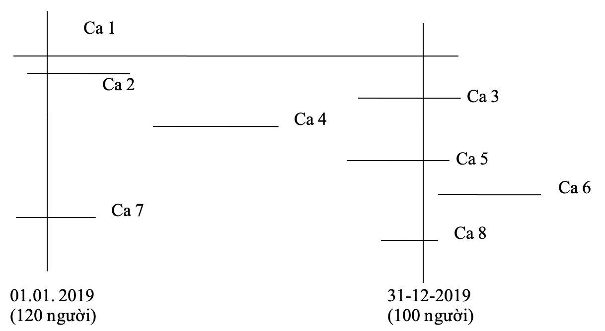
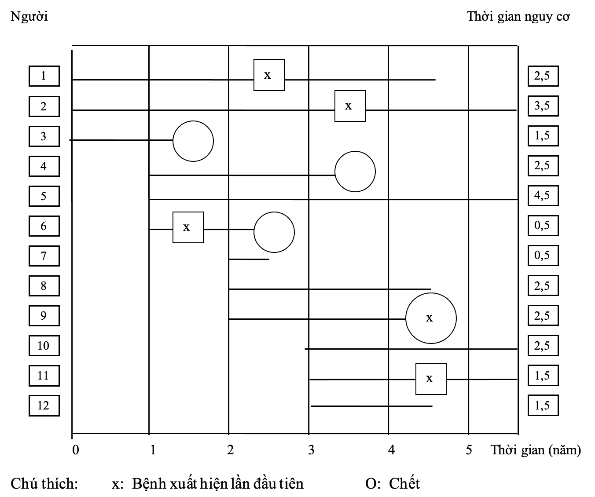

# Số Hiện Mắc và Số Mới Mắc {#dthcb_hienmac_moimac}

## Mục tiêu bài giảng {-}
Sau khi học xong bài này, học viên có thể

* Định nghĩa và phân biệt được ý nghĩa của số mới mắc (nguy cơ, tỉ suất), và số hiện mắc.

* Lựa chọn và tính toán được những số đo lường bệnh trạng thích hợp cho một nghiên cứu dịch tễ học.

* Lý giải được ý nghĩa của những số đo lường bệnh trạng trong một nghiên cứu dịch tễ học. 

## Giới thiệu {-}

Để biết được tính phổ biến của một bệnh trong một cộng đồng, thường chúng ta hay đếm xem trong tất cả những cá nhân của cộng đồng đó có bao nhiêu người mắc bệnh. Đó là những số liệu rất thô, và thường rất khó được sử dụng để so sánh tình hình bệnh tật của những cộng đồng khác nhau. Vì mỗi cộng đồng có một dân số khác nhau, và hơn nữa thời gian mà chúng ta theo dõi -để đếm sự xuất hiện của những trường hợp bệnh- tại mỗi cộng đồng cũng là khác nhau. Do đó, trong việc đo lường tính phổ biến của bệnh tật, khi đếm sự xuất hiện của bệnh, hai yếu tố mà chúng ta cần để ý đến là dân số mà chúng ta đang quan tâm là bao nhiêu, và thời gian mà chúng ta theo dõi nó là bao lâu. 

## BA LOẠI SỐ ĐO LƯỜNG TRONG DỊCH TỄ HỌC {-}

**Những số đo lường về tần số bệnh** dùng để đo lường sự xuất hiện của bệnh, tật, hoặc chết trong một dân số người. Đây là những số đo lường cơ bản dùng trong những điều tra mô tả hoặc tìm nguyên nhân. Những số đo thường dùng là số hiện mắc và số mới mắc.

**Những số đo lường về sự kết hợp** dùng để lượng giá độ mạnh của một sự kết hợp thống kê giữa một yếu tố nguyên nhân và một bệnh nào đó. Bệnh là kết cuộc hoặc điểm cuối cùng của một điều mà chúng ta quan tâm.

**Những số đo lường về tác động** phản ánh sự góp phần của những yếu tố nguyên nhân vào tần số bệnh trong một dân số cụ thể. Những số đo này hữu dụng trong lãnh vực y tế công cộng để tiên đoán hiệu quả và hiệu năng của một biện pháp điều trị hoặc can thiệp trong một dân số cụ thể. Thí dụ chúng ta muốn biết số hoặc tỉ lệ những trường hợp bệnh mạch vành ở đàn bà người Hoa tại Quận 5, TP. Hồ Chí Minh là do tăng huyết áp (trong khi bệnh mạch vành có thể được gây ra do nhiều nguyên nhân khác ngoài tăng huyết áp); hoặc sự giảm tỉ lệ bệnh sởi ở trẻ em thành phố Hồ Chí Minh là do tác động của một vắc-xin ngừa sởi trong chương trình tiêm chủng (trong khi số mắc sởi có thể giảm do nhiều yếu tố khác, chứ không chỉ nhờ vào việc chủng ngừa sởi). Những số đo tác động là kết hợp của những số đo tần số và số đo kết hợp.

### Những Số Đo Lường Về Tần Số Bệnh {-}

#### Những định nghĩa cần thiết {-}

**Tần số** là số lần xuất hiện của một hiện tượng. Thí dụ, số bệnh nhân đến khám tại Phòng khám đa khoa Đại học Y Dược TP. Hồ Chí Minh trong ngày 24-02-1997 là 150 người, trong đó có 50 người bị viêm loét dạ dày-tá tràng, 35 người bị tăng huyết áp, 40 người bệnh mắt, 25 người bệnh da. Tần số viêm loét dạ dày-tá tràng trong số những bệnh nhân đến khám tại Phòng khám đa khoa Đại học Y Dược TP. Hồ Chí Minh trong ngày 24-02-2019 là 50.

**Tỉ số** là một phân số mà trong đó tử số không bao gồm trong mẫu số. Thí dụ, trong 50 bệnh nhân đến khám tại phòng khám vào ngày 24-02-2019 vì viêm loét dạ dày-tá tràng có 20 bệnh nhân nam, và 30 bệnh nhân nữ. Tỉ số nam/nữ ở những bệnh nhân viêm loét dạ dày-tá tràng đến phòng khám trong ngày 24-02-2019 là 20/30 hay 2/3. 

Có hai loại tỉ số:

1. Tỉ số có đơn vị. Thí dụ số giường bệnh trên 100.000 dân tại huyện X. là 20 giường bệnh/100.000 dân.

2. Tỉ số không có đơn vị, là thương số của hai tỉ lệ, hoặc hai tỉ số. Thí dụ, tỉ số nam/nữ là 2/3. 

**Tỉ lệ** là một phân số mà trong đó tử số được bao gồm trong mẫu số. Tỉ lệ thường được diển tả ở dạng phần trăm. Thí dụ: Trong 50 bệnh nhân bị viêm loét dạ dày-tá tràng đến khám tại phòng khám vào ngày 24-02-2019 có 20 bệnh nhân là đàn ông, và 30 bệnh nhân là đàn bà. Tỉ lệ bệnh nhân nam bị viêm loét dạ dày-tá tràng đến khám tại phòng khám trong ngày 24-02-2019 là 20/50 = 0,40 hay là 40%. Tỉ lệ không có đơn vị và có giá trị từ 0 đến 1.

**Tỉ suất**, một tỉ suất thực sự là một sự thay đổi tức thời của một lượng trên một đơn vị thay đổi của một lượng khác, và lượng khác này thường là thời gian. Thí dụ: tốc  độ của một chiếc xe vào một thời điểm là một tỉ suất, được diển tả bằng khoảng cách trên một đơn vị thời gían. Tỉ suất, do đó, thực sự hàm chứa một khả năng thay đổi.

Tỉ suất dùng trong dịch tễ học là “tỉ suất trung bình”, vì thực sự rất khó để đo lường được sự thay đổi tức thời của bệnh trong dân số. Một thí dụ về tỉ suất trung bình là vận tốc trong một khoảng thời gian di chuyển, được tính bằng cách chia tổng chiều dài đi được cho tổng thời gian đã đi. Tỉ suất có đơn vị, và không có giới hạn (theo lý thuyết, tỉ suất có thể có giá trị vô tận). Hai số đo sự xuất hiện của bệnh (hoặc nói chung, của một hiện tượng sức khỏe) thường dùng là số hiện mắc và số mới mắc, được thể hiện ở dạng tỉ suất.

Hai số đo lường bệnh trạng được sử dụng trong dịch tễ học là số mới mắc và số hiện mắc. Số mới mắc là con số những trường hợp bệnh mới trong một khoảng thời gian. Số hiện mắc là con số những trường hợp bệnh hiện có vào một thời điểm. Hai con số này diển tả hai tình trạng khác nhau của bệnh, “trong một tình trạng không có bệnh”, và “trong một tình trạng có bệnh”. Số mới mắc mô tả một sự chuyển đổi từ tình trạng không có bệnh sang tình trạng có bệnh. Số hiện mắc mô tả tỉ lệ bệnh hiện đang có vào một thời điểm cụ thể. Một cách đơn giản, số mới mắc nói lên sự xuất hiện bệnh, còn số hiện mắc diển tả trạng thái của bệnh. Công thức tổng quát như sau:

\begin{equation}
\text{Tỉ lệ hiện mắc} = \frac{\text{Số những ca bệnh hiện có}}{\text{Toàn bộ dân số}} \text{vào một thời điểm}

(\#eq:tilehienmac)
\end{equation}

\begin{equation}
\text{Tỉ suất mới mắc} = \frac{\text{Số những ca bệnh mới}}{\text{Dân số nguy cơ}} \text{trong một thời khoảng}

(\#eq:tisuatmoimac)
\end{equation}

## SỐ HIỆN MẮC {-}

Số hiện mắc cho chúng ta biết được trạng thái hay tính phổ biến của bệnh vào một thời điểm cụ thể. Nói một cách khác, số hiện mắc là tỉ lệ dân số hiện đang có bệnh vào một thời điểm. Số hiện mắc không có đơn vị, và có giá trị từ 0 đến 1. Có 2 loại số hiện mắc.

### Số Hiện Mắc Thời Điểm {-}

Số hiện mắc thời điểm, thường được dùng dưới dạng xác suất, là xác suất để một cá nhân trong một dân số có bệnh vào một thời điểm nào đó. Số hiện mắc thời điểm được tính theo công thức \@ref(eq:sohienmacthoidiem). Xem thí dụ minh họa trong Hình \@ref(fig:hinh0301).

\begin{equation}
\text{Số hiện mắc thời điểm} = \frac{\text{Số người bệnh hiện có vào một thời điểm cụ thể}}{\text{Dân số cùng thời điểm}}

(\#eq:sohienmacthoidiem)
\end{equation}

```{r hinh0301, fig.cap="Số những ca bệnh bắt đầu, phát triển, và kết thúc trong thời gian từ 01-01-2019 đến 31-12-2019.", echo=FALSE}

```

Hình \@ref(fig:hinh0301) trình bày sự xuất hiện của những ca bệnh trong một cộng đồng với dân số tương ứng vào ngày 01-01-2019 và 31-12-2019 là 120 người và 100 người. Những ca số 1, 2, và 6 có thời điểm khởi bệnh trước năm 2019. Những ca số 3, 4, 5, 8 có thời điểm khởi bệnh trong năm 2019. Ca số 6 phát bệnh sau ngày 31-12-2019. Những ca bệnh số 1, 3, 5, 8 còn kéo dài đến sau ngày 31-12-1996. Những ca bệnh số 2, 4, 7 hoặc đã khỏi bệnh, hoặc đã chết trong năm 2019. Khi tính số hiện mắc vào thời điểm 01-01-1996, những ca bệnh số 1, 2, và 7 sẽ được tính. Vào thời điểm 31-12-2019, số hiện mắc sẽ gồm những ca số 1, 3, 5, và 8. Số hiện mắc thời điểm 31-12-2019, theo công thức (3), là 4 / 100 = 0,04 = 4%, có nghĩa là “Vào ngày 31-12-2019, xác suất để một người dân trong dân số N có bệnh là 4%”.
 
### Số Hiện Mắc Thời Khoảng {-}

Là tỉ lệ dân số có bệnh vào bất kỳ thời điểm nào trong một thời khoảng cụ thể, thí dụ 1 năm. Số hiện mắc thời khoảng được tính theo công thức \@ref(eq:sohienmacthoikhoang). Xem thí dụ minh họa trong Hình 3.1. Số hiện mắc thời khoảng từ 01-01-2019 đến 31-12-2019 sẽ được tính bao gồm những ca bệnh số 1, 2, 3, 4, 5, 7, và 8. Số hiện mắc thời khoảng năm 2019, theo công thức \@ref(eq:sohienmacthoikhoang), là: 7 / (120 + 100) = 0,06 = 6%, có nghĩa là “tỉ lệ có bệnh của dân số N trong năm 2019 là 6%”.

\begin{equation}
\text{Số hiện mắc thời khoảng} = \frac{\text{Số người bệnh hiện có trong một thời khoảng}}{\text{Dân số trung bình trong thời khoảng}}

(\#eq:sohienmacthoikhoang)
\end{equation}

Nếu thời khoảng là một năm theo lịch, thì dân số trung bình là dân số giữa năm, tức là vào ngày 01 tháng Bảy. Số hiện mắc thời khoảng gồm số hiện mắc thời điểm vào đầu thời khoảng cộng với những ca mới mắc (hoặc tái phát) trong suốt thời khoảng đó. Số hiện mắc thời khoảng thường được sử dụng khi phân tích dữ kiện của những bệnh tâm thần. Đối với bệnh tâm thần, thời điểm khởi bệnh chính xác (để tính số mới mắc) rất khó xác định, cũng như khó xác định vào một ngày nào đó, một đối tượng là thật sự có bệnh tâm thần (để tính số hiện mắc thời điểm). Nếu sử dụng số hiện mắc thời khoảng, chúng ta chỉ cần xem đối tượng mà chúng ta quan sát là có bệnh tâm thần vào một thời điểm nào đó trong suốt thời khoảng nghiên cứu.

### Công Dụng Của Số Hiện Mắc {-}

Số hiện mắc giúp cho nhân viên y tế xác định được tình hình bệnh hiện tại. Trong việc lập kế hoạch y tế, số hiện mắc được dùng để tính nhu cầu về điều trị, số giường bệnh và trang thiết bị y tế, cơ sở y tế và nhân lực.

## SỐ MỚI MẮC {-}

Số hiện mắc cho chúng ta hình dung được một bộ phận hiện đang có bệnh của dân số. Những người còn lại là những người chưa mắc bệnh, và có khả năng sẽ mắc bệnh, tạo thành dân số nguy cơ, được trình bày trong mẫu số của công thức \@ref(eq:tisuatmoimac). Tử số của công thức là tập hợp những ca bệnh mới xuất hiện ở mẫu số, tức là dân số nguy cơ. Như vậy, số mới mắc cho chúng ta biết được khả năng, hay xác suất, để mắc bệnh ở những người chưa bao giờ mắc bệnh. Có hai loại số mới mắc.

### Số Mới Mắc Tích Lũy (Số mới mắc dồn, NGUY CƠ) {-}

Số mới mắc tích lũy là xác suất để cho những người không có bệnh sẽ có bệnh trong một thời khoảng cụ thể, với điều kiện những cá nhân này sẽ không chết vì bất cứ những bệnh gì khác trong thời khoảng đó.

\begin{equation}
\text{Số mới mắc tích lũy} = \frac{\text{Số người mới mắc bệnh trong một thời khoảng}}{\text{Dân số nguy cơ cùng có mặt vào đầu thời khoảng}}

(\#eq:somoimactichluy)
\end{equation}

Cả tử số và mẫu số bao gồm những người vào lúc đầu thời khoảng là không có bệnh, do đó có nguy cơ mắc bệnh. Nguy cơ nói đến sự phát bệnh lần đầu tiên ở một người trước đó là không có bệnh. Số mới mắc tích lũy, do đó, là tỉ lệ những người trong tình trạng không có bệnh vào đầu thời khoảng và đi vào tình trạng có bệnh trong thời khoảng. Xem thí dụ được minh họa trong hình \@ref(fig:hinh0302). Trong hình \@ref(fig:hinh0302), một dân số cơ động gồm 12 người được theo dỏi trong 5,5 năm. Mỗi đầu năm có 3 người được đưa vào nghiên cứu, và kết cuộc xảy ra vào khoảng giữa năm. Trong số những người không phát bệnh, có 7 người rút lui, gồm 3 người mất dấu (số 7, 8, và 12), 2 chết (số 3, và 4), và 2 người do nghiên cứu được chấm dứt (số 5, và 10). Thời gian theo dỏi của từng cá nhân (cho đến khi bệnh xảy ra, hoặc rút lui) được trình bày trên trục tung bên phải. Nếu dời những đoạn thẳng 4, 5, 6, 7, 8, 9, 10, 11, và 12 đến vạch thẳng đứng ở trị số 0, tức là đầu năm thứ nhất, chúng ta sẽ giả sử rằng tất cả 12 đối tượng đều hiện diện vào đầu thời khoảng, nhưng thời gian theo dõi của từng đối tượng vẫn không đổi. Số mới mắc tích lũy (hay nguy cơ) trong 5 năm, theo công thức (5), là 5 / (12) = 0,416 (hay là 41,6% # 42%); có nghĩa là “trong dân số N mà chúng ta theo dõi trong thời gian 5 năm, xác suất để cho một người không có bệnh X sẽ mắc bệnh X là 42%”, hay “trong thời khoảng 5 năm, một người không có bệnh X trong dân số N có nguy cơ mắc bệnh X là 42%”, hay “trong thời khoảng 5 năm, tỉ lệ những người trong dân số N không có bệnh X sẽ mắc bệnh X là 42%”.

```{r hinh0302, fig.cap="Sơ đồ theo dõi trong 5 năm của một đoàn hệ gồm 12 người từ đầu không có bệnh.", echo=FALSE}

```

Số mới mắc tích lũy là một tỉ lệ, không có đơn vị, và có giá trị trong khoảng 0 và 1. Số mới mắc tích lũy còn được gọi là nguy cơ. Khái niệm về nguy cơ đòi hỏi một thời khoảng tham chiếu là khoảng thời gian mà qua đó, những trường hợp mới mắc bệnh sẽ được phát hiện, bởi vì số mới mắc tỉ lệ với chiều dài của thời khoảng quan sát. Do đó, khi lý giải những trị số của số mới mắc tích lũy, luôn luôn cần phải báo cáo chiều dài của thời khoảng quan sát. Tóm lại, số mới mắc tích lũy là tỉ lệ những người không có bệnh mắc bệnh trong một thời khoảng nào đó.

#### Những điểm cần lưu ý khi tính số mới mắc {-}

**Thời điểm bắt đầu bệnh** Số mới mắc quan tâm đến những ca bệnh mới khởi phát, do đó việc xác định thời điểm khởi bệnh là quan trọng. Đối với một số bệnh cấp tính như cúm, nhiễm trùng nhiễm độc thức ăn, nhồi máu cơ tim cấp, xuất huyết não, thời điểm khởi bệnh có thể xác định cụ thể từng giờ. Đối với một số bệnh mạn tính, thí dụ như ung thư, thời điểm khởi bệnh rất khó được xác định, do đó, thời điểm khởi phát được tính vào ngày bệnh được chẩn đoán xác định, chứ không dựa vào ngày có triệu chứng đầu tiên, hoặc không dựa vào lúc bác sĩ bắt đầu nghi rằng bệnh nhân mắc ung thư.

**Thời khoảng quan sát** Số mới mắc luôn luôn được xác định trong một thời khoảng có giới hạn. Thời khoảng này thường là một năm, nhưng có thể dài hoặc ngắn hơn. Đối với những bệnh không phổ biến, số mới mắc có thể phải được ghi nhận trong một thời khoảng kéo dài nhiều năm. Khi đó, dân số mà chúng ta quan sát có thể thay đổi theo thời gian, và số người có nguy cơ mắc bệnh cũng sẽ thay đổi. Để đơn giản hóa vấn đề, người ta có thể chọn dân số vào thời điểm giữa của thời khoảng quan sát làm dân số nguy cơ.

**Tử số** của tỉ suất mới mắc bao gồm những người mới mắc bệnh. Đôi khi bệnh, thí dụ như cảm lạnh hoặc tiêu chảy, có thể xảy đến cho một người nhiều lần trong một thời khoảng. Chúng ta có thể tính hai loại tỉ suất mới mắc khác nhau cho cùng một bộ dữ kiện, thí dụ đối với bệnh tiêu chảy như sau:

\begin{equation}
\frac{\text{Số người bị tiêu chảy}}{\text{Số người có nguy cơ bị tiêu chảy}} \text{trong thời gian 1 năm}

(\#eq:tieuchaynguoi)
\end{equation}

\begin{equation}
\frac{\text{Số lần bị tiêu chảy}}{\text{Số người có nguy cơ bị tiêu chảy}} \text{trong thời gian 1 năm}

(\#eq:tieuchaylan)
\end{equation} 

Công thức \@ref(eq:tieuchaynguoi) cho chúng ta tính được xác suất để một người có thể bị bệnh tiêu chảy trong thời gian 1 năm. Công thức \@ref(eq:tieuchaylan) cho biết nguy cơ của một người trong dân số có thể mắc bao nhiêu lần tiêu chảy trong 1 năm.

**Mẫu số** của tỉ suất mới mắc là dân số nguy cơ, có nghĩa là gồm những người có nguy cơ mắc bệnh. Dân số này không gồm những người đã hoặc đang có bệnh, và những người không cảm nhiễm với bệnh vì những nguyên nhân nào đó (tự nhiên hoặc do tiêm chủng). Hơn nữa, vì dân số này được theo dỏi trong một thời khoảng dài, nên có thể thay đổi. Chúng ta không cần điều chỉnh dân số này, nếu bệnh mà chúng ta quan tâm là không phổ biến, hoặc những dữ kiện mà chúng ta cần là không sẳn có. Tuy nhiên, nếu bệnh là phổ biến, hoặc nếu cần sự chính xác, thì dân số này cần được điều chỉnh để chỉ bao gồm những người có nguy cơ.

**Thời gian-người** Trong thực tế, dân số mà chúng ta theo dõi thường không cố định, mà lại rất cơ động. Số những cá thể mà chúng ta phải quan sát trong một thời khoảng kéo dài có thể giảm dần theo thời gian vì họ có thể chết đi, hoặc di chuyển đi nơi khác, hoặc mất dấu. Trong khi đó, lại có những đối tượng mới đi vào trong dân số. Như vậy, những đối tượng nghiên cứu của chúng ta sẽ có những thời khoảng được quan sát khác nhau, và do đó họ sẽ không góp phần như nhau vào nguy cơ chung của cả dân số. Trong suốt thời gian còn có mặt trong dân số, thời gian nguy cơ của từng cá nhân được tính từ thời điểm có mặt trong dân số đến thời điểm bệnh mới khởi phát. Để tính toán sự đóng góp của từng cá nhân vào dân số nguy cơ, có một loại đơn vị đặc biệt gọi là thời gian-người được dùng cho mẫu số của công thức tính tỉ suất mới mắc. Thí dụ, trong một nghiên cứu kéo dài 10 năm để tính số mới mắc của bệnh loét dạ dày, nếu ba bệnh nhân lần lượt được theo dỏi trong 3, 8, 10 năm, họ sẽ đóng góp 21 năm-người vào mẫu số của tỉ suất mới mắc. Đơn vị ‘thời gian-người’ được dùng khi tính một số mới mắc khác gọi là tỉ trọng mới mắc, được trình bày dưới đây.

### Tỉ Suất Mới Mắc (Tỉ trọng mới mắc, Tỉ suất trung bình, TỈ SUẤT) {-}

Tỉ suất mới mắc của một bệnh là khả năng thay đổi tức thời của bệnh trạng trên một đơn vị thời gian, theo dân số trong thời gian đó (dân số không có bệnh cùng thời gian). Vì dân số mà chúng ta nói đến không thể diển tả như một phương trình toán học theo thời gian, do đó chúng ta chỉ tính tỉ suất mới mắc trung bình trong một thời khoảng cụ thể. 

\begin{equation}
\text{Tỉ suất mới mắc trung bình} = \frac{\text{Số ca bệnh mới khởi phát}}{\text{Tổng thời gian-người nguy cơ}} 

(\#eq:tisuatmoimactb)
\end{equation} 

Xem thí dụ trong hình \@ref(fig:hinh0302), như đã trình bày trong phần 2.1.1., đây là một dân số mà chúng ta thường gặp trong thực tế, tức là một dân số cơ động mà trong đó mỗi cá nhân xuất hiện vào những thời điểm khác nhau, và thời gian nguy cơ của từng cá nhân cũng thay đổi khác nhau. Theo công thức \@ref{eq:tisuatmoimactb)}, tỉ suất mới mắc trung bình (hay tỉ trọng mới mắc, tỉ suất) là: 5 / (2,5 + 3,5 + ... + 1,5) = 0,192/năm; có nghĩa là “Hàng năm, trong dân số 1.000 người mà chúng ta theo dõi, có 192 người-không-có-bệnh-X mắc bệnh X”.

Tỉ suất mới mắc trung bình thường được gọi là tỉ trọng mới mắc hay số mới mắc thời gian-người. Nó cũng còn được gọi là tỉ suất. Tử số của tỉ suất là số những ca bệnh mới khởi phát trong một thời khoảng. Mẫu số là tổng thời gian quan sát của từng cá nhân trong dân số, được tính là năm-người, tháng-người, v.v., có nghĩa là thời gian nguy cơ. Đối với mỗi cá nhân trong dân số, thời gian nguy cơ là thời gian mà cá nhân đó còn ở trong dân số và vẫn chưa mắc bệnh, có nghĩa là có nguy cơ mắc bệnh. Trong thực tế, chúng ta khó tính được chính xác thời gian nguy cơ của từng cá nhân. Để đơn giản hóa, chúng ta có thể ước tính tổng thời gian nguy cơ bằng cách tính tích số của khoảng thời gian quan sát với dân số trung bình của hai thời điểm đầu và cuối thời khoảng.

Tỉ trọng mới mắc không phải là một tỉ lệ, nó có đơn vị (là 1/thời gian), và có trị số từ 0 đến $\infty$ (vô cực).

#### Ý Nghĩa Của Tỉ Suất {-}

Tổng số những cá nhân đi từ tình trạng không có bệnh sang một tình trạng có bệnh, trong bất kỳ một khoảng thời gian nào, tùy thuộc vào ba yếu tố: cỡ dân số, chiều dài của khoảng thời gian, và lực của bệnh trạng. Lực của bệnh trạng chính là cái mà tỉ suất muốn đo lường. Chúng ta thấy rằng tỉ suất được tính bằng cách chia số những ca bệnh mới mắc cho tích số của cở dân số với chiều dài của thời khoảng. Tích số này là tương đương với tổng của những thời khoảng của mỗi cá nhân trong dân số. Ưu điểm của tỉ suất so với nguy cơ là nó có tính đến những thời khoảng quan sát cá nhân khác nhau do những cá nhân đó đi vào dân số ở những thời điểm khác nhau, hoặc họ không còn trong dân số vì những lý do khác nhau (phát bệnh, chết, di chuyển, rút lui, v.v.).

Tỉ suất (hay tỉ trọng mới mắc) liên quan đến cả dân số, hay nói một cách khác, nó không liên quan đến bệnh trạng ở mức độ cá nhân, là cái mà nguy cơ (hay tỉ suất mới mắc tích lũy) nói đến. Tỉ suất thường được dùng trong những nghiên cứu đoàn hệ theo dõi những bệnh có thời gian ủ bệnh kéo dài, thí dụ những bệnh liên quan đến nghề nghiệp, AIDS, và những bệnh mạn tính. Nó cũng hữu dụng khi chúng ta muốn biết một người sẽ khởi bệnh nhanh cỡ nào. 

Tỉ suất có những điểm bất lợi riêng của nó. Thứ nhất, tỉ suất bao gồm chung những khoảng thời gian theo dõi khác nhau. Một số ít người được theo dõi lâu dài (thí dụ theo dõi 5 người trong vòng 2 năm), và một số nhiều người được theo dõi ngắn hạn (thí dụ theo dõi 20 người trong vòng 0,5 năm) cũng sẽ đóng góp như nhau vào mẫu số của công thức 8. Nếu những bệnh nhân được theo dõi ngắn hạn có những thuộc tính khác với những thuộc tính của những bệnh nhân được theo dõi lâu dài, kết quả của tỉ suất sẽ bị sai lệch. Thứ nhì, khả năng mắc bệnh hoặc chết của những cá nhân trong một dân số thường không thể hằng định trong suốt thời gian mà chúng ta theo dõi dân số đó. Thí dụ, với một bệnh có thời gian tiềm ẩn dài thì tỉ suất sẽ thấp trong khoảng đầu thời gian theo dõi, và sẽ cao trong khoảng cuối của thời gian theo dõi. Để giảm sai lệch, chúng ta có thể phân tích dữ kiện theo từng thời khoảng của cả thời gian quan sát. Thứ ba, với những bệnh tử vong nhanh, tỉ suất đo được sẽ cao giả tạo. Vì một trường hợp tử vong nhanh sẽ góp một đơn vị vào tử số, nhưng sẽ góp ít hơn một đơn vị thời gian-người vào mẫu số.

## MỐI LIÊN QUAN GIỮA SỐ MỚI MẮC VÀ SỐ HIỆN MẮC {-}

Số hiện mắc của một bệnh tùy thuộc vào 2 yếu tố: có bao nhiêu người bị bệnh trong quá khứ (tức là số mới mắc trước đây), và thời gian bệnh. Số người mới mắc hàng năm có thể nhỏ, nhưng nếu là bệnh mạn tính, tổng số người có bệnh sẽ lớn, và số hiện mắc sẽ cao so với số mới mắc. Ngược lại, nếu là bệnh cấp tính, người bệnh có thể đã chết, hoặc bình phục, hoặc có sự di chuyển của người bệnh, số hiện mắc sẽ thấp. Mối liên quan giữa số mới mắc với số hiện mắc và thời gian bệnh được thể hiện bằng công thức 

\begin{equation}
P \sim I \times d
\end{equation}

trong đó P là số hiện mắc (Prevalence), I là số mới mắc (Incidence), và d là thời gian bệnh. Như vậy, có nghĩa là số hiện mắc tỉ lệ thuận với số mới mắc và thời gian. Nếu số mới mắc và thời gian bệnh không thay đổi theo thời gian, công thức trên sẽ là 

\begin{equation}
P = I \times d
\end{equation}

Một bệnh có số mới mắc cao có nghĩa là nguy cơ mắc bệnh cao. Nhưng số hiện mắc cao không nhất thiết là bệnh có nguy cơ cao, nó chỉ phản ảnh sự sống còn cao, có thể do điều trị tốt hơn. Ngược lại, số hiện mắc thấp có thể phản ảnh tử vong nhanh, điều trị hiệu quả nhanh, hoặc số mới mắc là thấp. 

## NHỮNG SỐ ĐO LƯỜNG SINH, BỆNH, VÀ CHẾT THÔNG DỤNG KHÁC {-}


## Tài liệu tham khảo đề nghị đọc thêm {-}

1. Hennekens H. C., Buring E. J. Epidemiology in Medicine. Little, Brown and Company. USA, 1987. Chapter 4.

2. Mausner S. J., Bahn K. A. Epidemiology. An Introductory Text. W. B. Saunders Company. USA, 1974. Chapter 7.

3. Rothman J. K. Modern Epidemiology. Little, Brown and Company. USA. 1986. Chapter 3. 

4. Ahlbom A., Norell S. Introduction to Modern Epidemiology. Epidemiology Resources Inc. USA. 1990. Chapter 2.

5. Kleinbaum G. D., Kupper L. L., Morgenstern H. Epidemiologic Research: Principles and Quantitative Methods. Van Nostrand Reinhold Company. New York. 1982. Chapters 6, 7.

## Câu hỏi trắc nghiệm {-}

1)	Tỉ suất, tỉ lệ, và tỉ số sử dụng chung dạng cơ bản (X/Y).k

    a)	Để tính tỉ suất bệnh trạng và tỉ suất tử vong, X là:
    b)	Số những ca bệnh của một bệnh đặc biệt.
    c)	Nhóm nguy cơ.
    d)	Số những ca tử vong do một nguyên nhân cụ thể.
    e)	Tỉ suất bằng 1 hoặc 100.
    f)	a và c đúng.

2)	Để tính tỉ suất bệnh trạng và tử vong, Y thể hiện:
    a)	Số những biến cố.
    b)	Biến số của "k".
    c)	Thành phần của X.
    d)	Dân số nguy cơ.
    e)	a và b đúng.

3)	Khi tính tỉ suất mới mắc, cái gì sau đây là một ví dụ của "Y":
    a)	Số những người chưa có bệnh trong cộng đồng.
    b)	Số những người bị phơi nhiễm với sởi trong một trường học.
    c)	Số những người ăn gỏi gà.
    d)	Số phụ nữ tham gia cắm trại.
    e)	Tất cả các câu trên đều đúng.

4)	Tỉ suất mới mắc thường bị lẫn lộn với tỉ lệ hiện mắc. Chúng tương tự, nhưng việc phân biệt là quan trọng. Điều gì sau đây là KHÔNG đúng:
    a)	Cả hai đều là tỉ suất bệnh trạng.
    b)	Tử số trong tỉ lệ hiện mắc gồm tất cả mọi ca bệnh do một nguyên nhân chuyên biệt trong một thời gian nhất định, hay vào một thời điểm cụ thể.
    c)	Tỉ lệ hiện mắc không bao gồm những ca bệnh bắt đầu từ trước thời gian hay thời điểm nghiên cứu.
    d)	Tỉ suất mới mắc là số đo tần suất xuất hiện của những ca bệnh mới trong một dân số nhất định ở một thời kỳ nhất định.
    e)	Qui tắc để chọn giá trị của "k" là giống nhau đối với tỉ suất nguy cơ và tỉ lệ hiện mắc.

5)	Tỉ suất mới mắc thường được tính bằng phần trăm, được dùng cho một dân số nhất định và được quan sát trong một thời kỳ nhất định, thí dụ trong một vụ dịch, được gọi là:
    a)	Tỉ lệ hiện mắc.
    b)	Tỉ suất điều chỉnh.
    c)	Chỉ số.
    d)	Tỉ suất tấn công.
    e)	Tỉ số.

## Bài tập {-}

1.	Khi nghiên cứu mối tương quan giữa chế độ ăn và bệnh tật, bệnh trạng có thể được tính theo số tuyệt đối (số những ca bệnh), hoặc số tương đối (số so sánh với qui mô của dân số). Cách nào tốt hơn? Giải thích.

2.	Sự xuất hiện bệnh có thể được đo lường bằng số hiện mắc và số mới mắc. Số nào là tốt hơn để đánh giá chương trình phòng ngừa? Giải thích.

3.	
    a. Số hiện mắc của một bệnh trong cộng đồng là 0,02. Lý giải theo cách của bạn.
    b. Số mới mắc của một bệnh trong cộng đồng là 5/102/năm. Lý giải theo cách của bạn.


4.	Đối với một dân số có phân bố tuổi ổn định, hãy giải thích tại sao số hiện mắc của bệnh có thể giảm trong khi số mới mắc vẫn cố định.

5.	Trong thời gian 4 năm, có 532 ca chấn thương do tai nạn ở những nhân viên của một phòng thí nghiệm y khoa. Số những nhân viên của phòng thí nghiệm này là 520 vào đầu giai đoạn, và 6890 vào cuối giai đoạn. Số đo bệnh trạng nào có thể được tính? Hãy tính và lý giải số đo đó. 

6.	Trong một sàng lọc 1.000 người đàn ông 65 tuổi, có 100 người mắc một chứng bệnh X. Trong thời gian theo dõi 10 năm tiếp theo, có 200 người nữa bị bệnh X. Số đo bệnh trạng nào có thể được tính? Hãy tính và lý giải số đo đó.

7.	Ở một số trại của một trung tâm điều trị tâm thần có những bệnh nhân có tình trạng mang trùng viêm gan siêu vi B. Để nghiên cứu nguy cơ nhiễm vi-rút viêm gan B ở nhân viên y tế vì làm việc ở những trại có bệnh nhân mang trùng, tất cả nhân viên của trung tâm được cho xét nghiệm tìm kháng thể kháng HBs. Trong số 67 người làm việc ở các trại có người mang trùng, có 14 người có kháng thể kháng HBs. Trong số 72 người làm ở những trại không có người mang trùng, 4 người có kháng thể kháng HBs. Số đo bệnh trạng nào có thể được tính? Tính những số đo đó, và lý giải.

8.	Để cho phép phát hiện sớm và điều trị ung thư cổ tử cung, người ta tiến hành khám phụ khoa ở phụ nữ tuổi từ 30 đến 59 tuổi. Theo dõi những người không bị bệnh trong lần khám đầu tiên chiếm 338.294 năm-người nguy cơ, và xác định được 123 ca mới ung thư tại chỗ. Số đo bệnh trạng nào có thể được tính? Tính và lý giải số đo đó.

9.	Trong sàng lọc hàng loạt cho 5.000 phụ nữ, có 25 người có ung thư vú. Trong 5 năm sau đó, có 10 người phát triển ung thư vú. Số đo bệnh trạng nào có thể được tính? Tính và lý giải số đo đó.

10.	Trong thời gian 5 năm, có 270 trường hợp viêm loét dạ dày tá tràng xảy ra trong dân số nam của một thành phố. Số nam trong thành phố là 18.500 người ở đầu giai đoạn, và 21.500 người ở cuối giai đoạn. Số đo bệnh trạng nào có thể được tính? Tính và lý giải số đo đó.

11.	Ở Luân đôn trong những năm 1970-1973, có 832 trẻ sinh ra có trọng lượng nhỏ hơn 2.000g. Trong số đó có 113 trẻ tử sản. Trong số những trẻ còn sống, 210 trẻ chết trong những năm đầu tiên sau sinh. Số đo bệnh trạng nào có thể được tính cho (a): tử sản; (b): tử vong trong số những trẻ sinh sống với trọng lượng lúc sinh nhỏ hơn 2.000g? Tính và lý giải số đo đó.

12.	Trong một sàng lọc, 1.329 nam tuổi 40-59 được xét nghiệm cholesterol máu và huyết áp tâm thu, và sau đó được theo dõi trong 6 năm để xem sự xuất hiện của bệnh mạch vành (BMV) (Bảng \@ref(tab:bang0301)). Ở đầu giai đoạn, tất cả mọi người đều không có BMV. Số đo bệnh trạng nào có thể được tính? Tính và lý giải số đo đó với:
    a.	Nam có cholesterol huyết thanh dưới 220mg/100ml, và huyết áp tâm thu dưới 147mmHg.
    b.	Nam có cholesterol huyết thanh trên 260mg/100ml, và huyết áp tâm thu dưới 147mmHg.
    c.	Nam có cholesterol huyết thanh dưới 220mg/100ml, và huyết áp tâm thu trên 167mmHg.
    d.	Nam có cholesterol huyết thanh trên 260mg/100ml, và huyết áp tâm thu trên 167mmHg.

```{r bang0301, echo = FALSE}
data.frame(
  cholesterol = c("$$<220$$", "$$220-259$$", "$$\\geq 260$$"),
  n1 = c(431, 347, 185),
  BMV1 = c(10, 19, 19),
  n2 = c(93, 74, 57),
  BMV2 = c(3, 6, 11),
  n3 = c(49, 49, 44),
  BMV3 = c(7, 6, 11)
) %>%
  gt(caption = "Số đo huyết áp, cholesterol huyết thanh, và BMV của 1.329 nam 40-59 tuổi.") %>%
  cols_label(cholesterol = "Cholesterol huyết thanh (mg/100ml)",
             n1 = "n",
             BMV1 = "BMV",
             n2 = "n",
             BMV2 = "BMV",
             n3 = "n",
             BMV3 = "BMV") %>%
  tab_spanner(
    label = "$$< 147$$",
    columns = c(n1, BMV1)
  ) %>%
  tab_spanner(
    label = "$$147-166$$",
    columns = c(n2, BMV2)
  ) %>%
  tab_spanner(
    label = "$$> 167$$",
    columns = c(n3, BMV3)
  ) %>%
  tab_stubhead(label = "Huyết áp tâm thu (mmHg)")
```

13.	Một vụ bùng phát sởi xảy ra ở một trường trung học với 300 học sinh. Trong tháng 10 và 11, 72 học sinh của trường này phải nghĩ học do bệnh sởi. Trong tuần đầu của tháng 11 (01 đến 05-11), 15 bệnh mới xuất hiện trong trường. Tám trong số những ca này mắc bệnh vào ngày thứ hai, 01-11. Trong tháng 10, có 25 trường hợp bệnh, trong đó có 12 ca vẫn còn bệnh vào ngày 01-11. Có 35 học sinh lớp 6. Mười trong số những học sinh này vắng mặt do bệnh sởi trong vụ bùng phát sởi vào tháng 10 và 11. Tất cả những trường hợp bệnh này khởi phát vào tháng 10 như sau: tuần đầu 4 ca, tuần thứ nhì 4 ca, tuần thứ ba 1 ca, và tuần thứ tư 1 ca. Bảy mươi hai học sinh bệnh sởi có tất cả 92 anh chị em sống chung trong nhà. Trong tất cả những này có 20 người sau đó bị sởi từ tháng 10 đến tháng 12. Tính:
    a.	Tỉ suất tấn công vào tháng 10 và 11 ở trường trung học.
    b.	Tỉ suất tấn công thứ cấp trong những người anh em.
    c.	Tỉ suất mới mắc trong giai đoạn từ 01 đến 05-11.
    d.	Tỉ lệ hiện mắc thời khoảng cho giai đoạn từ 01 đến 05-11.
    e.	Tỉ lệ hiện mắc thời điểm vào ngày 01-11.
    f.	Tỉ suất tấn công đối với học sinh lớp 6 trong mỗi tuần của tháng 10.


