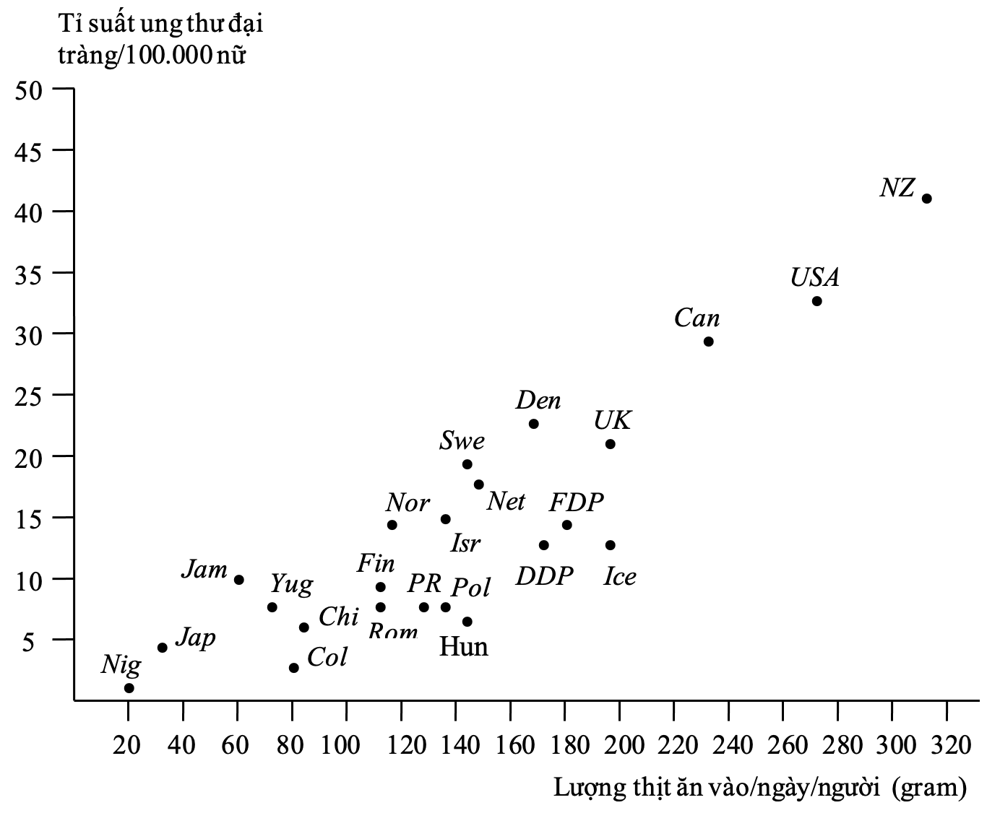
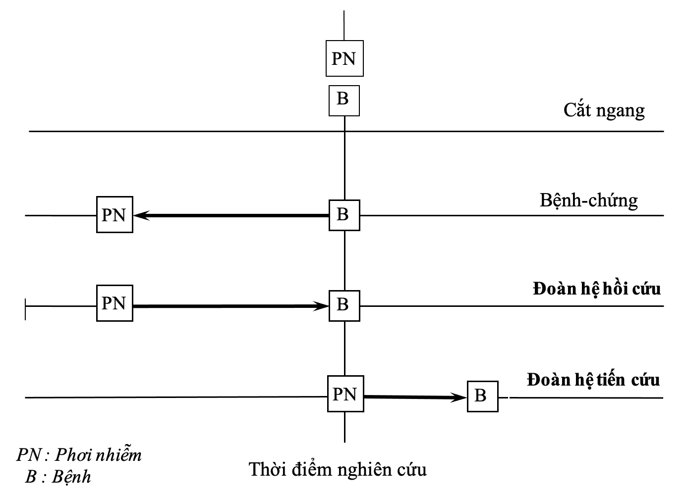

# Những thiết kế nghiên cứu Dịch tễ học {#dthcb_thietke}

## Mục tiêu bài giảng {-}
Sau khi học xong bài này, học viên có thể

* Liệt kê được 9 loại thiết kế nghiên cứu dịch tễ học.

* Xác định được bản chất của một loại thiết kế nghiên cứu dịch tễ học.

* Nêu được những điểm mạnh và yếu của một loại thiết kế nghiên cứu dịch tễ học.

## Giới thiệu {-}

Dịch tễ học là “một môn học về sự phân bố, và những yếu tố xác định của những biến cố và tình trạng liên quan đến sức khoẻ trong những dân số cụ thể, và sự ứng dụng môn học này trong việc kiểm soát những vấn đề sức khoẻ.” Theo định nghĩa này thì những nghiên cứu dịch tễ học nhắm vào ba mục đích chính: 1) Mô tả trạng thái của bệnh trong dân số, tìm xem bệnh xảy ra đối với ai, ở đâu, và khi nào; 2) Từ những mô tả đó, dịch tễ học so sánh những điểm khác biệt của sự phân bố bệnh trong những dân số mang những thuộc tính khác nhau. Sự so sánh này sẽ giúp nhà dịch tễ học tìm ra được những yếu tố có liên quan đến bệnh, có nghĩa là những yếu tố quyết định cho việc mắc bệnh của một người này chứ không phải là người khác, của một dân số này chứ không phải một dân số khác. Những yếu tố đó có thể là yếu tố nguy cơ, hoặc là nguyên nhân của bệnh; 3) Những kết luận rút ra được từ những sự mô tả hoặc so sánh nói trên sẽ giúp cho những nhà dịch tễ học, hoặc những nhân viên y tế nói chung đề ra được những hành động cụ thể nhằm cải thiện sức khoẻ của người dân và cộng đồng. Những chương trình hành động này bao gồm những biện pháp can thiệp sức khỏe (thí dụ như phòng ngừa, điều trị, giáo dục sức khoẻ, v.v.) mà hiệu quả và tác động của chúng được lượng giá bằng cách so sánh những nhóm dân số khác nhau, nhóm được can thiệp và nhóm không được can thiệp. Để đạt được ba mục đích trên, dịch tễ học sử dụng những chiến lược nghiên cứu mà trong mỗi chiến lược khác nhau, sẽ có những thiết kế khác nhau.

## NHỮNG LOẠI THIẾT KẾ NGHIÊN CỨU DỊCH TỄ HỌC {-}

Tùy theo chiến lược nghiên cứu là mô tả bệnh trạng; hoặc phân tích để tìm yếu tố nguy cơ (hay yếu tố nguyên nhân); hoặc tiến hành một biện pháp can thiệp, dịch tễ học có thể sử dụng những loại hình nghiên cứu khác nhau, và những loại hình đó được gọi là những thiết kế nghiên cứu dịch tễ học. Thiết kế nghiên cứu dịch tễ học có thể được định nghĩa là “một kế hoạch mô tả chi tiết những bước cơ bản để xác định đối tượng nghiên cứu, phương pháp thu thập, phân tích, và lý giải những dữ kiện nhằm mô tả về bệnh trạng, hoặc suy diễn về nguyên nhân của bệnh, hoặc kết luận về hiệu quả của một biện pháp can thiệp sức khỏe”. Những loại thiết kế nghiên cứu dịch tễ học được trình bày trong bảng 5.1, với những chiến lược và mục đích nghiên cứu tương ứng. 

```{r bang0501, echo = FALSE}
data.frame(
  loai = c("Nghiên cứu quan sát", "   Nghiên cứu mô tả", rep("", 4), "   Nghiên cứu phân tích", rep("", 3),
           "Nghiên cứu can thiệp", rep("", 3)),
  thietke = c(rep("", 2), "Nghiên cứu tương quan", "Báo cáo một ca", "Hàng loạt ca", "Cắt ngang mô tả", "",
              "Cắt ngang phân tích", "Bệnh-chứng", "Đoàn hệ", "",
              "Thử nghiệm lâm sàng", "Thử nghiệm thực địa", "Thử nghiệm can thiệp cộng đồng"),
  chienluoc = c(rep("", 2), "Mô tả bệnh trạng trên những dân số", "Mô tả bệnh trạng trên một ca cụ thể", "Mô tả bệnh trạng trên một số ca", "Mô tả bệnh trạng của những cá nhân trong một dân số. So sánh số hiện mắc bệnh của những cá nhân trong hai nhóm có và không có phơi nhiễm", "",
                "So sánh số hiện mắc bệnh của những cá nhân trong hai nhóm có và không có phơi nhiễm", "So sánh tỉ lệ phơi nhiễm trong hai nhóm có bệnh và không có bệnh", "Tìm và so sánh số mới mắc bệnh trong hai nhóm có và không có phơi nhiễm", "",
                "So sánh tỉ suất khỏi bệnh ở những bệnh nhân trong hai nhóm được và không được điều trị với một phác đồ", "So sánh tỉ suất mắc bệnh ở hai nhóm người khỏe được và không được áp dụng biện pháp dự phòng", "So sánh tỉ suất mắc bệnh của hai cộng đồng được và không được áp dụng biện pháp dự phòng"),
  mucdich = c(rep("", 2), "Xác định mối liên quan giữa yếu tố nguy cơ và bệnh", "Mô tả đặc điểm bệnh trạng của một ca bệnh cụ thể", "Mô tả đặc điểm bệnh trạng của nhiều ca mắc cùng một bệnh", "Mô tả mô hình bệnh trạng của một dân số. Hình thành giả thuyết nhân quả", "",
              "Xác định sự kết hợp nhân-quả giữa yếu tố nguyên nhân và bệnh", "Xác định sự kết hợp nhân-quả giữa yếu tố nguyên nhân và bệnh", "Xác định sự kết hợp nhân-quả giữa yếu tố nguyên nhân và bệnh", "",
              "Xác định hiệu quả của một phác đồ điều trị trên những bệnh nhân được điều trị", "Xác định hiệu quả của một biện pháp phòng bệnh ở những người khỏe", "Xác định hiệu quả của một biện pháp phòng bệnh trên cộng đồng")
) %>%
  gt(caption = "Phân loại những thiết kế nghiên cứu dịch tễ học.") %>%
  cols_label(loai = "Loại nghiên cứu",
             thietke = "Thiết kế nghiên cứu",
             chienluoc = "Chiến lược nghiên cứu",
             mucdich = "Mục đích nghiên cứu") 
```

## NGHIÊN CỨU QUAN SÁT {-}

Trong những nghiên cứu quan sát, người nghiên cứu chỉ đơn thuần quan sát những tính chất tự có của bệnh trạng cũng như của những yếu tố ảnh hưởng đến bệnh trạng, và hoàn toàn không có một tác động nào trên những tính chất đó. Có hai loại nghiên cứu quan sát là nghiên cứu mô tả và nghiên cứu phân tích. Nếu mục tiêu nghiên cứu nhằm mô tả bệnh trạng theo những thuộc tính sẵn có của nó, thiết kế nghiên cứu sẽ là mô tả. Nếu mục tiêu nghiên cứu là xác định mối liên quan nhân quả giữa những yếu tố phơi nhiễm và bệnh, chiến lược nghiên cứu sẽ là phân tích sự phân bố của yếu tố phơi nhiễm (hoặc bệnh) trong hai nhóm bệnh và không bệnh (hoặc có và không có phơi nhiễm) để tìm sự khác biệt. Những thiết kế nghiên cứu trong trường hợp này thuộc loại nghiên cứu phân tích.

### Nghiên Cứu Mô Tả {-}

#### Nghiên cứu tương quan {-}

Nghiên cứu tương quan còn được gọi là nghiên cứu sinh thái. Thiết kế nghiên cứu này sử dụng những dữ kiện trên toàn bộ những dân số để so sánh tần số bệnh của những dân số đó trong cùng thời gian, hoặc tần số bệnh của một dân số vào những thời điểm khác nhau. Nghiên cứu tương quan thường được sử dụng để hình thành giả thuyết về mối liên quan giữa hai biến số, một biến số độc lập (nguyên nhân hay yếu tố phơi nhiễm), và một biến số phụ thuộc (hậu quả hay bệnh). Thí dụ, khi so sánh lượng thịt ăn vào trung bình hàng ngày cho một đầu người, và tỉ lệ ung thư đại tràng ở phụ nữ của các nước trên thế giới, kết quả cho thấy tỉ lệ ung thư đại tràng càng tăng khi lượng thịt ăn vào càng cao (Hình \@ref(fig:hinh0501)). Một giả thuyết có thể được hình thành từ kết quả nghiên cứu, đó là ăn nhiều thịt sẽ tăng nguy cơ ung thư đại tràng ở phụ nữ. Đặc điểm để nhận ra một nghiên cứu tương quan là: 1) Đối tượng nghiên cứu là từng dân số, chứ không phải từng cá nhân; 2) Gía trị của biến số là trị số trung bình của từng dân số, chứ không phải trị số cụ thể của từng cá nhân. 

```{r hinh0501, fig.cap="Tương quan giữa lượng thịt ăn vào/người và ung thư đại tràng ở phụ nữ các nước. (Nguồn: Hennekens, H.C., Buring E.J. Epidemiology in Medicine. Little, Brown and Company. Boston. 1987: 19.).", echo=FALSE}

```

#### Báo cáo một ca {-}

Báo cáo một ca là một nghiên cứu mô tả những đặc tính bệnh trạng của một bệnh xảy ra trên một đối tượng nghiên cứu duy nhất. Báo cáo một ca thường cung cấp thông tin về đặc điểm của một bệnh lý hoặc hiện tượng hiếm gặp, chưa từng hoặc ít được ghi nhận trong y văn trước đó. Thí dụ, những bệnh nhi sốt xuất huyết dengue nặng thường chết trong bệnh cảnh trụy tim mạch. Trong một mùa dịch, chúng ta gặp một trường hợp sốt xuất huyết dengue tử vong vì suy hô hấp. Báo cáo “Nhân một trường hợp bệnh lý sốt xuất huyết dengue tử vong vì suy hô hấp cấp” mô tả một trường hợp đặc biệt và hiếm gặp.

Những đặc điểm của bệnh trạng cùng những yếu tố có liên quan đến sự xuất hiện của bệnh có thể gợi ý về một mối liên hệ giữa những yếu tố nguy cơ và bệnh. Ví dụ, ca nhiễm COVID-19 đầu tiên ở Việt Nam được tìm thấy là có liên quan đến Vũ Hán, nơi phát hiện ổ dịch đầu tiên của Trung Quốc. Người phụ nữ Việt 25 tuổi đã ở Vũ Hán trong hai tháng vì công việc và trở về Việt Nam vào ngày 17 tháng 1 năm 2020. Cô tường trình rằng đã không đi chợ Hoa Nam, chợ hải sản ở Vũ Hán, nơi những ca nhiễm đầu tiên được phát hiện, và cũng không nhớ rõ có tiếp xúc với ai có triệu chứng giống nhiễm cúm hay không. Ngày 23 tháng 1, người phụ nữ biểu hiện ho, hắt hơi, sốt, và đau ngực. Cô đi khám ở bệnh viện quận, và được chuyển đến bệnh viện đa khoa Thanh Hóa do nghi ngờ có hội chứng hô hấp cấp do nhiễm corona virus 2 (SARS-CoV-2). Mẫu phết hầu họng được xét nghiệm cho SARS-CoV-2 bằng RT-PCR và cho kết quả dương tính. Bệnh nhân được chuyển đến phòng cách ly áp lực âm và được điều trị. Khi hỏi về tiền sử tiếp xúc cho thấy có 21 người đã tiếp xúc gần với bệnh nhân trước đó. Tất cả những người này được đưa đi cách ly sau đó (Van Cuong et al. The first Vietnamese case of COVID-19 acquired from China. The Lancet. Infectious diseases. 2020, 20: 408-409).   

#### Nghiên cứu hàng loạt ca {-}

Cũng giống như báo cáo một ca, báo cáo hàng loạt ca mô tả một bệnh lý hoặc hiện tượng hiếm gặp, ít hoặc chưa từng được ghi nhận trong y văn trước đó, nhưng trên đối tượng là một nhóm người. Thí dụ, kiến thức về COVID ở người lớn ngày càng đầy đủ hơn, tuy nhiên kiến thức về COVID trên đối tượng trẻ em vẫn còn bị giới hạn. Phần lớn các ca bệnh ở trẻ em biểu hiện triệu chứng nhẹ hơn so với người lớn, như là viêm đường hô hấp trên hoặc viêm phổi nhẹ, và một số không biểu hiện triệu chứng. Tuy nhiên, một số trường hợp nặng và tử vong đã được báo cáo ở trẻ em, và ở những trường hợp này có sẵn bệnh lý nền chính là yếu tố thúc đẩy bệnh nhi vào tình trạng nặng hơn của nhiễm COVID. Một nghiên cứu tại bệnh viện nhi ở Đức báo cáo từ tháng 3 đến tháng 11 năm 2020 có mười bốn bệnh nhi nhập viện vì COVID. Trong đó có ba trẻ phát triển hội chứng viêm đa hệ thống (là hội chứng bao gồm sốt dai dẳng, viêm và suy đa tạng), hai trẻ phải điều trị hồi sức tích cực, một trẻ phải thở máy xâm lấn, và một trẻ tử vong một thời gian ngắn sau xuất viện do các biến chứng của COVID. Tất cả những trẻ này đều có bệnh lý nền như bị suy giảm miễn dịch, bệnh tim bẩm sinh, hay đang điều trị ức chế miễn dịch. Báo cáo hàng loạt ca bệnh nhi này cho thấy những trẻ có bệnh lý nền có thể là đối tượng dễ bị tổn thương và có nguy cơ có các biến chứng của COVID (Remppis, J., et al. A case series of children and young people admitted to a tertiary care hospital in Germany with COVID-19. BMC Infectious Diseases. 2021, 21:133).

Báo cáo hàng loạt ca có thể giúp chúng ta phát hiện dịch, hoặc sự xuất hiện của một bệnh mới. Thí dụ, trong khoảng thời gian 6 tháng từ 1980 đến 1981, tại ba bệnh viện ở Los Angeles, có 5 thanh niên khoẻ mạnh, đồng tính ái được chẩn đoán là viêm phổi do Pneumocystis carinii. Vì bệnh này thường xảy ra ở những người lớn tuổi hơn, có hệ thống miễn dịch bị ức chế, do đó, những trường hợp bất thường này gợi ý rằng 5 bệnh nhân này đã mắc một bệnh gì trước đó, là một bệnh mà sau này được biết đến là ‘Hội chứng suy giảm miễn dịch mắc phải’ (AIDS). Hơn nữa, tất cả 5 bệnh nhân là những người đồng tính ái khiến chúng ta có thể nghĩ đến một vài hành vi tình dục nào đó có liên quan đến việc mắc bệnh.

#### Nghiên cứu cắt ngang {-}

Loại thiết kế nghiên cứu này sử dụng những dữ kiện được thu thập trên từng cá nhân. Bệnh trạng (có hoặc không có bệnh), và sự hiện diện của yếu tố có liên quan đến bệnh (có hoặc không có phơi nhiễm) được ghi nhận vào cùng một thời điểm khảo sát. Thí dụ, trong nghiên cứu về ‘Thực hành ăn kiêng và kiểm soát cân nặng ở những bệnh nhân người lớn tăng huyết áp tại bệnh viện Nguyễn Tri Phương’ (Nguyễn Đỗ Nguyên. Thực hành ăn kiêng và kiểm soát cân nặng ở bệnh nhân người lớn tăng huyết áp tại bệnh viện Nguyễn Tri Phương. Kỷ yếu công trình nghiên cứu khoa học 1994-1995. Trường Đại học Y Dược TP. Hồ chí Minh. 1995, trang 89-93.), trong suốt thời gian nghiên cứu có 192 bệnh nhân trong số những bệnh nhân đến khám ngoại chẩn, hoặc/và nhập viện tại bệnh viện Nguyễn Tri Phương được xác định có tăng huyết áp. Cùng lúc đó, một bộ câu hỏi được sử dụng để phỏng vấn xem những bệnh nhân tăng huyết áp này có hoặc không có thực hành kiểm soát cân nặng, uống rượu vừa phải, và hạn chế ăn mặn. Tần số của những thực hành này được phân tích theo những dữ kiện dân số, kinh tế xã hội (như tuổi, giới, số người trong gia đình, trình độ văn hoá, nghề nghiệp, thu nhập), và giai đoạn bệnh, thời gian bệnh, để tìm những ảnh hưởng có thể có của các yếu tố trên đối với những thực hành của bệnh nhân. Trong nghiên cứu này, “thực hành của bệnh nhân tăng huyết áp” và những yếu tố có thể ảnh hưởng đến những thực hành đó được ghi nhận ở cùng một thời điểm.

Nghiên cứu cắt ngang được sử dụng như một nghiên cứu mô tả để ước lượng tỉ lệ hiện mắc của một bệnh trong dân số, hoặc so sánh tỉ lệ hiện mắc của bệnh trong những nhóm khác nhau của dân số. Tuy nhiên, nghiên cứu cắt ngang vẫn có thể được sử dụng như một nghiên cứu phân tích để xác định nguyên nhân của một hiện tượng sức khoẻ. Một sự kết hợp có ý nghĩa thống kê giữa hai biến số nếu thỏa những tiêu chí để suy diễn nhân quả (thí dụ, có đủ bằng chứng để xác định rằng biến số được coi là nguyên nhân xuất hiện trước biến số được coi là hậu quả) thì người nghiên cứu có thể khẳng định được mối quan hệ nhân quả. Trong trường hợp đó, nghiên cứu cắt ngang được gọi là cắt ngang phân tích. Thí dụ, trong nghiên cứu nói trên về thực hành ăn kiêng và kiểm soát cân nặng ở bệnh nhân tăng huyết áp, giả sử kết quả cho thấy tỉ lệ thực hành là cao hơn có ý nghĩa thống kê ở những người bệnh lâu năm so với tỉ lệ tương ứng ở nhóm mới được chẩn đoán, và nếu có đủ bằng chứng để chắc chắn rằng bệnh nhân bắt đầu kiểm soát cân nặng sau khi được chẩn đoán tăng huyết áp thì người nghiên cứu có thể kết luận rằng người bệnh tăng huyết áp càng lâu càng thực hành kiểm soát cân nặng nhiều hơn những người mới mắc bệnh. Hiện nay, nghiên cứu cắt ngang được sử dụng rộng rãi như một nghiên cứu phân tích để kiểm định những giả thuyết nhân-quả giữa yếu tố phơi nhiễm và bệnh, dựa trên kết quả tìm thấy của chính nghiên cứu cắt ngang cùng sự ủng hộ của những bằng chứng sẵn có khác.

Đặc điểm để nhận ra một nghiên cứu là cắt ngang là: 1) Không có điểm xuất phát cụ thể (không bằng nguyên nhân cũng không bằng hậu quả); 2) Không có chiều nghiên cứu rõ ràng so với chiều thời gian (Hình 5.2). Ưu điểm của nghiên cứu cắt ngang là có thể thực hiện nhanh, ít tốn kém, nhưng có khuyết điểm là không xác định được trình tự thời gian giữa nguyên nhân (yếu tố phơi nhiễm) và hậu quả (bệnh), vì cả hai yếu tố này được ghi nhận vào cùng một thời điểm.

### Nghiên Cứu Phân Tích {-}

Trong những nghiên cứu phân tích, người nghiên cứu chọn hai nhóm người để so sánh nguy cơ mắc bệnh. Nếu những người có phơi nhiễm với một yếu tố nào đó có nguy cơ mắc bệnh nhiều hơn (hoặc ít hơn) những người không có phơi nhiễm, thì kết luận về một mối liên hệ nhân-quả giữa yếu tố phơi nhiễm và bệnh sẽ được xác lập. Vì bản chất của nghiên cứu phân tích là nghiên cứu quan sát, do đó, người nghiên cứu chỉ quan sát để tìm bệnh (hoặc yếu tố phơi nhiễm) trên những người có/không phơi nhiễm (hoặc có/không bệnh). Nghiên cứu phân tích luôn luôn cần một nhóm so sánh, đó là nhóm những người không có bệnh để so sánh với nhóm bệnh, hoặc nhóm những người không có phơi nhiễm với một yếu tố nguy cơ để so sánh với nhóm có phơi nhiễm. 

```{r hinh0502, fig.cap="Trình tự thời gian của những loại thiết kế nghiên cứu quan sát phân tích.", echo=FALSE}

```

#### Nghiên cứu bệnh-chứng {-}

Trong nghiên cứu bệnh chứng, một nhóm những người có bệnh (nhóm bệnh), và một nhóm người không có bệnh (nhóm chứng) được chọn để quan sát. Người nghiên cứu sẽ truy ngược về trong quá khứ để thu thập thông tin về sự phơi nhiễm với yếu tố nguy cơ của những đối tượng nghiên cứu (Hình \@ref(fig:hinh0502)), và sau đó, so sánh tỉ lệ phơi nhiễm trong hai nhóm với nhau. Thí dụ, một nghiên cứu muốn xem xét nồng độ đường huyết và sự thay đổi cân nặng trước khi khởi phát đái tháo đường có thể là những chỉ điểm tiềm năng cho ung thư tụy hay không. Nghiên cứu chọn ra những ca bệnh ung thư tụy có khởi phát đái tháo đường trong vòng hai năm trước khi chẩn đoán ung thư, và những ca chứng không bị ung thư tụy cũng bị đái tháo đường mới khởi phát trong vòng hai năm, tương thích về tuổi và giới với những ca bệnh. Phân tích so sánh về sự nồng độ đường huyết ở thời điểm trước khi khởi phát đái tháo đường ở cả hai nhóm cho thấy những người có nồng độ đường huyết thấp hơn 5.1 mmol/L có nguy cơ bị ung thư tụy cao hơn so với những người có đường huyết cao hơn 6.3 mmol/L (OR 2.42, khoảng tin cậy 95% 1.60-3.66). Phân tích so sánh về cân nặng ở hai nhóm cho thấy những người bị sụt cân càng nhiều vào thời điểm khởi phát đái tháo đường thì nguy cơ ung thư tụy càng cao, so với những người có cân nặng ổn định. Cụ thể ở nhóm sụt 3.1-9.9% cân nặng tăng nguy cơ ung thư tụy 1.57 lần (khoảng tin cậy 95% 1.13–2.19), ở nhóm cân nặng sụt 10.0-14.9% tăng 3.58 lần nguy cơ ung thư tụy (khoảng tin cậy 95% 2.31–5.54), và nhóm cân nặng sụt lớn hơn 15% tăng nguy cơ ung thư tụy 4.56 lần (khoảng tin cậy 95% 2.82–7.36). Nghiên cứu kết luận nồng độ đường huyết thấp và sụt giảm cân vào thời điểm trước khi khởi phát đái tháo đường có thể là những yếu tố tiềm năng để dự đoán sự xuất hiện ung thư tụy (Mueller A. M., et al. Weight change and blood glucose concentration as markers for pancreatic cancer in subjects with new-onset diabetes mellitus: A matched case-control study. Pancreatology. 2019, 19: 578–586). Như vậy, đặc điểm để nhận ra một nghiên cứu là bệnh chứng là: 1) Xuất phát bằng hậu quả (bệnh hoặc không bệnh); 2) Chiều nghiên cứu ngược chiều thời gian (truy ngược quá khứ để tìm nguyên nhân) (Hình \@ref(fig:hinh0502)).

Nghiên cứu bệnh-chứng có ưu điểm là tương đối ít tốn kém về thời gian và chi phí, nhưng vì khi bắt đầu nghiên cứu, hai biến cố phơi nhiễm và bệnh đều đã xảy ra nên người nghiên cứu dễ phạm vào những sai lệch chọn lựa đối tượng, sai lệch hồi tưởng (vì đối tượng nghiên cứu phải nhớ lại những thông tin trong quá khứ), và tương tự như trong nghiên cứu cắt ngang, trình tự thời gian của nguyên nhân và hậu quả khó xác định (Bảng \@ref(fig:hinh0502)).

#### Nghiên cứu đoàn hệ {-}

Trong nghiên cứu đoàn hệ, hai nhóm đối tượng được chọn dựa trên tiêu chí có, hoặc không có phơi nhiễm. Những đối tượng trong hai nhóm sẽ được theo dõi trong một thời khoảng để xem có hoặc không có bệnh mới khởi phát (Hình \@ref(fig:hinh0502)). Thời gian theo dõi cần phải đủ để bệnh có thể phát triển tính từ thời điểm đối tượng có phơi nhiễm. Nếu tỉ suất mới mắc trong nhóm có phơi nhiễm là cao hơn (hoặc thấp hơn) so với tỉ suất này trong nhóm không phơi nhiễm, thì mối liên hệ nhân-quả giữa yếu tố nguy cơ và bệnh sẽ được xác lập. Có hai loại nghiên cứu đoàn hệ là đoàn hệ tiến cứu và đoàn hệ hồi cứu.

##### Nghiên cứu đoàn hệ tiến cứu {-}

Trong loại nghiên cứu này, khi bắt đầu nghiên cứu, việc phơi nhiễm (ở nhóm có phơi nhiễm) là đã xảy ra, trong khi bệnh chưa khởi phát. Bệnh sẽ xảy ra, nếu có, trong tương lai (Hình \@ref(fig:hinh0502)). Thí dụ, UK Biobank là một cơ sở dữ liệu y sinh lớn ở Anh, bao gồm dữ liệu của đoàn hệ 500,000 người lứa tuổi 40-69 tình nguyện tham gia trong khoảng thời gian 2006-2010. Những người tham gia được thu thập thông tin về xã hội, tiền sử gia đình, tâm lý, tình trạng sức khỏe, hoạt động thể lực, tần suất sử dụng thực phẩm, và được đo lường các chỉ số về huyết áp, sức cơ, nhân trắc học, hô hấp kí, các chỉ số sinh hóa máu, nước tiểu, nước bọt. Đoàn hệ người được theo dõi qua thời gian cho đến khi các biến cố sức khỏe xảy ra bao gồm ung thư, đái tháo đường, tim mạch, đột quỵ, tâm thần, thoái hóa thần kinh, cơ xương, hô hấp. Dựa vào cơ sở dữ liệu này, rất nhiều nghiên cứu đoàn hệ tiến cứu đã được thực hiện để tìm hiểu mối liên quan giữa các yếu tố nguy cơ và kết cục sức khỏe. Thí dụ, một nghiên cứu tìm hiểu về mối liên quan giữa việc sử dụng thuốc ức chế bơm proton và ung thư gan. Ức chế bơm proton là loại thuốc được sử dụng rất phổ biến trong điều trị trào ngược dạ dày thực quản, chứng khó tiêu, và là thuốc được chỉ định điều trị viêm thực quản, loét dạ dày-tá tràng, ngăn ngừa loét do thuốc kháng viêm không steroid, và là một phần trong phác đồ điều trị viêm Helicobacter pylori. Đây là thuốc được cho là an toàn, tuy nhiên tình trạng sử dụng thuốc bừa bãi (kê đơn dù không có chỉ định) và sử dụng kéo dài quá mức cần thiết đã dấy lên lo ngại về những hậu quả sức khỏe. Cụ thể một nghiên cứu đoàn hệ đã thu thập thông tin sử dụng thuốc ức chế bơm proton dựa vào bảng câu hỏi ở thời gian đầu khi người dân tham gia nghiên cứu trong khoảng thời gian 2006-2010, và theo dõi họ đến khi biến cố ung thư xuất hiện hoặc cho đến khi kết thúc nghiên cứu vào năm 2014. Qua thời gian theo dõi trung bình là 7.5 năm, kết quả có 182 người bị ung thư gan nguyên phát trong tổng số 475,768 người. Sau khi điều chỉnh các yếu tố gây nhiễu, kết quả cho thấy những người sử dụng thuốc ức chế bơm proton có nguy cơ ung thư gan cao gấp 1.99 lần so với những người không sử dụng (KTC 95% 1.34-2.94). Đặc biệt, khi phân tích sâu hơn cho thấy nguy cơ tăng có ý nghĩa thống kê ở ung thư tế bào đường mật (HR 3.12, KTC 95% 1.72-5.68), và không đạt được ý nghĩa thống kê ở ung thư tế bào gan (HR 1.60, KTC 95% 0.91-2.83). Tác giả kết luận sử dụng thuốc ức chế bơm proton gây tăng nguy cơ ung thư gan, tuy nhiên cấn sự khẳng định thêm từ những nghiên cứu lớn khác trong tương lai. (Tran, K. T., et al. Proton pump inhibitor and histamine‐2 receptor antagonist use and risk of liver cancer in two population‐based studies. Aliment Pharmacol Ther. 2018, 48:55–64). 

##### Nghiên cứu đoàn hệ hồi cứu {-}

Điểm cốt lõi của nghiên cứu đoàn hệ là chiều nghiên cứu đi theo trình tự thời gian, từ nguyên nhân đến hậu quả. Điều này có nghĩa là những đối tượng nghiên cứu luôn luôn phải được chọn, bắt đầu với việc họ có hoặc không có phơi nhiễm với yếu tố nguy cơ, và được theo dõi cho đến lúc bệnh khởi phát. Tuy nhiên, trong một số trường hợp khi bắt đầu nghiên cứu, nếu bệnh đã xảy ra, và người nghiên cứu xác định được thời điểm phơi nhiễm đã xảy ra trước khi có bệnh, thì thiết kế nghiên cứu đoàn hệ hồi cứu có thể được sử dụng. Thiết kế này được gọi là nghiên cứu đoàn hệ vì người nghiên cứu xuất phát từ những đối tượng có/không phơi nhiễm với yếu tố nguy cơ, và theo dõi theo tiến trình của thời gian để khám phá bệnh có/không xảy ra. Nó được gọi là hồi cứu vì vào thời điểm bắt đầu nghiên cứu, cả hai biến cố ‘phơi nhiễm’ và ‘bệnh’ đều đã xảy ra, do đó, trong quá trình thu thập dữ kiện, bước đầu tiên của người nghiên cứu là đi ngược thời gian, trở về quá khứ để xuất phát bằng hai nhóm có và không phơi nhiễm, và lần theo thời gian để ghi nhận những bệnh mới đã xảy ra. Điểm mấu chốt để phân biệt nghiên cứu đoàn hệ tiến cứu và hồi cứu là, khi bắt đầu nghiên cứu bệnh chưa (hoặc đã) xảy ra (Hình 5.2), và người nghiên cứu, trong đoàn hệ hồi cứu, phải có một bước lùi lại trong quá khứ để lấy điểm xuất phát. Do đó, nghiên cứu đoàn hệ hồi cứu còn có tên gọi là đoàn hệ lịch sử.

Thí dụ, một nghiên cứu đoàn hệ hồi cứu được tiến hành để tìm hiểu xem những công nhân làm việc trong những xưởng đóng tàu ngầm nguyên tử có bị tăng nguy cơ tử vong vì ung thư máu hoặc những loại ung thư khác hay không. Hồ sơ nhân viên của Xưởng đóng tàu Hải quân Portsmouth được hồi cứu. Mẫu nghiên cứu là một đoàn hệ gồm 24.545 công nhân da trắng được tuyển dụng vào bất kỳ thời điểm nào trong khoảng 1952-1977. Dữ kiện được thu thập gồm có: thời gian làm việc, và thời gian phơi nhiễm với phóng xạ hàng năm để xếp nhóm theo tổng liều phơi nhiễm trong suốt thời gian làm việc của mỗi công nhân. Ngày 15-08-1977 được chọn làm mốc thời gian để đánh giá tình trạng sống còn của tất cả đối tượng nghiên cứu, và nguyên nhân của những người chết sẽ được xác định dựa vào giấy chứng tử. Những dữ kiện này được dùng để so sánh tình trạng tử vong của những công nhân đóng tàu có phơi nhiễm phóng xạ với những công nhân không phơi nhiễm. Đây là một nghiên cứu đoàn hệ, vì đối tượng nghiên cứu được xác định dựa vào tiêu chí có/ không phơi nhiễm với phóng xạ do làm việc trong xưởng đóng tàu, và theo dõi để xác định tình trạng tử vong. Nghiên cứu là hồi cứu, vì khi bắt đầu nghiên cứu, cả hai biến cố ‘phơi nhiễm với phóng xạ’ và ‘chết’ đều đã xảy ra. Thông tin về biến cố ‘chết’ là đã có sẵn, và người nghiên cứu không chờ những cái chết sẽ xảy ra (Rinsky, R. A., Zumualde, R. D. Waneiler, R. J., et al. Cancer mortality at a naval nuclear shipyard. Lancet. 1981, 1:231).

Nghiên cứu đoàn hệ có ưu điểm là có thể xác lập được mối liên hệ nhân-quả giữa yếu tố phơi nhiễm và bệnh (vì trình tự thời gian giữa yếu tố phơi nhiễm và bệnh là rõ ràng, phơi nhiễm xảy ra trước khi có bệnh), nhưng có những khuyết điểm là tốn kém về thời gian, chi phí, và có thể phạm vào những sai lệch do đối tượng bị mất dấu trong quá trình theo dõi (Bảng \@ref(tab:bang0502)). Nguyên tắc để nhận ra một nghiên cứu là đoàn hệ là: 1) Xuất phát bằng phơi nhiễm (có hoặc không phơi nhiễm); 2) Chiều nghiên cứu cùng chiều thời gian.

Những điểm mạnh và hạn chế của ba thiết kế quan sát phân tích được trình bày trong bảng \@ref(tab:bang0502).

```{r bang0502, echo = FALSE}
data.frame(
  dacdiem = c("Dễ thực hiện", "Chi phí", "Tốn thời gian", "Trình tự thời gian của quan hệ nhân-quả",
           "Sức mạnh của bằng chứng quan hệ nhân quả", "Đo lường trực tiếp nguy cơ"),
  catngang = c("++", "+", "+", "Không xác định", "-", "-"),
  benhchung = c("+", "+", "++", "Không xác định", "-", "Ước lượng gần đúng khi bệnh là hiếm"),
  doanhe = c("-", "++", "+++", "Xác định", "+", "+")
) %>%
  gt(caption = "Ưu và khuyết điểm của những loại thiết kế nghiên cứu quan sát phân tích.") %>%
  cols_label(dacdiem = "Đặc điểm",
             catngang = "Nghiên cứu cắt ngang",
             benhchung = "Nghiên cứu bệnh-chứng",
             doanhe = "Nghiên cứu đoàn hệ") 
```

## NGHIÊN CỨU CAN THIỆP {-}

Bản chất của nghiên cứu can thiệp là một nghiên cứu đoàn hệ tiến cứu. Đối tượng nghiên cứu được chia ngẫu nhiên thành hai nhóm, một nhóm được can thiệp (có nghĩa là được thử thuốc, hoặc được áp dụng một biện pháp can thiệp sức khỏe; tương đương với nhóm phơi nhiễm trong nghiên cứu đoàn hệ), và một nhóm không được can thiệp (có nghĩa là không được thử thuốc, hoặc không được áp dụng một biện pháp can thiệp sức khỏe; tương đương với nhóm không phơi nhiễm trong nghiên cứu đoàn hệ). Những đối tượng trong hai nhóm sẽ được theo dõi trong một thời gian đủ để tác dụng xuất hiện. Tỉ suất của tác dụng mong đợi sẽ được so sánh giữa hai nhóm có và không có can thiệp. Điểm khác biệt cơ bản giữa nghiên cứu can thiệp và nghiên cứu đoàn hệ là: 1) Người nghiên cứu không quan sát để xác định một đối tượng nghiên cứu là có hoặc không có phơi nhiễm, mà chính người nghiên cứu quyết định cho một đối tượng sẽ được hoặc không được phơi nhiễm (có hoặc không có sự can thiệp). Quá trình quyết định đó là một sự phân bổ ngẫu nhiên; 2) Trong suốt quá trình nghiên cứu, hay can thiệp, người nghiên cứu quyết định toàn bộ từng điều kiện cụ thể được áp dụng cho từng loại đối tượng nghiên cứu, hay nói một cách khác, tác dụng mong đợi sẽ có hoặc không có là tùy thuộc vào những điều kiện do người nghiên cứu tạo ra trên đối tượng nghiên cứu. 

### Thử nghiệm lâm sàng {-}

Thử nghiệm lâm sàng là một nghiên cứu thí nghiệm với đối tượng nghiên cứu là bệnh nhân, với hai mục đích, hoặc xác định hiệu quả của một phác đồ điều trị bệnh, hoặc tìm một biện pháp ngăn ngừa những dư chứng hoặc biến chứng của bệnh, thí dụ tàn phế hoặc tử vong. Như đã trình bày ở trên, bệnh nhân được phân bổ ngẫu nhiên thành hai nhóm, một nhóm có phơi nhiễm (được áp dụng phác đồ nghiên cứu), và một nhóm không phơi nhiễm (không được áp dụng phác đồ nghiên cứu). Yếu tố phơi nhiễm trong thử nghiệm lâm sàng không phải là yếu tố phòng ngừa bậc 1, vì thử nghiệm lâm sàng không có mục đích ngăn ngừa sự xuất hiện của bệnh.
Nếu chưa có sẵn một phác đồ điều trị, thì phác đồ thử nghiệm sẽ được so sánh với một giả dược. Nếu phác đồ điều trị đã có sẵn, việc dùng giả dược cho nhóm chứng sẽ không được cho phép về mặt y đức, và phác đồ thử nghiệm sẽ được so sánh với một phác đồ hiệu quả nhất hiện có. Hơn nữa, giả dược là không cần thiết nếu mục đích của thử nghiệm lâm sàng là so sánh hiệu quả của những phác đồ điều trị khác nhau.

### Thử nghiệm thực địa {-}

Điểm khác biệt của thử nghiệm thực địa với thử nghiệm lâm sàng là đối tượng nghiên cứu của thử nghiệm thực địa là người khỏe mạnh chứ không phải bệnh nhân. Nghiên cứu thực địa thường đòi hỏi chi phí rất lớn vì hai lý do: 1) Khả năng mắc bệnh của người khỏe là nhỏ hơn nhiều so với khả năng có biến chứng, trong một thời gian ngắn, của một người bệnh, do đó, thử nghiệm thực địa thường đòi hỏi một cỡ mẫu lớn; 2) Quá trình thu thập dữ kiện với những đối tượng nghiên cứu là người khỏe đòi hỏi phải tiếp xúc tại nhà, cơ quan, trường học, v.v., do đó, càng tăng thêm chi phí. Vì những lý do đó, mục đích của những thử nghiệm thực địa được khu trú vào việc tìm những biện pháp phòng những bệnh hoặc rất phổ biến (thí dụ thử nghiệm thực địa xác định hiệu lực của sinh tố C liều cao để phòng ngừa cảm lạnh), hoặc rất trầm trọng (thí dụ thử nghiệm thực địa xác định hiệu lực của vắc-xin Salk để phòng ngừa bại liệt là một nghiên cứu thí nghiệm trên con người lớn nhất trong lịch sử, bao gồm hàng trăm ngàn học sinh được sử dụng vắc-xin hoặc giả dược). 

### Thử nghiệm can thiệp cộng đồng {-}

Nghiên cứu can thiệp cộng đồng có thể được xem là một dạng mở rộng của nghiên cứu thử nghiệm thực địa, nhưng biện pháp can thiệp được áp dụng và đánh giá cho cả một cộng đồng chứ không cho từng cá nhân. Những biện pháp can thiệp sử dụng trong nghiên cứu can thiệp cộng đồng là những biện pháp dễ áp dụng cho cả cộng đồng hơn là cho từng cá nhân, thí dụ, cung cấp fluor trong nước sinh hoạt, giáo dục sức khỏe bằng phương tiện truyền thông đại chúng, v.v.

## NHỮNG ĐIỂM LƯU Ý QUAN TRỌNG {-}

Chúng ta đã biết qua đặc tính của những thiết kế được sử dụng trong nghiên cứu dịch tễ học. Những điểm cần lưu ý là:

1. Lựa chọn thiết kế nghiên cứu

Mỗi loại thiết kế có những ưu cũng như khuyết điểm của nó. Sự lựa chọn một loại thiết kế khi tiến hành nghiên cứu cần phải:

    * Dựa vào câu hỏi nghiên cứu và mục tiêu nghiên cứu.
    * Tùy thuộc bản chất của bệnh, và yếu tố phơi nhiễm.
    * Tính khả thi của nghiên cứu xét trên phương diện tài chánh, thời gian, nhân lực.
    * Những kiến thức sẵn có về đề tài nghiên cứu.

2. Khả năng khái quát hóa mối liên hệ nhân quả giữa yếu tố phơi nhiễm và yếu tố kết cuộc

Mục tiêu cuối cùng của người nghiên cứu là tìm nguyên nhân của bệnh hoặc một biến cố sức khoẻ, có nghĩa là người nghiên cứu muốn khái quát hoá rằng mối liên quan tìm thấy từ một hoặc một vài nghiên cứu của mình là có tính nhân-quả. Việc làm này thường khó. Ngay cả một sự kết hợp có ý nghĩa thống kê từ một nghiên cứu đoàn hệ riêng lẻ cũng không chắc chắn xác định được rằng đó là một mối liên hệ nhân-quả (có nghĩa là yếu tố phơi nhiễm thực sự là nguyên nhân gây ra bệnh) nếu những bằng chứng khoa học đương thời không ủng hộ cho những kết quả mà chúng ta tìm thấy trong nghiên cứu của mình. Ngược lại, như chúng ta đã biết rằng trình tự thời gian giữa yếu tố phơi nhiễm và bệnh trong nghiên cứu cắt ngang và nghiên cứu bệnh-chứng là không thể (hoặc khó) xác định, nhưng chúng ta vẫn có thể, dựa vào một sự kết hợp có ý nghĩa thống kê tìm thấy từ một nghiên cứu cắt ngang hoặc nghiên cứu bệnh-chứng, để suy diễn nguyên nhân nếu có đủ bằng chứng của khoa học đương đại ủng hộ cho kết quả tìm thấy của chúng ta.

3. Một số khái niệm và từ ngữ cần được làm rõ 

Chúng ta thường gọi một yếu tố phơi nhiễm (exposure) là yếu tố nguy cơ (risk factor). Yếu tố nguy cơ có nghĩa là một yếu tố mà khi có sự hiện diện của nó trong ta (thí dụ do tiếp xúc với nó), chúng ta sẽ có nhiều nguy cơ mắc bệnh hơn những người mà trong họ không có sự hiện diện của nó. Tuy nhiên, sự tiếp xúc với một yếu tố nào đó đôi khi có thể bảo vệ chúng ta chống lại một bệnh. Trong trường hợp này, yếu tố tiếp xúc là yếu tố bảo vệ (protective factor), thí dụ đánh răng ngừa được sâu răng, uống rượu vừa phải có thể giảm nguy cơ nhồi máu cơ tim, thì đánh răng, hoặc uống rượu vừa phải là yếu tố bảo vệ.

Một số tác giả còn gọi nghiên cứu bệnh-chứng là nghiên cứu hồi cứu (retrospective study). Vì, như chúng ta đã biết, trong loại thiết kế nghiên cứu này, cũng như trong thiết kế nghiên cứu đoàn hệ hồi cứu, vào thời điểm bắt đầu nghiên cứu, cả hai biến cố ‘phơi nhiễm’ hay ‘tiếp xúc với yếu tố nguy cơ’ và ‘bệnh’ đã xảy ra, do đó qui trình thu thập dữ kiện là đi ngược về (retrospective) quá khứ. Tuy nhiên, cần phân biệt nghiên cứu bệnh-chứng với nghiên cứu đoàn hệ hồi cứu là điểm bắt đầu của nghiên cứu đoàn hệ hồi cứu là sự kiện có (hoặc không) ‘phơi nhiễm’, để rồi đi theo tiến trình thời gian để tìm ‘bệnh’. Trong khi đó, nghiên cứu bệnh-chứng đi vào quá khứ, nhưng bắt đầu bằng sự kiện có (hoặc không) ‘bệnh’ để rồi ngược tiến trình thời gian để tìm ‘phơi nhiễm’. Hiện nay, đa số các tác giả đề nghị không nên gọi nghiên cứu bệnh-chứng là nghiên cứu hồi cứu, và dành từ ‘hồi cứu’ để phân biệt với ‘tiến cứu’ cho hai loại nghiên cứu đoàn hệ.

Những cụm từ ‘phương pháp nghiên cứu dịch tễ học’ và ‘thiết kế nghiên cứu dịch tễ học’ có thể gây ngộ nhận cho một số người rằng đấy là những phương pháp hoặc những thiết kế chỉ dành cho những nghiên cứu ‘về dịch tễ học’. Tuy nhiên, chúng ta đã, đang, và sẽ thấy qua rất nhiều những y văn trên thế giới, đấy là những phương pháp, những nguyên tắc, những thiết kế được sử dụng rất phổ biến trong những nghiên cứu y học. Vì, như đã được định nghĩa, dịch tễ học có thể được xem là phương pháp luận cho đa số những nghiên cứu trong y khoa.

4. Nguyên tắc để xác định loại của một thiết kế nghiên cứu:

Phân biệt nghiên cứu quan sát và can thiệp: Trong nghiên cứu quan sát, người nghiên cứu chỉ ghi nhận lại những hiện tượng thấy được trên đối tượng nghiên cứu. Trong nghiên cứu can thiệp, người nghiên cứu tạo ra những điều kiện khác nhau theo yêu cầu nghiên cứu trên từng đối tượng nghiên cứu.

Phân biệt nghiên cứu mô tả và nghiên cứu phân tích: Nghiên cứu mô tả mô tả bệnh trạng trên từng dân số một, nhưng không so sánh bệnh trạng của một dân số này với một dân số khác. Nghiên cứu phân tích so sánh bệnh trạng của những dân số mang những thuộc tính khác nhau để xác định những yếu tố quyết định của bệnh, hay hiện tượng sức khỏe. Nghiên cứu tương quan là một nghiên cứu mô tả, nhưng điểm khác biệt so với những nghiên cứu khác là đối tượng nghiên cứu của nó là từng dân số chứ không phải cá nhân.

Phân biệt các loại thiết kế nghiên cứu trong nhóm phân tích: Nghiên cứu phân tích có mục đích chung là xác định quan hệ nhân-quả. Nguyên tắc để phân biệt các loại thiết kế nghiên cứu phân tích là: 1) Dựa vào điểm xuất phát (nguyên nhân hoặc hậu quả, hay phơi nhiễm hoặc bệnh); 2) Chiều nghiên cứu so với chiều thời gian. Cụ thể là:

    * Nghiên cứu đoàn hệ có điểm xuất phát là nguyên nhân (hay phơi nhiễm), và chiều nghiên cứu cùng chiều thời gian.
    * Nghiên cứu bệnh-chứng xuất phát bằng hậu quả (hay bệnh), và chiều nghiên cứu ngược chiều thời gian.
    * Nghiên cứu cắt ngang không có điểm xuất phát (không bắt đầu bằng nguyên nhân cũng không bắt đầu bằng hậu quả), do đó, không có chiều nghiên cứu cụ thể.

## Bài tập {-}

1.	Trong số những người nhập viện vào một trung tâm điều trị tâm thần có những người có tình trạng mang trùng viêm gan siêu vi B, ở một số trại nhưng không có ở những trại khác. Để nghiên cứu quy mô ảnh hưởng của điều này lên sự xuất hiện của viêm gan B trong những nhân viên của trung tâm điều trị, nhân viên được xét nghiệm xem có sự hiện diện của kháng thể kháng HBS. Trong số 67 người làm việc ở trại có người mang trùng, 14 người có kháng thể kháng HBS. Trong số 72 người làm việc ở trại không có người mang trùng, 4 người có kháng thể kháng HBS.

    a. Cho biết thiết kế nghiên cứu thuộc loại nào. Vẽ sơ đồ của thiết kế.
    b. Chúng ta có thể rút ra kết luận gì qua nghiên cứu này? (Hướng dẫn: Tính những số đo cần thiết).
    c. Để chứng minh rằng “sự tiếp xúc với người mang trùng viêm gan B tại nơi làm việc” là nguy cơ nhiễm siêu vi gan B cho nhân viên làm việc nơi đó, chúng ta có thể thiết kế một nghiên cứu như thế nào?
    
2.	Vào ngày 14 tháng giêng, 1960, người ta tiến hành một cuộc điều tra trong vòng một ngày tại những bệnh viện tâm thần trên 12 hòn đảo của vùng biển Caribbe. Báo cáo của nghiên cứu này viết:
Khi chúng tôi nghiên cứu lần nhập viện đầu tiên theo thời gian nằm viện, chúng tôi thấy rằng 18% đã được nhập viện từ dưới một năm; 19% được nhập viện từ khoảng 1 năm đến 5 năm, và 63% đã ở trong bệnh viện từ trên 5 năm. Do đó, đa số những lần nhập viện đầu tiên là những bệnh nhân nằm viện lâu (báo cáo điều tra của bệnh viện tâm thần ở vùng biển Caribbe, 1960)

    a.	Loại nghiên cứu này là loại nghiên cứu gì - hồi cứu, tiến cứu hay cắt ngang
    b.	Kết luận này có giá trị hay không? Nếu không, vì sao?
    
3.	Dưới đây là một loạt những câu hỏi nghiên cứu. Đọc từng câu một và quyết định loại nghiên cứu dịch tễ nào anh chị sẽ tiến hành để kiểm tra giả thuyết nghiên cứu. Vẽ sơ đồ thiết kế của nghiên cứu đó

    3.1.	Bướu Wilm là một ung thư của thận ở trẻ em từ ngay những thời gian đầu tiên của cuộc sống. Bướu Wilm hiện nay rất phổ biến ở Nigeria và những vùng khác ở Tây Phi hơn những vùng khác trên thế giới. Bởi vì bệnh khởi phát trước khi sinh hay rất sớm ngay sau khi sinh, người ta nghĩ rằng nguyên nhân của bệnh có thể tác động ngay trong tử cung. Nếu anh chị muốn thiết kế một nghiên cứu để đề ra một giả thuyết về những phơi nhiễm có thể trong tử cung có thể dẫn đến bướu Wilm, anh chị sẽ chọn loại thiết kế nghiên cứu gì?
    
    3.2.	Bệnh Perthes là một bệnh gây ảnh hưởng đến mô sụn của đầu xương đùi, dẫn đến việc đi khập khiễng và đau vùng háng. Nguyên nhân của bệnh này cho đến nay vẫn không rõ. Nó tương đối hiếm, khoảng 1 trên 150 trẻ trai ở bắc Anh Quốc bị mắc bệnh này trong khi đó ở nam Anh quốc chỉ có khoảng 1 trên 1200 trẻ trai bị bệnh. Số đo mới mắc cao nhất ở khoảng 6 tuổi và bệnh thường khởi phát từ 2 đến 12 tuổi. Bệnh được biết là có liên quan đến nghèo khó. Bệnh này tương tự với một số bệnh trên động vật gây ra do thiếu một số những nguyên tố vi lượng. Anh chị muốn kiểm tra khả năng bệnh Perthes gây ra do thiếu kẽm và mangan hay là thừa những kim loại độc như chì và cadmi. Anh chị sẽ dùng thiết kế nghiên cứu gì để nghiên cứu giả thuyết này?
    
    3.3.	Giả sử anh chị đã tiến hành một nghiên cứu bệnh-chứng của bệnh Perthes và nồng độ Mangan trong máu. Có một sự liên hệ có ý nghĩa giữa nồng độ mangan trong máu thấp và bệnh. Dù vậy anh chị không rõ sự thiếu Mangan này là có trước bệnh hay là hậu quả của nó. Anh chị cũng không rõ sự liên hệ này có do yếu tố gây nhiễu nào hay không. Hãy trình bày một thiết kế nghiên cứu khác có khả năng giải quyết được khó khăn này.

    3.4.	Helicobacter pylori là một vi khuẩn sống trong dạ dày trong nhiều năm. Những nghiên cứu cho thấy rằng vi khuẩn này có thể gây bệnh viêm loét dạ dày. Một nghiên cứu trên 20 quốc gia cho thấy quốc gia nào có tỉ lệ hiện mắc Helicobacter pylori càng cao thì có tỉ suất ung thư dạ dày càng cao. Do đó nghiên cứu này gợi ý rằng có sự liên quan giữa nhiễm trùng Helicobacter pylori và ung thư dạ dày. Loại nghiên cứu này được gọi là loại nghiên cứu gì?

    3.5.	Nếu anh chị muốn kiểm tra giả thuyết nhiễm trùng Helicobacter pylori là một nguyên nhân của ung thư dạ dày, anh chị sẽ sử dụng thiết kế nghiên cứu nào?

4.	Xác định thiết kế nghiên cứu được sử dụng trong những nghiên cứu dưới đây:
    
    4.1.	Những đặc tính dân số học của các phụ nữ đã được triệt sản tại TP. Hồ chí Minh trong năm 1995.
    
    4.2.	Một nghiên cứu được thiết kế để xác định xem sử dụng vòng xoắn có liên quan đến những viêm nhiễm vùng chậu hay không. Đối tượng được chia làm hai nhóm, có và không có viêm nhiễm vùng chậu. Việc sử dụng vòng xoắn trong một năm trước được xác định trong khi phỏng vấn đối tượng nghiên cứu.

    4.3.	Một nghiên cứu được tiến hành để xác định nguyên nhân của viêm nhiễm vùng chậu là do sử dụng vòng xoắn. Những người phụ nữ trong mẫu nghiên cứu được chọn tùy theo họ có hoặc không có đặt vòng. Những bệnh lý viêm nhiễm vùng chậu được xác định trong vòng một năm sau đó.

    4.4.	Một nghiên cứu được tiến hành xem việc thắt ống dẫn trứng qua ổ bụng được là an toàn hơn khi được thực hiện bởi nữ hộ sinh, hoặc bác sĩ. Những người đàn bà có yêu cầu triệt sản được chia làm hai nhóm ngẫu nhiên để được thắt ống dẫn trứng do một nữ hộ sinh hoặc một bác sĩ. Những biến chứng, nếu có, được ghi nhận trong vòng 42 ngày sau phẫu thuật.

    4.5.	Trong vòng 24 giờ sau một bữa tiệc cưới, có 25 người bị ói, tiêu chảy, kèm theo những triệu chứng đau bụng, sốt. Để xác định nguyên nhân của vụ dịch ngộ độc thức ăn này, người ta đã thu thập thông tin về tiền sử ăn uống của tất cả những người tham dự tiệc cưới, có hoặc không có tiêu chảy. Những thông tin đó bao gồm: các loại thức ăn, đồ uống đã sử dụng trong tiệc cưới, thời điểm ăn, thời điểm bắt đầu triệu chứng.

    4.6.	Một nghiên cứu được tiến hành tại xã Tân Hòa, huyện Tân Châu, Tỉnh Tây Ninh, vào tháng 09-2001 để xác định tỉ lệ và cường độ nhiễm giun tròn đường ruột và các hành vi nguy cơ nhiễm giun ở 578 người từ 2 tuổi trở lên. 

    4.7.	Môt trăm mười bệnh nhi sốt xuất huyết dengue dương tính được so sánh với 110 bệnh nhi mắc các bệnh tai mũi họng và nhiễm khuẩn hô hấp về những hành vi của cha mẹ trong việc phòng ngừa sốt xuất huyết, như ngủ mùng, đậy nắp, và súc rửa những vật chứa nước sinh hoạt, dẹp bỏ những vật phế thải.

    4.8.	Ba loại thuốc thường được các nhà thuốc tây bán lẽ cho người mua là : thuốc hạ sốt các loại (45%), kháng sinh (20%), kháng viêm corticoid (18%).

    4.9.	Tỉ lệ bệnh tim mạch, viêm phế quản, loét dạ dày tá tràng được ghi nhận ở hai nhóm nhân viên y tế có và không có hút thuốc lá được theo dỏi trong vòng 10 năm.

    4.10.	Hai trăm sinh viên được chọn vào nghiên cứu sẽ tự điền vào một bộ câu hỏi phỏng vấn. Những câu hỏi gồm có tuổi, giới tính, lớp học, tình trạng kinh tế, sống chung với gia đình, và kiến thức, thái độ, thực hành về phòng chống HIV/AIDS.

    4.11.	Những đặc tính lâm sàng, cận lâm sàng của 27 trường hợp xuất huyết tiêu hoá ở trẻ em dưới 15 tuổi nhập viện tại bệnh viện nhi đồng trong năm 2001.


