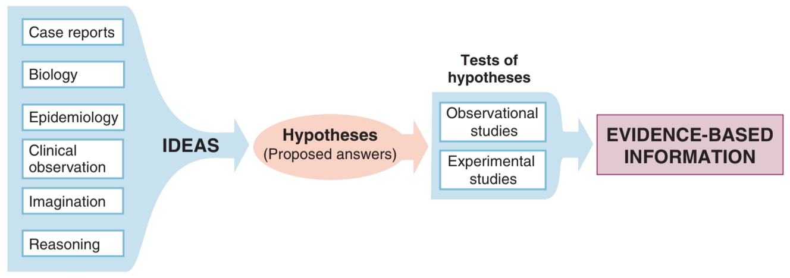

#  Ảnh Hưởng Của Sai Lệch Trong Những Nghiên Cứu Dịch Tễ Học {#dthls_sailech}

## Mục tiêu

1. Các dạng nghiên cứu đánh giá một phương pháp điều trị (đặc biệt là thử nghiệm lâm sàng)

2. Cách đọc và đánh giá một nghiên cứu về điều trị

## Vì sao cần nghiên cứu lâm sàng về phương pháp điều trị?

(Ý tưởng/giả thuyết vs. bằng chứng)

Trong thực tế, các ý tưởng hay giả thuyết về hiệu lực của các phương pháp điều trị thường bắt nguồn từ các diễn giải về cơ chế sinh bệnh học, các quan sát hay trải nghiệm thực tế trên lâm sàng, các nghiên cứu dịch tễ học hoặc thậm chí từ trí tưởng tượng của con người [@fletcher_clinical_2014]. Ngoại trừ các phương pháp điều trị có hiệu quả quá lớn mà không cần phải có thêm bằng chứng, luôn cần kiểm tra và đánh giá các ý tưởng hay giả thuyết trên bằng các nghiên cứu khoa học để có bằng chứng rõ ràng và thuyết phục. Bên cạnh bằng chứng từ các nghiên cứu về cơ chế sinh học trong phòng thí nghiệm hay trên động vật, bằng chứng trực tiếp từ các nghiên cứu trên người là cần thiết vì không phải lúc nào cũng có thể suy diễn các kết quả nghiên cứu trong phòng thí nghiệm hay trên động vật sang người. 

```{r, fig.cap="Từ ý tưởng đến bằng chứng", echo=FALSE}

```

Ví dụ

* Truyền huyết tương hồi phục trong điều trị COVID-19:
    + Có cơ sở về cơ chế sinh học
    + Có bằng chứng từ các bệnh truyền nhiễm khác (viêm phổi do cúm)
    + Có bằng chứng từ các nghiên cứu quan sát
    + Tuy nhiên kết quả từ các thử nghiệm lâm sàng ngẫu nhiên lớn cho thấy truyền huyết tương hồi phục không có tác dụng giảm tỉ lệ tử vong/biến chứng trên bệnh nhân COVID-19 nhập viện điều trị (nghiên cứu PlasmAr, nghiên cứu RECOVERY, nghiên cứu CONCOR-1) 
    
## Làm thế nào để đánh giá hiệu quả điều trị?

* __Can thiệp__ bao gồm tất cả các can thiệp diễn ra vào bất kỳ giai đoạn nào trong lịch sử tự nhiên của bệnh, từ phòng ngừa đến chăm sóc giảm nhẹ.
* __Điều trị__ là một dạng can thiệp đặc biệt, nhằm làm thay đổi kết cuộc của bệnh sau khi bệnh đã khởi phát (Dự phòng bậc 3).
* Phương pháp đánh giá
    + Nghiên cứu quan sát: dễ thực hiện, nhiễu --> các nhóm so sánh không tương đồng, chất lượng dữ liệu/sai lệch
    + Nghiên cứu can thiệp: khó thực hiện, y đức, công sức/chi phí/thời gian, kiểm soát được sự tương đồng giữa các nhóm so sánh, kiểm soát được chất lượng dữ liệu/sai lệch [thử nghiệm lâm sàng]
    
## Thử nghiệm lâm sàng ngẫu nhiên

### Vì sao cần tiến hành & vì sao có thể phân ngẫu nhiên?

__Equipoise__: không có lý do/bằng chứng thuyết phục để tin rằng một điều trị tốt hơn điều trị còn lại

### Mẫu 

Tiêu chuẩn chọn bệnh 

## Các vấn đề về đạo đức khi tiến hành một nghiên cứu lâm sàng về điều trị

* Khi nào thì một nghiên cứu lâm sàng về điều trị là cần thiết và phù hợp?

* Chọn nhóm chứng như thế nào là phù hợp?

* Khi nào thì việc phân nhóm ngẫu nhiên bệnh nhân vào nhóm điều trị khác nhau là phù hợp?

"Equipoise": không có lý do nào để tin rằng một phương pháp điều trị là tốt hơn điều trị còn lại. Ai quyết định? Như thế nào là tốt hơn?

* Các nguyên tắc về đạo đức khác
    + Informed consent: bệnh nhân cần được giải thích và hiểu rõ về quyền lợi và rủi ro khi tham gia nghiên cứu, tự nguyện và không bị ép buộc tham gia nghiên cứu  
    + Được quyền rút lui bất kỳ lúc nào

## Các câu hỏi nghiên cứu liên quan đến phương pháp điều trị

PICO

### Dân số nghiên cứu

Để có bằng chứng trực tiếp và thuyết phục về hiệu quả của các phương pháp điều trị, các nghiên cứu lâm sàng cần được tiến hành trên người bệnh. Việc lựa chọn đối tượng nghiên cứu cụ thể được thể hiện qua các tiêu chuẩn chọn vào và loại ra cụ thể, và sẽ tuỳ theo mục đích của nghiên cứu.

Nếu mục tiêu chính của nghiên cứu là nhằm chứng minh hiệu lực 

### Điều trị

### Nhóm so sánh

### Kết cuộc

## Các dạng nghiên cứu lâm sàng giúp đánh giá một phương pháp điều trị

## Cách đọc và đánh giá một nghiên cứu về điều trị

## Ví dụ thực tế: nghiên cứu về điều trị COVID-19

## Bài tập

### Điền vào chỗ trống

2 + 2 = `r fitb("4", num = TRUE, width = 10)`

`r hide("Gợi ý")`

See the documentation for `plot()` (`?plot`)

`r unhide()`

`r hide("Xem đáp án")`

4

`r unhide()`


```{r eval = FALSE, webex.hide="Xem đáp án"}
4
```

